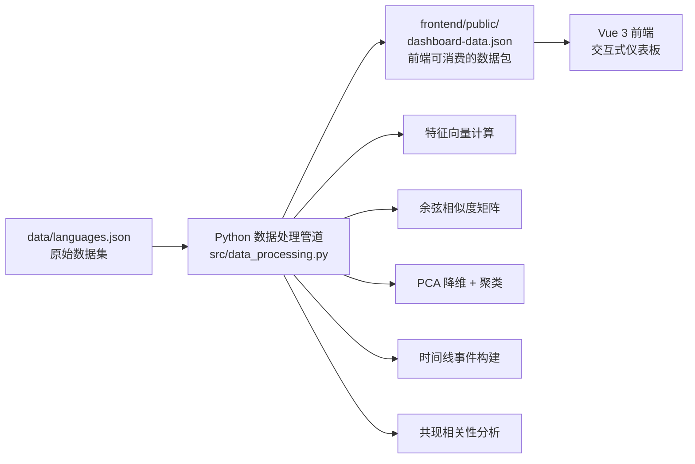

Lang Analysis Dashboard 是一个围绕**编程语言类型系统设计**构建的分析型知识图谱可视化平台。该项目通过系统化地评估 26 门编程语言在 14 个类型系统特性维度上的表现，并借助 Vue 3 前端仪表板将复杂的类型系统比较分析以交互式图表形式呈现。

## 核心定位

传统的编程语言比较往往关注语法风格、社区热度或生态规模，而本项目选择从**类型系统设计**这一独特视角切入，聚焦于回答一个核心问题：不同语言在类型系统的表达力、安全性、工程可用性和学习成本之间，分别做了怎样的取舍？

这个视角之所以重要，是因为"类型系统强不强"并非单一维度。某些语言追求证明能力和类型级表达力（如 Idris、Haskell），某些语言强调工程安全和内存安全（如 Rust），还有些语言专注于渐进式类型迁移体验（如 TypeScript）。

Sources: [docs/dashboard-handbook.md](docs/dashboard-handbook.md#L14-L47)

## 技术架构

项目采用 **Python + Vue 3** 的双层架构，数据建模层由 Python 负责，前端交互层由 Vue 承担。这种分离使得复杂的数据变换逻辑与 UI 展示逻辑各自保持清晰边界。



### 数据处理管道

Python 层负责将原始 JSON 数据转换为前端可直接使用的数据结构，核心处理逻辑位于 `src/data_processing.py`。该模块实现了以下关键功能：

| 函数 | 功能描述 |
|------|----------|
| `get_feature_vectors()` | 将每门语言转换为 14 维特征向量 |
| `cosine_similarity()` | 计算两个特征向量间的余弦相似度 |
| `pearson_correlation()` | 计算皮尔逊相关系数（用于共现分析） |
| `compute_similarity_edges()` | 生成相似性网络图的边列表 |
| `build_timeline_events()` | 构建特性采用时间线事件 |
| `build_arms_race_index()` | 计算"军备竞赛指数"趋势数据 |
| `build_domain_clusters()` | 执行 PCA 降维与 K-means 聚类 |
| `build_feature_cooccurrence()` | 分析特性共现模式 |
| `build_language_lineage()` | 构建语言影响关系图 |

Sources: [src/data_processing.py](src/data_processing.py#L51-L628)

### 前端架构

Vue 3 前端采用组合式 API（Composition API）结合 TypeScript 开发，主要由以下模块组成：

| 模块路径 | 职责 |
|----------|------|
| `frontend/src/App.vue` | 应用外壳与面板切换逻辑 |
| `frontend/src/composables/useDashboardData.ts` | JSON 数据加载与响应式绑定 |
| `frontend/src/types/dashboard.ts` | 完整的 TypeScript 类型定义 |
| `frontend/src/constants.ts` | 颜色方案与 UI 常量 |
| `frontend/src/components/PanelCard.vue` | 面板通用包装组件 |
| `frontend/src/components/EChartPanel.vue` | ECharts 图表容器组件 |
| `frontend/src/components/panels/` | 11 个独立分析面板 |

Sources: [frontend/src/App.vue](frontend/src/App.vue#L1-L133)
Sources: [frontend/src/composables/useDashboardData.ts](frontend/src/composables/useDashboardData.ts#L1-L21)
Sources: [frontend/src/types/dashboard.ts](frontend/src/types/dashboard.ts#L1-L148)

## 数据模型

### 原始数据集结构

`data/languages.json` 是整个项目的核心数据源，采用统一格式存储所有语言信息：

```json
{
  "metadata": {
    "version": "2.0",
    "scoring": {
      "0": "完全缺失",
      "1": "极弱或非官方支持",
      "2": "基本形式但限制较多",
      "3": "常见场景可用",
      "4": "集成度高仅有少量不足",
      "5": "同类最佳或参考实现"
    },
    "features": {
      "parametric_polymorphism": "泛型 / 参数多态",
      "ad_hoc_polymorphism": "Trait / typeclass / 接口多态",
      ...
    }
  },
  "languages": [...]
}
```

每门语言包含：基本信息（名称、年份、范式、应用领域）、14 维特性评分、评分理由说明、特性采用时间线、以及流行度指标。

Sources: [data/languages.json](data/languages.json#L1-L1152)

### 评分标准

项目采用 0-5 的六档渐进评分体系，这种设计考虑了两个重要维度：

**第一，理论能力与产品化程度的区分**。一个特性可能原生存在于语言核心，也可能通过扩展或外部工具部分实现。评分既反映特性是否存在，也反映其工程可用性。

**第二，主动设计决策与能力缺失的区分**。很多语言没有某个特性，并非"做不到"，而是"没打算这么做"。例如 Go 刻意回避 ADT 和模式匹配以保持语言简洁，TypeScript 将渐进类型作为核心使命。

Sources: [docs/dashboard-handbook.md](docs/dashboard-handbook.md#L91-L114)

## 分析维度

### 14 个类型系统特性

| 特性标识 | 中文说明 | 代表语言 |
|----------|----------|----------|
| parametric_polymorphism | 参数多态 / 泛型 | Rust, Haskell, Scala |
| ad_hoc_polymorphism | Ad hoc 多态 (Trait/Typeclass) | Rust, Haskell |
| algebraic_data_types | 代数数据类型 (ADT) | Haskell, Rust, Scala |
| pattern_matching | 模式匹配 | Rust, Haskell, Scala |
| ownership_lifetime | 所有权 / 生命周期 / 借用检查 | Rust |
| dependent_types | 依赖类型 | Idris, Agda |
| gadts | GADT | Haskell, Scala |
| higher_kinded_types | 高阶类型 (HKT) | Haskell, Scala |
| effect_system | 效应系统 | Haskell, Koka |
| refinement_types | 细化类型 | LiquidHaskell |
| gradual_typing | 渐进类型 | TypeScript |
| type_inference | 类型推断 | Haskell, OCaml |
| structural_typing | 结构类型 | TypeScript |
| flow_sensitive_typing | 流敏感类型 | TypeScript |

Sources: [data/languages.json](data/languages.json#L13-L28)

### 覆盖语言

当前数据集涵盖 **26 门编程语言**，按设计理念可分为几个主要类别：

- **学术/理论导向**：Haskell、Idris、OCaml、PureScript、Elm
- **系统/底层编程**：Rust、C、Zig、Nim、C++
- **JVM 生态**：Scala、Kotlin、Java、Clojure
- **Web 前端**：TypeScript、Elm、Dart
- **多范式语言**：Python、Ruby、Go、F#、Swift、Julia
- **现代新锐**：Gleam、Roc、Elixir

Sources: [docs/dashboard-handbook.md](docs/dashboard-handbook.md#L36-L47)

## 快速启动

### 环境要求

- Python 3.11+
- Node.js 22+
- pnpm 10+

### 启动步骤

```powershell
# 1. 安装前端依赖
cd frontend
pnpm install

# 2. 生成数据文件
python main.py

# 3. 启动开发服务器
cd frontend
pnpm dev
```

对于一站式本地开发体验，可使用组合命令 `pnpm run dev:sync`，该命令会先执行数据生成，再启动 Vite 开发服务器。

Sources: [README.md](README.md#L39-L63)

## 下一步阅读

完成本概览后，建议按以下路径深入：

1. **[快速启动指南](2-kuai-su-qi-dong-zhi-nan)** — 包含详细的环境配置与常见问题排查
2. **[项目架构设计](3-xiang-mu-jia-gou-she-ji)** — 深入理解 Python 数据管道与 Vue 前端的模块划分
3. **[14个类型系统特性说明](22-14ge-lei-xing-xi-tong-te-xing-shuo-ming)** — 了解每个特性维度的具体含义与分析价值