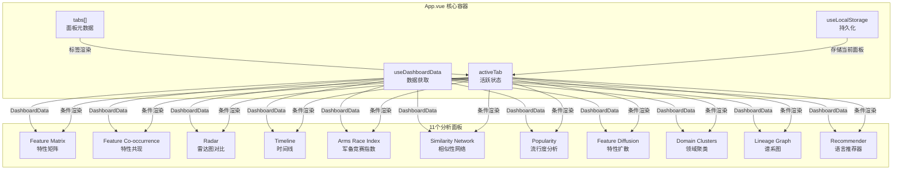
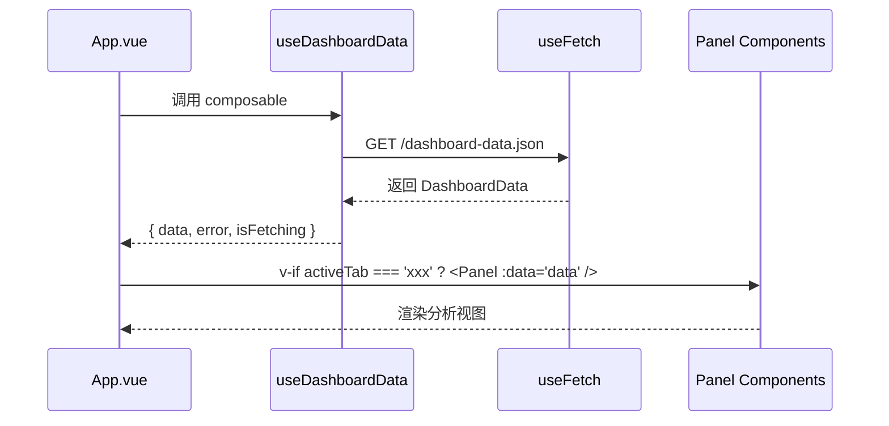

本文档详细介绍编程语言类型系统知识图谱仪表板的面板导航系统，帮助开发者理解如何在 11 个分析面板之间切换、每个面板的用途以及底层的技术实现原理。

## 面板系统架构概述

仪表板采用了**单页应用（SPA）模式**的标签页导航设计，所有分析面板共享同一个数据上下文，用户可以在不同分析视角之间快速切换而无需重新加载页面。这种设计使得数据只需加载一次，多个视图可以复用相同的内存状态。



Sources: [App.vue](frontend/src/App.vue#L1-L50)

## 标签页配置结构

每个面板在 `tabs` 数组中定义了四个核心属性，这些属性共同决定了标签按钮的显示效果和上下文说明。

| 属性 | 类型 | 用途 | 示例值 |
|------|------|------|--------|
| `key` | string literal | 面板唯一标识符，用于 v-if 条件渲染 | `'matrix'`, `'radar'` |
| `label` | string | 面板显示名称 | `'Feature Matrix'` |
| `kicker` | string | 分析模式标签（大写小号字） | `'Compare'`, `'Shape'` |
| `summary` | string | 面板功能描述 | 约 120 字符的功能说明 |

标签按钮采用双行布局：上行显示 kicker（分析模式），下行显示 label（面板名称）。这种设计让用户在不展开详情的情况下快速识别每个面板的分析性质。

Sources: [App.vue](frontend/src/App.vue#L18-L29)

## 状态管理机制

### 活跃面板状态

活跃面板通过 `useLocalStorage` hook 实现持久化存储，这意味着用户的面板选择会保存在浏览器本地存储中，刷新页面后自动恢复到上次选择的面板。

```typescript
const activeTab = useLocalStorage<(typeof tabs)[number]['key']>('dashboard-active-tab', 'matrix')
const activeTabMeta = computed(() => tabs.find((tab) => tab.key === activeTab.value) ?? tabs[0])
```

活跃面板的元数据通过计算属性动态获取，用于在 Hero 区域和 View Rail 区域显示当前面板的上下文信息。

Sources: [App.vue](frontend/src/App.vue#L31-L33)

### 条件渲染模式

面板组件采用 Vue 3 的条件渲染模式（`v-if`/`v-else-if`）实现，每次只有一个面板被挂载到 DOM 中。这种方式的优势包括：

- **内存占用最小化**：未激活面板不占用渲染资源
- **状态隔离**：面板重新激活时从 Vue 的 keep-alive 机制（当前未启用）中恢复
- **代码分割友好**：各面板可独立加载

```vue
<FeatureMatrixPanel v-if="activeTab === 'matrix'" :data="data" />
<FeatureCooccurrencePanel v-else-if="activeTab === 'cooccurrence'" :data="data" />
<RadarComparisonPanel v-else-if="activeTab === 'radar'" :data="data" />
```

Sources: [App.vue](frontend/src/App.vue#L97-L108)

## 数据流向设计

### 统一数据上下文

所有面板共享同一个 `DashboardData` 数据源，该数据通过 `useDashboardData` composable 获取并提供给所有面板组件。

```typescript
const { data, error, isFetching } = useDashboardData()
```

数据包含以下核心模块：

- **heatmap**: 语言特性评分矩阵（HeatmapLanguage[]）
- **network**: 相似性网络图数据（NetworkNode[], NetworkEdge[]）
- **timeline**: 特性演进时间线事件（TimelineEvent[]）
- **arms_race**: 年份特性引入统计（ArmsRaceSeries）
- **popularity**: 语言流行度数据（PopularityPoint[]）
- **diffusion**: 特性扩散轨迹（DiffusionFeature[]）
- **lineage**: 谱系关系数据（LineageNode[], LineageEdge[]）
- **clusters**: 领域聚类结果（ClusterPoint[]）
- **cooccurrence**: 特性共现矩阵（CooccurrenceCell[]）

Sources: [App.vue](frontend/src/App.vue#L8-L10)
Sources: [useDashboardData.ts](frontend/src/composables/useDashboardData.ts#L1-L21)
Sources: [dashboard.ts](frontend/src/types/dashboard.ts#L109-L148)

### 数据获取流程



Sources: [useDashboardData.ts](frontend/src/composables/useDashboardData.ts#L6-L12)

## 核心组件体系

### PanelCard 通用面板容器

`PanelCard` 是所有分析面板的统一包装组件，提供了标准化的面板结构和样式。

```vue
<PanelCard
  eyebrow="Compare"
  title="Feature Matrix"
  description="The matrix stays compact by default..."
>
  <!-- 面板内容插槽 -->
</PanelCard>
```

组件结构包含三个区域：面板头部（标题+描述）、操作按钮区（actions 插槽）、内容区（默认插槽）。

Sources: [PanelCard.vue](frontend/src/components/PanelCard.vue#L1-L26)

### EChartPanel 图表封装

`EChartPanel` 是 ECharts 图表的 Vue 3 封装组件，处理了图表的初始化、响应式调整和资源清理。

| 生命周期钩子 | 职责 |
|------------|------|
| `onMounted` | 初始化 ECharts 实例 |
| `watch` | 监听配置变化并重新渲染 |
| `useResizeObserver` | 响应容器尺寸变化 |
| `onBeforeUnmount` | 销毁图表实例释放内存 |

```vue
<EChartPanel :option="chartOption" :compact="true" />
```

Sources: [EChartPanel.vue](frontend/src/components/EChartPanel.vue#L1-L47)

## 视觉设计系统

### 颜色主题

仪表板使用深色主题设计，通过 CSS 变量定义完整的色彩体系。

| CSS 变量 | 用途 | 十六进制值 |
|----------|------|-----------|
| `--bg` | 背景色 | `#0d1017` |
| `--accent` | 主强调色 | `#7e96ff` |
| `--accent-2` | 次强调色 | `#ff8aa1` |
| `--accent-3` | 第三强调色 | `#6fe0b7` |
| `--warning` | 警示色 | `#ffcf7a` |
| `--text` | 主文字色 | `#edf2ff` |
| `--text-dim` | 辅助文字色 | `#98a4c6` |

Sources: [style.css](frontend/src/style.css#L1-L20)

### 标签按钮样式

标签按钮通过 CSS Grid 实现双行布局，激活状态使用渐变背景和发光边框效果。

```css
.tab-button.active {
  background: linear-gradient(135deg, rgba(126, 150, 255, 0.2), rgba(126, 150, 255, 0.08)),
              rgba(18, 23, 38, 0.94);
  border-color: rgba(126, 150, 255, 0.42);
  box-shadow: 0 18px 48px rgba(8, 12, 24, 0.28);
}
```

Sources: [style.css](frontend/src/style.css#L236-L244)

## 顶部统计卡片

Hero 区域显示四个核心统计指标，这些数据从 `DashboardData` 动态计算得出。

```typescript
const topStats = computed(() => [
  { label: 'Languages', value: data.value.heatmap.length },
  { label: 'Feature dimensions', value: data.value.features.length },
  { label: 'Similarity edges', value: data.value.network.edges.length },
  { label: 'Lineage links', value: data.value.lineage.edges.length },
])
```

| 统计项 | 数据来源 | 说明 |
|--------|----------|------|
| Languages | `heatmap.length` | 已评分语言数量 |
| Feature dimensions | `features.length` | 类型系统特性维度数 |
| Similarity edges | `network.edges.length` | 相似性网络连接数 |
| Lineage links | `lineage.edges.length` | 谱系关系链接数 |

Sources: [App.vue](frontend/src/App.vue#L35-L44)

## 加载状态与错误处理

仪表板实现了三级状态展示：加载中、错误状态、正常数据。

```vue
<div v-if="isFetching && !data" class="loading">
  Loading dashboard data...
</div>
<div v-else-if="error" class="error">
  Failed to load <code>dashboard-data.json</code>. 
  Run <code>python main.py --json-output frontend/public/dashboard-data.json</code> and refresh.
</div>
<template v-else-if="data">
  <!-- 面板组件渲染 -->
</template>
```

错误状态提供了具体的解决方案指导，帮助用户在数据文件缺失时快速恢复。

Sources: [App.vue](frontend/src/App.vue#L96-L102)

## 下一步阅读建议

面板导航系统的实现依赖于 Vue 3 的组合式 API 和响应式系统，建议按以下顺序深入学习：

1. **[Feature Matrix 特性矩阵](11-feature-matrix-te-xing-ju-zhen)** — 首先了解默认面板的实现方式，这是理解其他面板的基础
2. **[Vue 3 前端组件架构](5-vue-3-qian-duan-zu-jian-jia-gou)** — 深入了解前端整体架构设计和组件组织方式
3. **[DashboardData 接口详解](7-dashboarddata-jie-kou-xiang-jie)** — 详细了解数据类型定义，这对于理解所有面板的数据结构至关重要