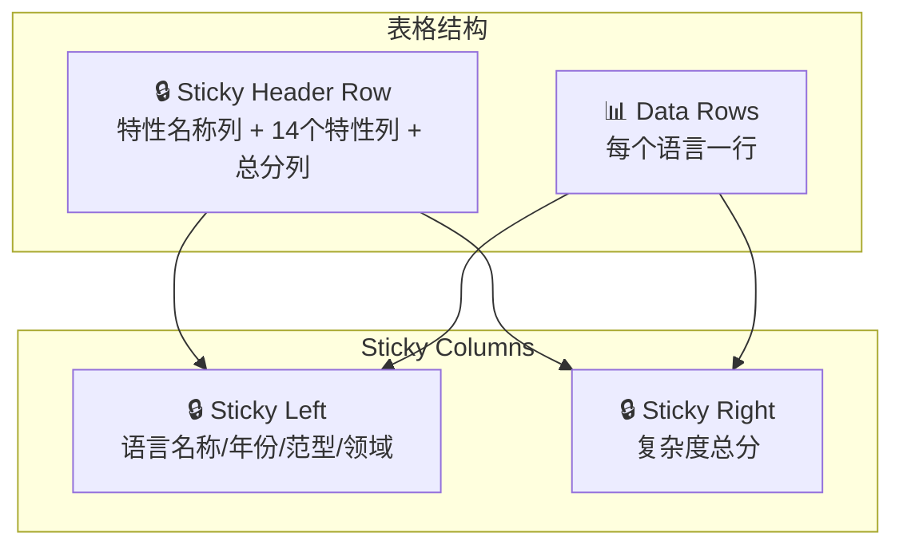

Feature Matrix（特性矩阵）是本仪表板的核心可视化面板，以紧凑的表格形式呈现所有编程语言的类型系统特性评分数据。该面板支持悬停查看详细评分依据，并提供复杂度排序概览，使用户能够快速对比不同语言在14个类型系统维度上的表现差异。

Sources: [FeatureMatrixPanel.vue](frontend/src/components/panels/FeatureMatrixPanel.vue#L1-L159)

## 数据结构设计

### DashboardData 中的矩阵结构

Feature Matrix 的数据结构定义于 `DashboardData` 接口的 `heatmap` 字段。该字段为 `HeatmapLanguage[]` 数组类型，每个元素包含语言的名称、年份、编程范型、应用领域、评分数组、综合复杂度得分以及详细的评分理由说明。数据在 `prepare_dashboard_data()` 函数中被构建时，会按复杂度得分降序排列，确保最复杂的语言系统显示在表格顶部。

Sources: [dashboard.ts](frontend/src/types/dashboard.ts#L14-L25)
Sources: [data_processing.py](src/data_processing.py#L545-L570)

### HeatmapLanguage 接口定义

```typescript
interface HeatmapLanguage {
  name: string           // 语言名称
  year: number           // 首次发布年份
  paradigm: string       // 主要编程范型
  domain: string         // 主要应用领域
  scores: number[]       // 14个特性的评分数组
  complexity: number     // 复杂度总分
  rationale: Record<string, string>  // 评分理由映射
}
```

该接口完整封装了语言类型系统分析所需的全部信息，其中 `scores` 数组的顺序与 `DashboardData.features` 数组保持一致，确保前端渲染时的索引对齐。

Sources: [dashboard.ts](frontend/src/types/dashboard.ts#L14-L25)

## 评分体系

### 六级评分标准

本项目采用 0-5 的六级评分体系，每个分数对应明确的语义定义：

| 分数 | 语义 | 说明 |
|------|------|------|
| 0 | Not supported | 功能完全不存在 |
| 1 | Minimal | 极其有限或仅第三方支持 |
| 2 | Basic | 功能存在但有明显限制 |
| 3 | Moderate | 可用的实现，覆盖常见场景 |
| 4 | Strong | 良好集成，仅有微小缺陷 |
| 5 | Full | 最佳实践或参考实现 |

评分标准定义于 `languages.json` 的 `metadata.scoring` 字段，并在前端面板顶部以 pill-grid 形式展示，使读者一目了然每个分数的含义。

Sources: [languages.json](data/languages.json#L3-L14)
Sources: [FeatureMatrixPanel.vue](frontend/src/components/panels/FeatureMatrixPanel.vue#L49-L57)

### 14个类型系统特性

数据集中评估的14个类型系统特性如下：

| 特性键名 | 完整名称 | 简称（表格列头） |
|---------|---------|----------------|
| parametric_polymorphism | Generics / parametric polymorphism | Generics |
| ad_hoc_polymorphism | Trait / typeclass / interface-based polymorphism | Traits |
| algebraic_data_types | Sum types + product types | ADTs |
| pattern_matching | Exhaustive pattern matching on types | Matching |
| ownership_lifetime | Ownership / lifetime / borrow checking | Ownership |
| dependent_types | Types that depend on values | Dep Types |
| gadts | Generalized algebraic data types | GADTs |
| higher_kinded_types | Type constructors as parameters | HKT |
| effect_system | Tracked computational effects | Effects |
| refinement_types | Types refined by predicates | Refinement |
| gradual_typing | Mix of static and dynamic typing | Gradual |
| type_inference | Automatic type deduction | Inference |
| structural_typing | Compatibility based on structure | Structural |
| flow_sensitive_typing | Type narrowing based on control flow | Flow |

简称映射定义于 `get_feature_short_labels()` 函数，确保在表格列头空间有限时仍能清晰显示特性名称。

Sources: [data_processing.py](src/data_processing.py#L28-L42)

## 视觉设计

### 矩阵表格布局

Feature Matrix 使用 CSS Grid 和 sticky 定位实现固定表头与行列锁定功能：



表格使用 `border-collapse: separate` 和 `border-spacing: 6px` 实现单元格之间的呼吸感，每个单元格尺寸为 48x36 像素，确保在保持紧凑的同时易于阅读。

Sources: [style.css](frontend/src/style.css#L496-L532)

### 评分颜色映射

分数的视觉强度通过透明度算法动态计算：

```typescript
function colorFor(score: number, max: number) {
  const alpha = 0.16 + (score / Math.max(max, 1)) * 0.8
  return `rgba(126, 150, 255, ${alpha.toFixed(3)})`
}
```

该函数确保 0 分显示为极浅的蓝色（α≈0.16），而 5 分显示为深蓝色（α≈0.96），分数越高颜色越深。用户可以直观地通过颜色深浅判断语言在特定特性上的支持程度。

Sources: [FeatureMatrixPanel.vue](frontend/src/components/panels/FeatureMatrixPanel.vue#L18-L21)

### 悬停交互

矩阵支持两种悬停提示：

1. **列头悬停**：显示特性的完整名称和简短说明
2. **单元格悬停**：显示该语言该特性的详细评分理由

悬停卡片通过 Vue 的 `<Teleport to="body">` 渲染到文档末尾，确保不会被父容器的 `overflow: hidden` 或 `z-index` 遮挡。卡片跟随鼠标位置偏移 14 像素显示。

Sources: [FeatureMatrixPanel.vue](frontend/src/components/panels/FeatureMatrixPanel.vue#L75-L82)
Sources: [FeatureMatrixPanel.vue](frontend/src/components/panels/FeatureMatrixPanel.vue#L100-L110)
Sources: [style.css](frontend/src/style.css#L593-L612)

## 数据流架构

### 数据生成管道

```
languages.json (原始数据)
        ↓
main.py → load_data()
        ↓
src/data_processing.py → prepare_dashboard_data()
        ↓
frontend/public/dashboard-data.json (前端可消费数据)
        ↓
Vue Composable → useFetch().json<DashboardData>()
        ↓
FeatureMatrixPanel.vue → 渲染矩阵表格
```

`main.py` 作为入口点调用 `generate_dashboard_json()` 函数，该函数加载 `languages.json` 并通过 `prepare_dashboard_data()` 处理后输出到 `frontend/public/dashboard-data.json`。前端通过 `useDashboardData` composable 使用 `@vueuse/core` 的 `useFetch` 获取数据。

Sources: [main.py](main.py#L1-L67)
Sources: [useDashboardData.ts](frontend/src/composables/useDashboardData.ts#L1-L21)

### 热力图数据构建

`prepare_dashboard_data()` 中构建热力图的核心逻辑：

```python
heatmap_languages = []
for lang in data["languages"]:
    heatmap_languages.append({
        "name": lang["name"],
        "year": lang["year"],
        "paradigm": lang["paradigm"],
        "domain": lang["domain"],
        "scores": [lang["features"].get(f, 0) for f in features],
        "complexity": compute_type_complexity_score(lang),
        "rationale": lang.get("scoring_rationale", {}),
    })
heatmap_languages.sort(key=lambda x: -x["complexity"])
```

复杂度得分通过 `compute_type_complexity_score()` 计算，该函数对语言所有特性评分求和作为复杂度指标。排序后的数组使复杂度最高的语言（如 Idris 51分、Haskell 43分、Scala 43分）显示在顶部，便于用户快速识别类型系统最丰富的语言。

Sources: [data_processing.py](src/data_processing.py#L545-L570)
Sources: [data_processing.py](src/data_processing.py#L122-L125)

## 响应式设计

### 断点适配

面板在屏幕宽度小于 900px 时进入移动端布局模式：

| 元素 | 桌面端 | 移动端 |
|------|--------|--------|
| 应用容器内边距 | 32px 20px 48px | 18px 12px 32px |
| 面板内边距 | 26px | 16px |
| 语言名称列最小宽度 | 220px | 180px |
| 图表容器高度 | 560px | 440px |

矩阵表头和第一/最后一列的 `sticky` 定位确保在横向滚动时语言名称和总分始终可见，解决特性列较多时的浏览体验问题。

Sources: [style.css](frontend/src/style.css#L645-L678)

## 与其他面板的关联

Feature Matrix 作为基础数据源，为多个高级分析面板提供原始评分数据：

- **[Radar 雷达图对比](12-radar-lei-da-tu-dui-bi)**：使用相同的 `heatmap` 数据渲染多语言雷达叠加图
- **[Feature Co-occurrence 特性共现](13-feature-co-occurrence-te-xing-gong-xian)**：基于 `heatmap.scores` 计算特性间的 Pearson 相关系数
- **[Similarity Network 相似性网络](16-similarity-network-xiang-si-xing-wang-luo)**：使用余弦相似度计算语言间的类型系统相似程度
- **[Feature Recommender 语言推荐器](21-feature-recommender-yu-yan-tui-jian-qi)**：根据用户选择的特性需求从矩阵中筛选匹配语言

Sources: [data_processing.py](src/data_processing.py#L73-L82)
Sources: [data_processing.py](src/data_processing.py#L505-L548)

## 后续阅读建议

深入理解 Feature Matrix 的数据来源后，建议依次学习：

1. **[Radar 雷达图对比](12-radar-lei-da-tu-dui-bi)** — 了解如何将矩阵数据可视化为一目了然的雷达图
2. **[Feature Co-occurrence 特性共现](13-feature-co-occurrence-te-xing-gong-xian)** — 探索特性间的相关性分析方法
3. **[14个类型系统特性说明](22-14ge-lei-xing-xi-tong-te-xing-shuo-ming)** — 深入理解每个评分维度的技术内涵
4. **[评分模型与标准](23-ping-fen-mo-xing-yu-biao-zhun)** — 了解评分方法论和质量保证机制