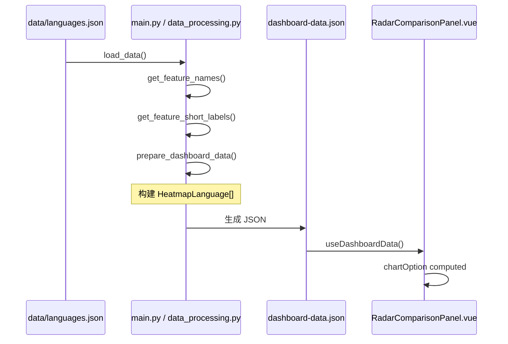

Radar 雷达图对比是一种直观展示编程语言类型系统特征的视觉分析工具。该面板允许用户选择最多四门语言，通过多维度雷达图的形式，将每门语言的 14 项类型系统特性评分投射到一个以圆心向外辐射的雷达图中，从而快速识别语言间的类型系统设计差异与相似性。

## 核心架构

RadarComparisonPanel 采用了典型的**单向数据流架构**，数据从 DashboardData 传入组件，经过计算属性转换生成 ECharts 配置对象，最终由 EChartPanel 渲染为交互式雷达图。

```mermaid
flowchart TD
    A["DashboardData<br/>dashboard.ts"] --> B["RadarComparisonPanel.vue<br/>接收 props: data"]
    B --> C["selected ref<br/>选中的语言列表"]
    C --> D["toggleLanguage 函数<br/>管理选择状态"]
    D --> C
    B --> E["chartOption computed<br/>生成 ECharts 配置"]
    E --> F["EChartPanel 组件<br/>图表渲染容器"]
    F --> G["Radar Chart<br/>交互式雷达图"]
    
    style A fill:#1a1f2e,stroke:#7e96ff
    style B fill:#1a1f2e,stroke:#6fe0b7
    style F fill:#1a1f2e,stroke:#ffcf7a
    style G fill:#2d3548,stroke:#98a4c6
```



Sources: [RadarComparisonPanel.vue](frontend/src/components/panels/RadarComparisonPanel.vue#L1-L81)
Sources: [App.vue](frontend/src/App.vue#L87)

## 组件结构

### 组件层级关系

| 层级 | 组件 | 职责 |
|------|------|------|
| 容器层 | `PanelCard` | 提供统一的卡片容器，包含标题、描述和内容区域 |
| 交互层 | `chip-list` | 语言选择按钮列表，支持多选（最多4门） |
| 渲染层 | `EChartPanel` | ECharts 图表渲染容器，处理响应式调整 |
| 数据层 | `chartOption` | 计算属性，将 DashboardData 转换为 ECharts 配置 |

Sources: [PanelCard.vue](frontend/src/components/PanelCard.vue#L1-L26)
Sources: [EChartPanel.vue](frontend/src/components/EChartPanel.vue#L1-L47)

### RadarComparisonPanel 核心逻辑

组件的核心在于 `chartOption` 计算属性，它完成了从语言特征向量到雷达图配置的转换：

```typescript
const chartOption = computed<EChartsOption>(() => {
  const series = selected.value
    .map((name) => props.data.heatmap.find((language) => language.name === name))
    .filter((language): language is NonNullable<typeof language> => Boolean(language))
    .map((language) => ({
      value: language.scores,  // 14维特征向量
      name: language.name,
      lineStyle: { width: 2, color: paradigmColors[language.paradigm] ?? '#7e96ff' },
      itemStyle: { color: paradigmColors[language.paradigm] ?? '#7e96ff' },
      areaStyle: { opacity: 0.14 },
    }))

  return {
    tooltip: { trigger: 'item' },
    legend: { bottom: 0, textStyle: { color: '#98a4c6' }, data: selected.value },
    radar: {
      indicator: props.data.features.map((feature) => ({
        name: props.data.feature_short_labels[feature],  // 短标签映射
        max: props.data.max_score,  // 标准化最大值为5
      })),
      axisName: { color: '#98a4c6', fontSize: 11 },
      splitArea: { areaStyle: { color: ['#151b2a', '#101522'] } },
      splitLine: { lineStyle: { color: '#27314b' } },
      axisLine: { lineStyle: { color: '#27314b' } },
    },
    series: [{ type: 'radar', data: series }],
  }
})
```

关键实现细节：
- **特征选择器** (`features`) 提供了雷达图的 14 个维度
- **短标签映射** (`feature_short_labels`) 确保雷达图轴标签紧凑可读
- **Paradigm 色彩编码** 使用 `paradigmColors` 为不同编程范式的语言着色

Sources: [RadarComparisonPanel.vue](frontend/src/components/panels/RadarComparisonPanel.vue#L20-L51)
Sources: [constants.ts](frontend/src/constants.ts#L1-L6)

## 数据模型

### DashboardData 中雷达图相关字段

```typescript
interface DashboardData {
  features: string[]                           // 14个特征键名
  feature_labels: Record<string, string>      // 完整特征描述
  feature_short_labels: Record<string, string> // 雷达图短标签
  max_score: number                            // 最大评分（5分制）
  heatmap: HeatmapLanguage[]                   // 语言特征矩阵
}

interface HeatmapLanguage {
  name: string         // 语言名称
  paradigm: string     // 编程范式
  scores: number[]     // 14维特征评分向量 [0-5]
  complexity: number    // 类型复杂度总分
}
```

Sources: [dashboard.ts](frontend/src/types/dashboard.ts#L1-L148)
Sources: [data_processing.py](src/data_processing.py#L518-L536)

### 14 个类型系统特性维度

| 特征键名 | 短标签 | 说明 |
|----------|--------|------|
| `parametric_polymorphism` | Generics | 泛型/参数多态 |
| `ad_hoc_polymorphism` | Traits | Trait/类型类/接口多态 |
| `algebraic_data_types` | ADTs | 代数数据类型（和类型+积类型）|
| `pattern_matching` | Matching | 穷尽式模式匹配 |
| `ownership_lifetime` | Ownership | 所有权/生命周期/借用检查 |
| `dependent_types` | Dep Types | 依赖类型（类型依赖值）|
| `gadts` | GADTs | 广义代数数据类型 |
| `higher_kinded_types` | HKT | 高阶类型构造器 |
| `effect_system` | Effects | 效果系统 |
| `refinement_types` | Refinement | 细化类型 |
| `gradual_typing` | Gradual | 渐进式类型系统 |
| `type_inference` | Inference | 类型推断 |
| `structural_typing` | Structural | 结构化类型系统 |
| `flow_sensitive_typing` | Flow | 流敏感类型 |

Sources: [languages.json](data/languages.json#L8-L21)

## 交互设计

### 语言选择机制

```typescript
const selected = ref<string[]>(['Rust', 'Haskell', 'Go'])

function toggleLanguage(name: string) {
  if (selected.value.includes(name)) {
    selected.value = selected.value.filter((item) => item !== name)
    return
  }
  if (selected.value.length >= 4) return  // 最多4门语言
  selected.value = [...selected.value, name]
}
```

设计约束：
- **最小选择数**：默认预选 3 门语言
- **最大选择数**：4 门语言（防止图表过于拥挤）
- **取消选择**：点击已选中语言可取消选择

Sources: [RadarComparisonPanel.vue](frontend/src/components/panels/RadarComparisonPanel.vue#L15-L28)

### 样式与色彩系统

```css
/* 语言选择按钮 */
.language-chip {
  border: 1px solid var(--border);
  background: rgba(10, 13, 22, 0.86);
  border-radius: 12px;
}

.language-chip.active {
  background: rgba(126, 150, 255, 0.18);
  border-color: rgba(126, 150, 255, 0.42);
}

/* 雷达图容器 */
.chart-shell {
  height: 560px;
}
```

**Paradigm 色彩映射表**：

| 编程范式 | 颜色代码 |
|----------|----------|
| Functional | `#6fe0b7` |
| Multi-paradigm | `#7e96ff` |
| Systems | `#ffcf7a` |
| Object-oriented | `#ff8aa1` |
| Procedural | `#9bd6ff` |

Sources: [constants.ts](frontend/src/constants.ts#L1-L6)
Sources: [style.css](frontend/src/style.css#L436-L475)

## 数据处理管道

雷达图数据的生成流程从原始 JSON 到前端可用的 DashboardData：



关键处理步骤：
1. **特征提取**：从 `languages.json` 的 `metadata.features` 获取 14 个特征键
2. **评分归一化**：确保所有评分在 0-5 范围内
3. **复杂度计算**：`sum(scores)` 作为语言类型系统复杂度指标
4. **排序输出**：按复杂度降序排列，便于默认展示最复杂的语言

Sources: [data_processing.py](src/data_processing.py#L518-L536)
Sources: [main.py](frontend/src/App.vue#L1-L67)

## 技术栈

| 层级 | 技术选型 | 用途 |
|------|----------|------|
| 图表库 | **ECharts 5.6** | 雷达图渲染 |
| 前端框架 | **Vue 3.5** (Composition API) | 组件化开发 |
| 类型系统 | **TypeScript** | 类型安全 |
| 数据获取 | **@vueuse/core** | useLocalStorage / useResizeObserver |
| 数据管道 | **Python 3** | 数据处理与 JSON 生成 |

Sources: [package.json](frontend/package.json#L1-L27)

## 使用指南

### 默认展示语言

组件初始化时预选了三门代表性语言：

| 语言 | 范式 | 类型系统特点 |
|------|------|--------------|
| Rust | Systems | 所有权系统、模式匹配、强类型推断 |
| Haskell | Functional | 类型类、高阶类型、依赖类型 |
| Go | Multi-paradigm | 接口、结构类型、并发安全 |

这种组合覆盖了**系统编程**、**学术函数式**和**工程多范式**三种典型类型系统设计哲学。

### 运行与查看

```bash
# 生成仪表板数据
python main.py

# 启动前端开发服务器
cd frontend && pnpm dev

# 访问页面后点击 "Radar" 标签页查看
```

Sources: [main.py](main.py#L1-L67)

## 下一步阅读

完成雷达图对比面板的学习后，建议按以下路径深入：

- **[Feature Matrix 特性矩阵](11-feature-matrix-te-xing-ju-zhen)** — 了解密集表格形式的全量特征评分对比
- **[Feature Co-occurrence 特性共现](13-feature-co-occurrence-te-xing-gong-xian)** — 探索特性间的相关性分析
- **[Timeline 时间线](14-timeline-shi-jian-xian)** — 查看特性随时间的发展脉络
- **[Similarity Network 相似性网络](16-similarity-network-xiang-si-xing-wang-luo)** — 基于特征向量的语言相似度网络图