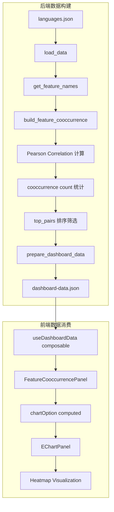

Feature Co-occurrence（特性共现）面板通过热力图形式展示编程语言类型系统特性之间的相关性强度，帮助开发者理解哪些特性倾向于同时出现在同一种语言中，以及这种共现关系的紧密程度。

## 核心数据结构

该面板依赖后端 `build_feature_cooccurrence` 函数生成的三层数据结构，与前端 TypeScript 接口形成完整的类型对应关系。

### 后端数据结构 (`src/data_processing.py`)

```python
# 构建特性共现分析结果
def build_feature_cooccurrence(data: dict) -> dict:
    features = get_feature_names(data)  # 获取所有特性名称
    labels = get_feature_labels(data)   # 获取特性标签映射
    
    # 提取每个特性的评分向量
    feature_scores = {
        feature: [lang["features"].get(feature, 0) for lang in data["languages"]]
        for feature in features
    }
    
    # 计算每个特性的流行度（支持该特性的语言数量）
    prevalence = {
        feature: sum(1 for score in scores if score > 0)
        for feature, scores in feature_scores.items()
    }
```

[Sources: src/data_processing.py#L505-L516](src/data_processing.py#L505-L516)

### 前端类型定义 (`frontend/src/types/dashboard.ts`)

```typescript
// 热力图单元格数据结构
export interface CooccurrenceCell {
  x: string           // X轴特性名称
  y: string           // Y轴特性名称
  x_index: number     // X轴索引
  y_index: number     // Y轴索引
  correlation: number // Pearson相关系数 [-1, 1]
  cooccurrence: number // 同时支持两种特性的语言数量
  support_x: number   // X特性支持度
  support_y: number   // Y特性支持度
}

// 高相关特性对数据结构
export interface CooccurrenceTopPair {
  feature_a: string
  feature_b: string
  label_a: string
  label_b: string
  correlation: number
  cooccurrence: number
}
```

[Sources: frontend/src/types/dashboard.ts#L95-L113](frontend/src/types/dashboard.ts#L95-L113)

## 相关性计算算法

### Pearson 相关系数

该面板使用 Pearson 相关系数衡量特性之间的线性相关程度。相关系数取值范围为 [-1, 1]，其中 1 表示完全正相关，-1 表示完全负相关，0 表示无相关性。

```python
def pearson_correlation(a: list[float], b: list[float]) -> float:
    """计算两个等长向量的 Pearson 相关系数"""
    if not a or not b or len(a) != len(b):
        return 0.0

    mean_a = sum(a) / len(a)
    mean_b = sum(b) / len(b)
    centered_a = [value - mean_a for value in a]  # 中心化
    centered_b = [value - mean_b for value in b]  # 中心化
    
    numerator = sum(x * y for x, y in zip(centered_a, centered_b))
    denom_a = math.sqrt(sum(value * value for value in centered_a))
    denom_b = math.sqrt(sum(value * value for value in centered_b))
    
    if denom_a == 0 or denom_b == 0:
        return 0.0
    return numerator / (denom_a * denom_b)
```

[Sources: src/data_processing.py#L70-L84](src/data_processing.py#L70-L84)

### 热力图矩阵生成

热力图单元格的生成逻辑遍历所有特性组合，计算每对特性之间的相关性和共现次数：

```python
cells = []
top_pairs = []

for y_index, feature_y in enumerate(features):
    scores_y = feature_scores[feature_y]
    for x_index, feature_x in enumerate(features):
        scores_x = feature_scores[feature_x]
        
        # 对角线元素相关性为1.0（特性与自身）
        correlation = 1.0 if feature_x == feature_y else pearson_correlation(scores_x, scores_y)
        
        # 计算共现次数：两种特性评分都大于0的语言数量
        cooccurrence = sum(
            1 for score_x, score_y in zip(scores_x, scores_y)
            if score_x > 0 and score_y > 0
        )
        
        cells.append({
            "x": feature_x,
            "y": feature_y,
            "x_index": x_index,
            "y_index": y_index,
            "correlation": round(correlation, 3),
            "cooccurrence": cooccurrence,
            "support_x": prevalence[feature_x],
            "support_y": prevalence[feature_y],
        })
```

[Sources: src/data_processing.py#L518-L547](src/data_processing.py#L518-L547)

## 可视化渲染架构

### ECharts 热力图配置

前端组件使用 ECharts 的 `heatmap` 类型渲染相关性矩阵，通过 `visualMap` 组件实现从红色到绿色的渐变色映射。

```typescript
const chartOption = computed<EChartsOption>(() => ({
  tooltip: {
    formatter: (params: any) => {
      const data = params.data
      const xFeature = props.data.cooccurrence.features[data.value[0]]
      const yFeature = props.data.cooccurrence.features[data.value[1]]
      return [
        `<b>${props.data.feature_labels[xFeature]}</b> x <b>${props.data.feature_labels[yFeature]}</b>`,
        `Correlation: ${Number(data.value[2]).toFixed(2)}`,
        `Shared languages: ${data.cooccurrence}`,
        `${props.data.feature_short_labels[xFeature]} support: ${data.support_x}`,
        `${props.data.feature_short_labels[yFeature]} support: ${data.support_y}`,
      ].join('<br>')
    },
  },
  grid: { left: 110, right: 40, top: 72, bottom: 96 },
  visualMap: {
    min: -1,
    max: 1,
    calculable: false,
    orient: 'horizontal',
    left: 'center',
    top: 18,
    textStyle: { color: '#98a4c6' },
    inRange: {
      color: ['#ff8aa1', '#1c2436', '#6fe0b7'],  // 粉红-深灰-绿色渐变
    },
  },
  series: [{
    name: 'Feature correlation',
    type: 'heatmap',
    data: props.data.cooccurrence.cells.map((cell) => ({
      value: [cell.x_index, cell.y_index, cell.correlation],
      cooccurrence: cell.cooccurrence,
      support_x: cell.support_x,
      support_y: cell.support_y,
    })),
  }],
}))
```

[Sources: frontend/src/components/panels/FeatureCooccurrencePanel.vue#L28-L88](frontend/src/components/panels/FeatureCooccurrencePanel.vue#L28-L88)

### 面板布局结构

面板采用三段式布局设计：顶部 Top Pairs 卡片区域、中部图例信息栏、底部热力图主视图。

```vue
<template>
  <PanelCard
    eyebrow="Correlate"
    title="Feature Co-occurrence Matrix"
    description="Correlation is computed from the 0-5 feature scores across languages, 
                  while the tooltip also shows how many languages contain both features at all."
  >
    <div class="stack">
      <!-- 顶部：高相关性特性对卡片 -->
      <div class="mini-grid">
        <div v-for="pair in data.cooccurrence.top_pairs.slice(0, 4)" :key="..." class="mini-card">
          <strong>{{ data.feature_short_labels[pair.feature_a] }} + {{ data.feature_short_labels[pair.feature_b] }}</strong>
          <span>{{ pair.label_a }} and {{ pair.label_b }} move together with correlation 
            {{ pair.correlation.toFixed(2) }} across {{ pair.cooccurrence }} shared languages.</span>
        </div>
      </div>

      <!-- 中部：图例信息栏 -->
      <div v-if="mostCommonFeature" class="legend-row">
        <span class="legend-chip">
          Broadest feature: <strong>{{ mostCommonFeature.short }}</strong> in {{ mostCommonFeature.count }} languages
        </span>
      </div>

      <!-- 底部：ECharts 热力图 -->
      <EChartPanel :option="chartOption" />
    </div>
  </PanelCard>
</template>
```

[Sources: frontend/src/components/panels/FeatureCooccurrencePanel.vue#L91-L127](frontend/src/components/panels/FeatureCooccurrencePanel.vue#L91-L127)

## 数据处理流程

整体数据处理流程涉及后端数据构建与前端数据消费的完整链路。



## 核心指标解读

| 指标名称 | 计算方式 | 数值范围 | 含义解读 |
|---------|---------|---------|---------|
| **Correlation** | Pearson 相关系数 | [-1, 1] | 特性评分的线性相关性强度 |
| **Cooccurrence** | 同时支持两种特性的语言数 | [0, N] | 特性组合的实际出现频率 |
| **Support** | 支持某特性的语言数量 | [0, N] | 单个特性的流行程度 |

## 典型应用场景

### 识别特性设计模式

通过观察高相关性特性对，可以发现语言设计中的常见组合模式。例如，如果 `parametric_polymorphism` 和 `algebraic_data_types` 高度相关，这表明强类型多态与代数数据类型设计往往配套出现。

### 理解类型系统演进

分析负相关性特性对可以帮助理解类型系统设计的权衡取舍。某些特性可能因为设计哲学差异而呈现此消彼长的关系。

### 预测语言特性组合

基于相关性分析，可以预测新引入某种特性的语言可能同时具备哪些其他特性，为语言设计提供参考。

## 与相邻面板的关系

Feature Co-occurrence 面板与其他分析面板存在数据共享与互补关系：

| 关联面板 | 共享数据 | 互补分析维度 |
|---------|---------|-------------|
| [Feature Matrix 特性矩阵](11-feature-matrix-te-xing-ju-zhen) | features 列表 | 矩阵展示语言特性评分，热力图展示特性间相关性 |
| [Similarity Network 相似性网络](16-similarity-network-xiang-si-xing-wang-luo) | languages 数据 | 网络基于语言相似度，聚类基于特性共现模式 |
| [Feature Diffusion 特性扩散](17-feature-diffusion-te-xing-kuo-san) | feature_timeline | 扩散分析时间维度，共现分析空间维度 |

## 技术要点总结

**后端核心逻辑**：通过 `pearson_correlation` 函数计算所有特性两两之间的线性相关性，结合 `cooccurrence` 计数统计实际共现频率，最终筛选出 `top_pairs` 用于高亮展示。

**前端渲染策略**：利用 ECharts 热力图的 `visualMap` 实现 -1 到 1 区间的红绿渐变色映射，通过 `tooltip.formatter` 提供丰富的交互信息展示。

**数据流特点**：该面板数据完全由 `prepare_dashboard_data` 在构建时一次性计算生成，属于静态数据集，无需前端实时计算。

## 后续阅读建议

- 深入了解特性评分体系，请阅读 [评分模型与标准](23-ping-fen-mo-xing-yu-biao-zhun)
- 探索相似性计算原理，请阅读 [相似度计算算法](8-xiang-si-du-ji-suan-suan-fa)
- 查看所有 14 个类型系统特性，请阅读 [14个类型系统特性说明](22-14ge-lei-xing-xi-tong-te-xing-shuo-ming)