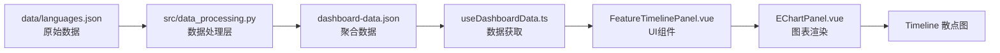

Timeline（时间线）面板是该类型系统知识图谱仪表板的核心可视化组件之一，以散点图形式呈现编程语言特性随时间的演进历程。该面板揭示了不同语言在类型系统特性采纳上的时间脉络，帮助开发者理解特性扩散的历史模式与语言设计哲学的演变。

## 架构概述

Timeline 功能涉及从前端展示到后端数据处理的全链路协作。其数据流向遵循标准的数据管道模式：后端 Python 脚本从结构化数据源提取原始数据，经处理后生成前端可直接消费的 JSON 文件，再由 Vue 组件解析并渲染为 ECharts 散点图。



## 数据结构

### TimelineEvent 接口

Timeline 功能的核心数据类型为 `TimelineEvent`，定义于 `frontend/src/types/dashboard.ts`。每个事件对象包含以下字段：

| 字段名 | 类型 | 说明 |
|--------|------|------|
| `year` | `number` | 特性引入的年份 |
| `language` | `string` | 编程语言名称 |
| `feature` | `string` | 特性标识符（如 `parametric_polymorphism`） |
| `feature_label` | `string` | 特性的人类可读名称 |

Sources: [dashboard.ts#L1-L6](frontend/src/types/dashboard.ts#L1-L6)

### DashboardData 中的 Timeline 字段

`DashboardData` 接口中，timeline 字段声明为 `TimelineEvent[]` 类型。该数组经过按年份排序处理，确保时间线事件按时间顺序呈现。

Sources: [dashboard.ts#L126](frontend/src/types/dashboard.ts#L126)

## 后端数据处理

### build_timeline_events 函数

`src/data_processing.py` 中的 `build_timeline_events` 函数负责从原始语言数据中提取时间线事件。该函数遍历每种语言的 `feature_timeline` 字段，将每个特性-年份组合转换为独立的事件对象。

```python
def build_timeline_events(data: dict) -> list[dict]:
    """Build a flat list of (year, language, feature) events for the timeline."""
    labels = get_feature_labels(data)
    events = []
    for lang in data["languages"]:
        for feat, year in lang.get("feature_timeline", {}).items():
            events.append({
                "year": year,
                "language": lang["name"],
                "feature": feat,
                "feature_label": labels.get(feat, feat),
            })
    events.sort(key=lambda e: e["year"])
    return events
```

处理流程的关键步骤：首先从 `data/languages.json` 读取语言元数据，然后对每种语言遍历其 `feature_timeline` 字典（包含该语言各特性的引入年份），最后将所有事件按年份升序排序。返回的事件列表即为前端 timeline 字段的原始数据来源。

Sources: [data_processing.py#L130-L143](src/data_processing.py#L130-L143)

### 数据聚合入口

`prepare_dashboard_data` 函数是生成仪表板完整 JSON 的统一入口，其中 timeline 部分通过调用 `build_timeline_events(data)` 获取。该函数将处理后的数据与特征矩阵、相似性网络、流行度分析等其他面板数据整合，输出完整的 `dashboard-data.json` 文件供前端加载。

Sources: [data_processing.py#L562-L627](src/data_processing.py#L562-L627)

## 前端组件实现

### FeatureTimelinePanel.vue

`FeatureTimelinePanel.vue` 是 Timeline 面板的 Vue 3 单文件组件，采用 Composition API 风格编写。组件接收 `DashboardData` 作为 prop，内部通过 `computed` 属性生成 ECharts 配置对象。

组件的核心逻辑位于 `chartOption` 计算属性：

```typescript
const chartOption = computed<EChartsOption>(() => {
  const events = props.data.timeline
  const languages = [...new Set(events.map((event) => event.language))]
  const features = [...new Set(events.map((event) => event.feature))]

  const series = features.map((feature, index) => ({
    name: props.data.feature_short_labels[feature],
    type: 'scatter',
    symbolSize: 13,
    itemStyle: { color: featurePalette[index % featurePalette.length] },
    data: events
      .filter((event) => event.feature === feature)
      .map((event) => ({
        value: [event.year, languages.indexOf(event.language)],
        language: event.language,
        feature_label: event.feature_label,
      })),
  }))

  return {
    tooltip: { /* ... */ },
    legend: { type: 'scroll', bottom: 0, textStyle: { color: '#98a4c6', fontSize: 10 } },
    grid: { left: 120, right: 30, top: 24, bottom: 80 },
    xAxis: { type: 'value', min: 1985, max: 2026, /* ... */ },
    yAxis: { type: 'category', data: languages, /* ... */ },
    series,
  } as EChartsOption
})
```

该实现包含以下关键设计决策：

**动态系列生成**：以特性类型为维度创建多个散点系列，每个系列使用 `featurePalette` 中对应索引的颜色着色。这种设计使得图例自动按特性分组，鼠标悬停时可高亮特定特性的所有事件。

**二维坐标映射**：X 轴为数值型年份（范围 1985-2026），Y 轴为类别型语言列表。通过 `languages.indexOf(event.language)` 将语言名称转换为数值索引，实现散点在 Y 轴上的精确定位。

**数据扩展**：每个数据点除了坐标外还附加了 `language` 和 `feature_label` 属性，供 tooltip 显示完整的语言名称和特性描述。

Sources: [FeatureTimelinePanel.vue#L13-L58](frontend/src/components/panels/FeatureTimelinePanel.vue#L13-L58)

### 图表配置详解

ECharts 配置对象包含以下核心配置项：

| 配置项 | 设置值 | 作用 |
|--------|--------|------|
| `tooltip.formatter` | 自定义函数 | 渲染语言名称、特性标签、年份信息 |
| `legend.type` | `'scroll'` | 启用滚动图例，支持大量特性 |
| `legend.bottom` | `0` | 固定在底部，适合长列表 |
| `grid.left` | `120` | 留出足够空间显示 Y 轴语言名称 |
| `xAxis.min/max` | `1985/2026` | 固定时间范围，覆盖所有数据点 |

Sources: [FeatureTimelinePanel.vue#L32-L55](frontend/src/components/panels/FeatureTimelinePanel.vue#L32-L55)

### 组件模板结构

```vue
<template>
  <PanelCard
    eyebrow="Sequence"
    title="Feature Timeline"
    description="Track when individual capabilities first appeared in each language, grouped by feature family."
  >
    <EChartPanel :option="chartOption" />
  </PanelCard>
</template>
```

组件使用 `PanelCard` 包装器提供统一的卡片样式和头部布局，内部通过 `EChartPanel` 组件渲染 ECharts 实例。`PanelCard` 组件支持 eyebrow（眉题）、title（标题）和 description（描述）三个 props。

Sources: [FeatureTimelinePanel.vue#L61-L68](frontend/src/components/panels/FeatureTimelinePanel.vue#L61-L68)

## EChartPanel 组件

`EChartPanel` 是通用的图表容器组件，负责 ECharts 实例的生命周期管理。组件在 `onMounted` 钩子中初始化图表，在 `onBeforeUnmount` 钩子中销毁实例以释放资源。

```typescript
onMounted(() => {
  if (!root.value) return
  chart.value = echarts.init(root.value)
  renderChart(props.option)
})

watch(
  () => props.option,
  (option) => { renderChart(option) },
  { deep: true },
)

useResizeObserver(root, () => {
  chart.value?.resize()
})
```

关键特性包括：深度监听 option 对象变化自动重新渲染，以及使用 `useResizeObserver` 响应容器尺寸变化自动调用 `resize()` 方法确保图表适配布局。

Sources: [EChartPanel.vue#L1-L47](frontend/src/components/EChartPanel.vue#L1-L47)

## 颜色系统

Timeline 面板使用 `featurePalette` 常量定义特性系列的配色方案。该调色板包含 14 种精心选择的颜色，确保相邻特性在视觉上可区分：

```typescript
export const featurePalette = [
  '#7e96ff', // 蓝紫
  '#ff8aa1', // 粉红
  '#6fe0b7', // 青绿
  '#ffcf7a', // 金黄
  '#8b7cff', // 薰衣草紫
  '#ffab5b', // 橙色
  '#55d6ff', // 天蓝
  '#ffa9e0', // 浅粉
  '#8bffa8', // 薄荷绿
  '#b38cff', // 紫罗兰
  '#ffd36f', // 柠檬黄
  '#ff7f7f', // 珊瑚红
  '#71f0ff', // 电光蓝
  '#b3ff7a', // 荧光绿
]
```

颜色通过取模运算 `index % featurePalette.length` 应用，确保即使特性数量超过调色板颜色数也能循环使用并保持视觉一致性。

Sources: [constants.ts#L26-L41](frontend/src/constants.ts#L26-L41)

## 样式与布局

Timeline 面板遵循仪表板的统一视觉设计系统，使用深色主题配合半透明玻璃拟态效果。面板容器通过 `backdrop-filter: blur(18px)` 实现毛玻璃效果，顶部渐变边框和悬停动画提升交互体验。

移动端适配方面，ECharts 容器在屏幕宽度小于 900px 时固定高度为 440px，确保在小屏幕设备上图表内容清晰可读。

Sources: [style.css#L316-L339](frontend/src/style.css#L316-L339)
Sources: [style.css#L716-L718](frontend/src/style.css#L716-L718)

## 数据样例

当前数据集中包含从 1996 年至 2024 年间 14 种编程语言的 55 个特性引入事件。以下为部分代表性事件：

| 年份 | 语言 | 特性 | 详细版本 |
|------|------|------|----------|
| 1998 | Haskell | type_classes | Haskell 98 |
| 2004 | Scala | higher_kinded_types | Scala 2 |
| 2012 | TypeScript | parametric_polymorphism | 0.9 Generics |
| 2015 | Rust | pattern_matching | 1.0 match |
| 2021 | Java | pattern_matching | JDK 16 instanceof patterns |
| 2022 | Go | parametric_polymorphism | 1.18 Generics |

这些事件涵盖了函数式语言（`Haskell`）、多范式语言（`Scala`、`TypeScript`）、系统级语言（`Rust`）以及近年持续演进的经典语言（`Java`、`Go`），共同勾勒出类型系统特性扩散的完整图景。

Sources: [feature_timeline.csv#L1-L56](feature_timeline.csv#L1-L56)

## 与相关面板的关系

Timeline 面板与 [Arms Race Index 军备竞赛指数](15-arms-race-index-jun-bei-jing-sai-zhi-shu) 面板存在紧密的关联逻辑。两者共享同一数据源——`build_timeline_events` 函数生成的事件列表。Arms Race 面板在此基础上进行时间聚合，计算年度特性引入数量、五年移动平均、累计总量和加速度指标，呈现时间线的统计概览。

Timeline 面板则保留事件粒度，允许用户观察具体是哪种语言在何时引入了何种特性。两者结合使用，既能从宏观把握类型系统复杂度的增长趋势，也能从微观追溯特定特性的历史渊源。

## 扩展阅读

若需深入理解仪表板中其他基于时间序列的可视化，建议继续阅读 [Arms Race Index 军备竞赛指数](15-arms-race-index-jun-bei-jing-sai-zhi-shu) 页面了解聚合统计视图，以及 [Feature Diffusion 特性扩散](17-feature-diffusion-te-xing-kuo-san) 页面了解单一特性跨语言的传播路径分析。