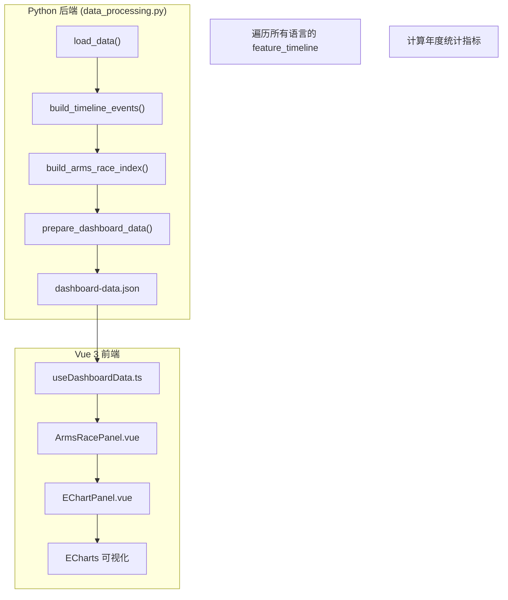
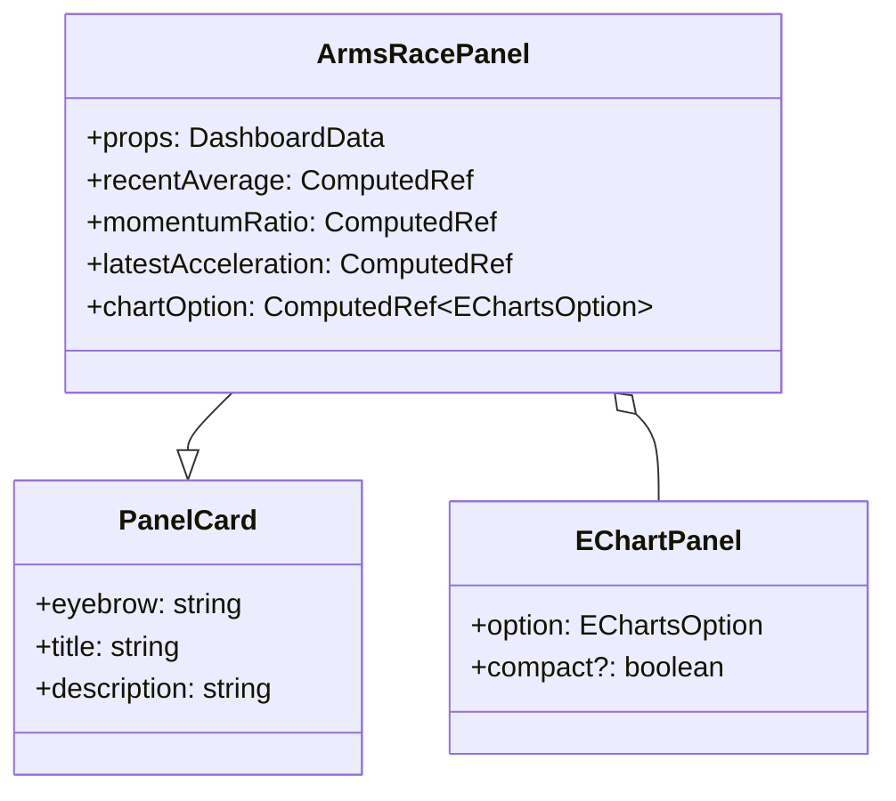
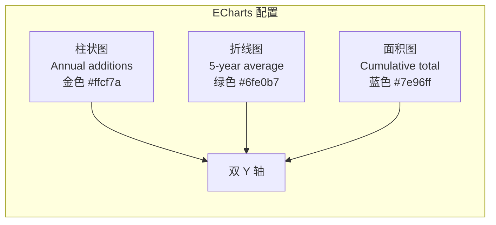
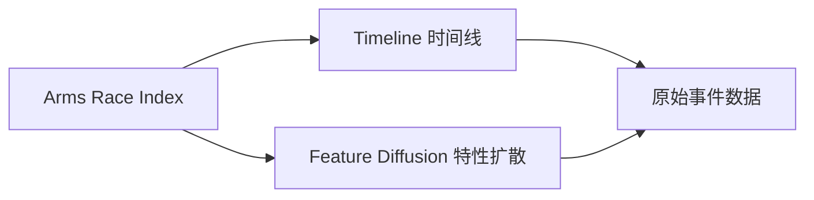

军备竞赛指数是一个用于可视化编程语言类型系统特性演进加速度的高级分析面板。它将所有语言的类型系统特性添加事件聚合为时间序列，通过年度增量、滑动均值和累积总量三个维度揭示类型系统特性的**采纳节奏**与**竞争态势**。

## 核心概念

本面板的设计理念源自冷战时期的军备竞赛隐喻：在类型系统领域，各编程语言持续投资于更强大的类型表达能力。从泛型到 GADTs，从依赖类型到-effects 系统，这些特性被视为语言间的"军备"投入。本面板通过量化这些投入的时间分布，帮助开发者理解类型系统演化的历史脉络与当前趋势。

Sources: [ArmsRacePanel.vue](frontend/src/components/panels/ArmsRacePanel.vue#L1-L148)

## 数据流架构



### 后端处理链路

**`build_timeline_events(data: dict)`** 函数从原始语言数据中提取所有特性时间线事件：

```python
def build_timeline_events(data: dict) -> list[dict]:
    labels = get_feature_labels(data)
    events = []
    for lang in data["languages"]:
        for feat, year in lang.get("feature_timeline", {}).items():
            events.append({
                "year": year,
                "language": lang["name"],
                "feature": feat,
                "feature_label": labels.get(feat, feat),
            })
    events.sort(key=lambda e: e["year"])
    return events
```

Sources: [data_processing.py#L130-L143](src/data_processing.py#L130-L143)

**`build_arms_race_index(data: dict)`** 函数将时间线事件转换为加速分析所需的多个统计序列：

| 指标 | 计算方法 | 用途 |
|------|----------|------|
| `years` | 从首事件年到末事件年的完整序列 | X 轴基础 |
| `yearly_counts` | 每年事件数计数 | 柱状图数据 |
| `cumulative_counts` | 前缀和累积 | 面积图数据 |
| `moving_average` | 5 年滑动窗口均值 | 平滑趋势线 |
| `acceleration` | 年度差分（一阶导数） | 动量分析 |

Sources: [data_processing.py#L146-L197](src/data_processing.py#L146-L197)

## 前端组件架构

### ArmsRacePanel.vue 组件结构



### 核心计算属性

**`recentAverage`** — 计算最近 5 年的年均添加量：

```typescript
const recentAverage = computed(() => {
  const counts = props.data.arms_race.yearly_counts
  const window = counts.slice(-5)
  if (!window.length) return 0
  return (window.reduce((sum, value) => sum + value, 0) / window.length).toFixed(2)
})
```

Sources: [ArmsRacePanel.vue#L12-L17](frontend/src/components/panels/ArmsRacePanel.vue#L12-L17)

**`momentumRatio`** — 计算近期与早期年均值的比率，反映演进动量：

```typescript
const momentumRatio = computed(() => {
  const counts = props.data.arms_race.yearly_counts
  if (!counts.length) return '0.0x'
  
  const splitIndex = Math.max(1, Math.floor(counts.length / 2))
  const early = counts.slice(0, splitIndex)
  const recent = counts.slice(-Math.min(5, counts.length))
  const earlyAverage = early.reduce((sum, value) => sum + value, 0) / early.length
  const recentAverageValue = recent.reduce((sum, value) => sum + value, 0) / recent.length
  
  if (earlyAverage <= 0) {
    return `${recentAverageValue.toFixed(1)}x`
  }
  return `${(recentAverageValue / earlyAverage).toFixed(1)}x`
})
```

Sources: [ArmsRacePanel.vue#L19-L33](frontend/src/components/panels/ArmsRacePanel.vue#L19-L33)

**`latestAcceleration`** — 获取最近一年的年度变化量：

```typescript
const latestAcceleration = computed(() => {
  const values = props.data.arms_race.acceleration
  return values.length ? values[values.length - 1] : 0
})
```

Sources: [ArmsRacePanel.vue#L35-L38](frontend/src/components/panels/ArmsRacePanel.vue#L35-L38)

## 数据类型定义

### ArmsRaceSeries 接口

```typescript
export interface ArmsRaceSeries {
  years: number[]           // 完整年份序列
  yearly_counts: number[]    // 每年事件计数
  cumulative_counts: number[]  // 累积总数
  moving_average: number[]  // 5 年滑动均值
  acceleration: number[]    // 年度加速度（差分）
  total_events: number      // 全部事件总数
  peak_year: number | null  // 峰值年份
  peak_count: number        // 峰值计数
}
```

Sources: [dashboard.ts#L8-L17](frontend/src/types/dashboard.ts#L8-L17)

### TimelineEvent 接口

```typescript
export interface TimelineEvent {
  year: number
  language: string
  feature: string
  feature_label: string
}
```

Sources: [dashboard.ts#L1-L6](frontend/src/types/dashboard.ts#L1-L6)

## 可视化设计

### 图表配置



面板采用**混合图表**设计，结合柱状图与折线图的优势：

- **柱状图（Annual additions）**：直观展示每年的特性添加数量，使用金色（`#ffcf7a`）填充，顶部圆角营造现代感
- **折线图（5-year average）**：使用 5 年滑动均值平滑短期波动，绿色（`#6fe0b7`）线条配合圆形标记点
- **面积折线图（Cumulative total）**：右侧 Y 轴显示累积总量，蓝色（`#7e96ff`）配合半透明填充

Sources: [ArmsRacePanel.vue#L40-L112](frontend/src/components/panels/ArmsRacePanel.vue#L40-L112)

### 统计卡片布局

```css
.mini-grid {
  display: grid;
  grid-template-columns: repeat(auto-fit, minmax(210px, 1fr));
  gap: 12px;
}
```

| 指标卡片 | 数据来源 | 说明 |
|----------|----------|------|
| Total feature arrivals | `arms_race.total_events` | 全时间跨度的事件总数 |
| Peak year | `arms_race.peak_year` | 添加量最高的年份 |
| 5-year average | `recentAverage` 计算属性 | 最近 5 年的年均值 |
| Momentum ratio | `momentumRatio` 计算属性 | 近期 vs 早期动量比 |

Sources: [ArmsRacePanel.vue#L122-L142](frontend/src/components/panels/ArmsRacePanel.vue#L122-L142)

## 使用场景

**类型系统演进研究**：通过观察峰值年份，可以识别出类型系统特性的"寒武纪大爆发"时期。例如，若某几年内大量语言同时引入模式匹配或泛型，则反映行业共识的形成。

**语言选型参考**：对于需要长期维护的项目，选择演进节奏稳定、特性持续投入的语言可能更具优势。

**学术研究方向**：军备竞赛指数的时间分布可作为 PL（编程语言）研究热点的代理指标。

## 与其他面板的关联



- **[Timeline 时间线](14-timeline-shi-jian-xian)**：提供原始的 `(语言, 特性, 年份)` 三元组事件流
- **[Feature Diffusion 特性扩散](17-feature-diffusion-te-xing-kuo-san)**：追踪单个特性的跨语言传播路径
- **[Feature Co-occurrence 特性共现](13-feature-co-occurrence-te-xing-gong-xian)**：分析特性间的相关性

Sources: [data_processing.py#L596-L598](src/data_processing.py#L596-L598)

## 延伸阅读

- [14个类型系统特性说明](22-14ge-lei-xing-xi-tong-te-xing-shuo-ming) — 了解面板追踪的具体特性定义
- [评分模型与标准](23-ping-fen-mo-xing-yu-biao-zhun) — 理解特性评分体系
- [Python 数据处理管道](4-python-shu-ju-chu-li-guan-dao) — 后端数据生成完整流程