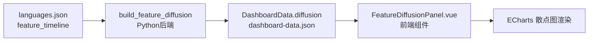

特性扩散（Feature Diffusion）面板是本仪表板中唯一一个采用**时间维度动画交互**的视图模块，它以时间线动画的形式追踪每种类型系统特性从起源语言向其他语言扩散的完整历史轨迹。通过选择不同的特性并控制播放进度，用户可以直观地观察到特定类型特性如何在编程语言生态中逐步传播。

## 架构设计

特性扩散模块采用前后端分离架构，数据流贯穿整个应用的数据处理管道。

### 数据管道架构



数据处理的核心逻辑位于 `src/data_processing.py` 中的 `build_feature_diffusion` 函数（第226-254行）。该函数遍历所有语言和特性，构建每个特性的采纳事件时间线，每个事件包含语言名称、年份、评分、范型、领域及领域分组信息。

Sources: [data_processing.py#L226-L254](src/data_processing.py#L226-L254)

### 前端组件结构

`FeatureDiffusionPanel.vue` 组件采用 Vue 3 Composition API 构建，核心职责包括：

- **状态管理**：通过 `ref` 管理选中特性（`selectedFeature`）和当前可见事件数量（`progress`）
- **动画控制**：使用 `@vueuse/core` 的 `useIntervalFn` 实现自动播放功能，间隔850毫秒
- **图表渲染**：通过计算属性 `chartOption` 生成 ECharts 配置，驱动散点图更新

Sources: [FeatureDiffusionPanel.vue#L1-L156](frontend/src/components/panels/FeatureDiffusionPanel.vue#L1-L156)

## 核心数据结构

### DiffusionEvent 接口定义

```typescript
interface DiffusionEvent {
  language: string      // 语言名称
  year: number          // 特性采纳年份
  score: number         // 特性实现评分 (0-5)
  paradigm: string      // 语言范型
  domain: string         // 详细领域分类
  domain_group: string   // 顶层领域分类
}
```

每个特性在 `diffusion.features` 中存储为 `DiffusionFeature` 对象，包含特性的人类可读标签和按年份排序的事件数组。

Sources: [dashboard.ts#L53-L65](frontend/src/types/dashboard.ts#L53-L65)

### DashboardData 中的嵌入结构

```typescript
interface DashboardData {
  // ...
  diffusion: {
    default_feature: string  // 默认选中特性，默认值为 "pattern_matching"
    features: Record<string, DiffusionFeature>
  }
}
```

该结构作为整体 Dashboard 数据的一部分，通过 `prepare_dashboard_data` 函数（第562-627行）统一构建并序列化为 `dashboard-data.json` 供前端消费。

Sources: [data_processing.py#L562-L627](src/data_processing.py#L562-L627)

## 交互机制

### 特性选择与重置

当用户切换下拉选择器时，组件执行 `onFeatureChange` 函数（Vue组件第26-29行）：先暂停动画，然后将进度重置为所选特性的最大事件数，使图表立即显示完整时间线。

Sources: [FeatureDiffusionPanel.vue#L26-L29](frontend/src/components/panels/FeatureDiffusionPanel.vue#L26-L29)

### 播放控制逻辑

组件提供两种播放模式：

| 操作 | 行为 | 触发条件 |
|------|------|----------|
| **播放 (Play)** | 重置进度为1，按850ms间隔逐步增加 | `progress < events.length` |
| **暂停 (Pause)** | 停止自动增加 | `isActive.value === true` |

当进度达到事件总数时，`useIntervalFn` 自动调用 `pause()` 停止计时器。

Sources: [FeatureDiffusionPanel.vue#L19-L38](frontend/src/components/panels/FeatureDiffusionPanel.vue#L19-L38)

### 滑块交互

进度滑块直接绑定 `v-model="progress"`（第143行），支持用户拖动到任意位置观察特定年份的采纳状态。这种交互允许精确定位到某个语言的特定版本发布时刻。

Sources: [FeatureDiffusionPanel.vue#L142-L149](frontend/src/components/panels/FeatureDiffusionPanel.vue#L142-L149)

## 可视化设计

### ECharts 图表配置

图表采用 **散点图 (Scatter)** + **涟漪散点图 (effectScatter)** 的复合模式：

```javascript
series: [
  {
    type: 'line',           // 沿时间轴的连接线
    data: visibleEvents,    // 当前可见事件
    symbolSize: 10,
    lineStyle: { color: '#7e96ff', width: 3 }
  },
  {
    type: 'effectScatter',  // 最新事件的涟漪特效
    data: [lastEvent],      // 最后一个可见事件
    symbolSize: 16,
    rippleEffect: { scale: 3, brushType: 'stroke' },
    itemStyle: { color: '#ff8aa1' }
  }
]
```

- **主线条**：蓝色 (`#7e96ff`)，宽度3px，展示历史采纳路径
- **涟漪特效**：粉色 (`#ff8aa1`)，标记最新可见事件，增强时间流动感

Sources: [FeatureDiffusionPanel.vue#L75-L95](frontend/src/components/panels/FeatureDiffusionPanel.vue#L75-L95)

### 迷你数据卡片

面板顶部的 `mini-grid` 布局展示三个关键指标：

| 指标 | 数据来源 | 说明 |
|------|----------|------|
| **Origin** | `events[0]` | 特性起源语言及年份 |
| **Coverage** | 可见/总数 | 当前显示的事件覆盖率 |
| **Domain spread** | `domain_group` 集合 | 已扩散到的领域分布 |

Sources: [FeatureDiffusionPanel.vue#L122-L135](frontend/src/components/panels/FeatureDiffusionPanel.vue#L122-L135)

## 数据示例：Pattern Matching 特性扩散

以 `pattern_matching`（默认选中的特性）为例，其扩散路径如下：

| 语言 | 年份 | 评分 | 领域分组 |
|------|------|------|----------|
| C++ | 1985 | 1 | Systems |
| Haskell | 1990 | 5 | Academic |
| OCaml | 1996 | 5 | Academic |
| Scala | 2004 | 5 | General |
| F# | 2005 | 5 | General |
| Clojure | 2007 | 1 | General |
| Nim | 2008 | 3 | Systems |
| Rust | 2010 | 5 | Systems programming |
| Kotlin | 2011 | 3 | Mobile |
| Elm | 2012 | 5 | Web frontend |
| TypeScript | 2012 | 2 | Web development |
| Swift | 2014 | 5 | Mobile |
| C# | 2017 | 4 | Enterprise |
| Gleam | 2019 | 5 | Web |
| Roc | 2020 | 5 | General |

此路径清晰展示了函数式语言的模式匹配特性如何从学术领域逐步渗透到系统编程、移动开发和Web开发领域。

## 样式系统

### 关键 CSS 类

| 类名 | 用途 | 样式规则 |
|------|------|----------|
| `.toolbar` | 进度控制工具栏 | flex布局，align-items: center |
| `.control` | 下拉选择器 | 边框1px，圆角12px，内边距10px 12px |
| `.ghost-button` | 播放/暂停按钮 | 透明背景，hover时阴影效果 |
| `.mini-card` | 指标卡片 | 渐变背景，圆角18px，内阴影 |

Sources: [style.css#L405-L491](frontend/src/style.css#L405-L491)

## 扩展方向

当前实现存在以下潜在增强点：

1. **筛选维度增强**：可增加按领域或范型筛选的功能，进一步细化扩散路径
2. **对比模式**：支持同时显示两个特性的扩散轨迹进行对照分析
3. **速度控制**：添加播放速度调节器，允许用户调整动画速率

---

**相关面板**：
- [Feature Matrix 特性矩阵](11-feature-matrix-te-xing-ju-zhen) — 查看特性在语言间的评分概览
- [Feature Co-occurrence 特性共现](13-feature-co-occurrence-te-xing-gong-xian) — 分析特性间的关联模式
- [Lineage Graph 谱系图](19-lineage-graph-pu-xi-tu) — 了解语言间的继承影响关系