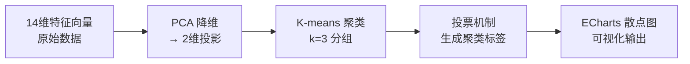

领域聚类面板通过 **K-means 聚类算法** 将编程语言按其类型系统特性向量分组，并使用 **PCA 降维** 将高维特征空间投影到二维平面进行可视化。这一过程揭示了语言设计中的隐藏亲和性——表面上来自不同范式或领域的语言，可能因类型系统复杂度相似而聚集在同一聚类中。

Sources: [DomainClustersPanel.vue](frontend/src/components/panels/DomainClustersPanel.vue#L1-L111)
Sources: [data_processing.py](src/data_processing.py#L461-L502)

## 核心算法架构

领域聚类的计算管线分为两个主要阶段：**PCA 降维** 和 **K-means 聚类**。



### 第一阶段：PCA 降维

原始数据包含每种语言的 14 个类型系统特性评分（0-5 分），构成一个 14 维向量空间。PCA（主成分分析）通过以下步骤将其压缩为 2 维：

1. **数据中心化**：计算每个维度的均值，将所有向量平移到原点
2. **协方差矩阵计算**：衡量各维度间的相关性
3. **幂迭代法求特征向量**：使用 `_power_iteration` 函数迭代计算前两个主成分方向
4. **降秩 deflation**：移除第一主成分后，再提取第二主成分
5. **投影**：将原始向量投影到这两个正交方向上

```python
# 从协方差矩阵提取前两个主成分
eigenvalue_1, eigenvector_1 = _power_iteration(covariance)
covariance_2 = _deflate(covariance, eigenvalue_1, eigenvector_1)
_, eigenvector_2 = _power_iteration(covariance_2)

# 投影到2D平面
projections = [
    (_dot(vector, eigenvector_1), _dot(vector, eigenvector_2))
    for vector in centered
]
```

Sources: [data_processing.py](src/data_processing.py#L384-L417)

### 第二阶段：K-means 聚类

在 PCA 投影后的 2 维空间上执行 K-means 聚类（k=3，最多 24 次迭代）：

```python
def _kmeans(points: list[list[float]], k: int = 3, iterations: int = 24):
    k = min(k, len(points))
    centroids = [point[:] for point in points[:k]]  # 初始化质心
    assignments = [0] * len(points)

    for _ in range(iterations):
        # E步骤：分配每个点到最近的质心
        for idx, point in enumerate(points):
            distances = [
                sum((value - centroid[dim]) ** 2 for dim, value in enumerate(point))
                for centroid in centroids
            ]
            cluster = min(range(k), key=lambda cluster_idx: distances[cluster_idx])
            assignments[idx] = cluster

        # M步骤：更新质心为簇内均值
        grouped: list[list[list[float]]] = [[] for _ in range(k)]
        for assignment, point in zip(assignments, points):
            grouped[assignment].append(point)

        new_centroids = []
        for cluster_idx, group in enumerate(grouped):
            if not group:
                new_centroids.append(centroids[cluster_idx])
                continue
            new_centroids.append([
                sum(point[dim] for point in group) / len(group)
                for dim in range(len(group[0]))
            ])
        centroids = new_centroids
```

Sources: [data_processing.py](src/data_processing.py#L420-L458)

## 数据结构设计

### Python 后端数据结构

```python
# 聚类结果结构
{
    "cluster_labels": {
        "0": "Cluster 1 / Systems programming-leaning",
        "1": "Cluster 2 / Academic-leaning",
        "2": "Cluster 3 / General-leaning"
    },
    "points": [
        {
            "name": "Rust",
            "x": 2.449,
            "y": -3.513,
            "cluster": 0,
            "cluster_label": "Cluster 1 / Systems programming-leaning",
            "domain": "Systems programming",
            "domain_group": "Systems programming",
            "paradigm": "Systems",
            "complexity": 32
        },
        # ... 其他语言
    ]
}
```

Sources: [data_processing.py](src/data_processing.py#L499-L502)
Sources: [dashboard-data.json](frontend/public/dashboard-data.json#L4950-L4965)

### TypeScript 前端类型定义

```typescript
export interface ClusterPoint {
  name: string
  x: number           // PCA 第一主成分坐标
  y: number           // PCA 第二主成分坐标
  cluster: number     // 聚类编号 (0, 1, 2)
  cluster_label: string
  domain: string      // 完整领域标签
  domain_group: string // 领域分组 (Systems/Web/Academic/General)
  paradigm: string    // 编程范式
  complexity: number  // 类型系统复杂度总分
}

export interface DashboardData {
  clusters: {
    cluster_labels: Record<string, string>
    points: ClusterPoint[]
  }
}
```

Sources: [dashboard.ts](frontend/src/types/dashboard.ts#L67-L140)

## 聚类标签生成算法

聚类标签并非简单编号，而是通过**投票机制**确定每个聚类的主导领域：

```python
# 统计每个聚类中各领域的语言数量
cluster_domain_votes: dict[int, dict[str, int]] = {}
for assignment, lang in zip(assignments, languages):
    cluster_domain_votes.setdefault(assignment, {})
    group = get_domain_group(lang["domain"])  # 提取顶层领域
    cluster_domain_votes[assignment][group] += 1

# 找出每个聚类中票数最多的领域
cluster_labels = {}
for assignment, votes in cluster_domain_votes.items():
    dominant_group = max(votes.items(), key=lambda item: item[1])[0]
    cluster_labels[assignment] = f"Cluster {assignment + 1} / {dominant_group}-leaning"
```

Sources: [data_processing.py](src/data_processing.py#L472-L481)

### 领域分组映射

```typescript
export const domainGroupColors: Record<string, string> = {
  Systems: '#ffcf7a',
  Web: '#7e96ff',
  Academic: '#6fe0b7',
  General: '#ff8aa1',
}

export const domainGroupSymbols: Record<string, string> = {
  Systems: 'diamond',
  Web: 'circle',
  Academic: 'triangle',
  General: 'rect',
}
```

Sources: [constants.ts](frontend/src/constants.ts#L12-L24)

## 前端可视化实现

DomainClustersPanel 使用 **ECharts 散点图** 渲染聚类结果：

```typescript
const chartOption = computed<EChartsOption>(() => {
  const clusters = [...new Set(props.data.clusters.points.map((point) => point.cluster))]
    .sort((a, b) => a - b)

  return {
    tooltip: {
      formatter: (params: any) =>
        `<b>${params.data.name}</b><br>${params.data.cluster_label}<br>${params.data.domain}<br>Complexity: ${params.data.value?.[2]}`,
    },
    legend: { bottom: 0, textStyle: { color: '#98a4c6' } },
    grid: { left: 62, right: 30, top: 24, bottom: 70 },
    xAxis: { type: 'value', name: 'Principal Component 1', ... },
    yAxis: { type: 'value', name: 'Principal Component 2', ... },
    series: clusters.map((cluster) => ({
      name: clusterLabels[String(cluster)] ?? `Cluster ${cluster + 1}`,
      type: 'scatter',
      data: props.data.clusters.points
        .filter((point) => point.cluster === cluster)
        .map((point) => ({
          value: [point.x, point.y, point.complexity],
          name: point.name,
          symbol: domainGroupSymbols[point.domain_group] ?? 'circle',
          symbolSize: Math.max(12, point.complexity / 2),
          itemStyle: { color: clusterPalette[cluster % clusterPalette.length] },
        })),
    })),
  }
})
```

Sources: [DomainClustersPanel.vue](frontend/src/components/panels/DomainClustersPanel.vue#L18-L66)

### 视觉编码规则

| 视觉属性 | 编码维度 | 映射规则 |
|---------|---------|---------|
| **X轴坐标** | PCA 第一主成分 | 特征向量的最大方差方向 |
| **Y轴坐标** | PCA 第二主成分 | 次大方差方向 |
| **散点颜色** | 聚类编号 | `clusterPalette` 三色循环 |
| **散点形状** | 领域分组 | Systems=diamond, Web=circle, Academic=triangle, General=rect |
| **散点大小** | 类型复杂度 | `Math.max(12, complexity / 2)` |

## 交互功能

### 标签显示切换

```typescript
const showLabels = ref(true)

const chartOption = computed<EChartsOption>(() => {
  // ...
  series: clusters.map((cluster) => ({
    label: {
      show: showLabels.value,
      formatter: (params: any) => params.data.name,
      position: 'top',
      color: '#c7d0ea',
      fontSize: 10,
    },
    // ...
  })),
})
```

```html
<button class="ghost-button" @click="showLabels = !showLabels">
  {{ showLabels ? 'Hide labels' : 'Show labels' }}
</button>
```

Sources: [DomainClustersPanel.vue](frontend/src/components/panels/DomainClustersPanel.vue#L13-L52-L76-L78)

### 聚类统计卡片

每个聚类显示其标签和语言数量：

```html
<div class="mini-grid">
  <div v-for="cluster in [0, 1, 2]" :key="cluster" class="mini-card">
    <strong>{{ clusterLabels[String(cluster)] }}</strong>
    <span>{{ data.clusters.points.filter((point) => point.cluster === cluster).length }} languages</span>
  </div>
</div>
```

### 领域图例

```html
<div class="legend-row">
  <span v-for="group in domainGroups" :key="group" class="legend-chip">
    <span
      style="width: 10px; height: 10px; border-radius: 999px; display: inline-block"
      :style="{ background: domainGroupColors[group] ?? '#98a4c6' }"
    />
    {{ group }}
  </span>
</div>
```

Sources: [DomainClustersPanel.vue](frontend/src/components/panels/DomainClustersPanel.vue#L82-L105)

## 面板描述解读

面板标题下的描述说明了算法本质：

> *"K-means groups languages by the full feature vector, then PCA compresses the space into a readable scatter plot."*

这一描述揭示了聚类的关键洞察：
- **K-means 分组依据**：完整的 14 维特征向量，而非单一特性
- **PCA 压缩目的**：将高维相似性关系投影到可读的二维散点图

这意味着地理位置接近的语言具有相似的整体类型系统轮廓，而非在某一特定特性上相似。

Sources: [DomainClustersPanel.vue](frontend/src/components/panels/DomainClustersPanel.vue#L72-L73)

## 与其他面板的关系

Domain Clusters 与仪表板中的其他分析面板形成互补关系：

| 面板 | 分析维度 | 与 Domain Clusters 的关系 |
|-----|---------|------------------------|
| [Similarity Network 相似性网络](16-similarity-network-xiang-si-xing-wang-luo) | 成对相似性边 | 网络是聚类的细粒度展开 |
| [Feature Co-occurrence 特性共现](13-feature-co-occurrence-te-xing-gong-xian) | 特性间相关性 | 解释为何某些语言聚集 |
| [Feature Diffusion 特性扩散](17-feature-diffusion-te-xing-kuo-san) | 特性跨领域传播 | 解释聚类形成的时序原因 |

## 下一步阅读

在理解领域聚类的原理后，建议继续探索以下内容：

- [PCA 降维与聚类算法详解](9-pca-jiang-wei-yu-ju-lei-suan-fa) — 更深入了解算法实现细节
- [Similarity Network 相似性网络](16-similarity-network-xiang-si-xing-wang-luo) — 查看聚类在网络图中的边连接关系
- [Feature Co-occurrence 特性共现](13-feature-co-occurrence-te-xing-gong-xian) — 理解哪些特性组合驱动语言聚集