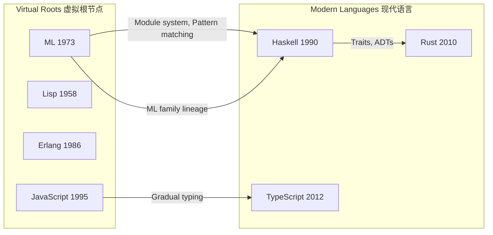
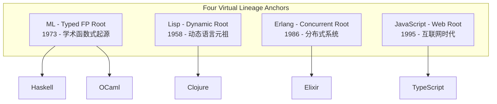
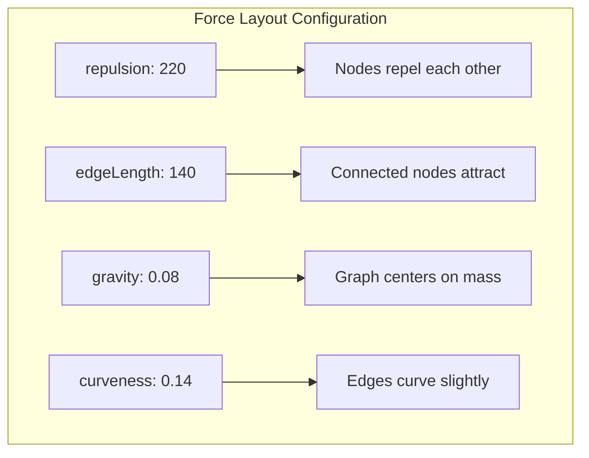
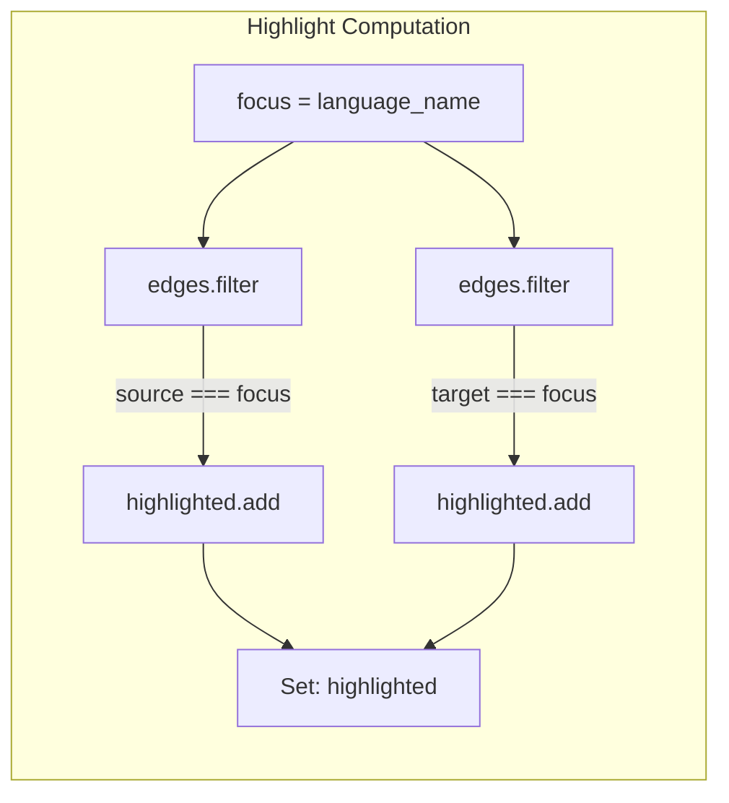
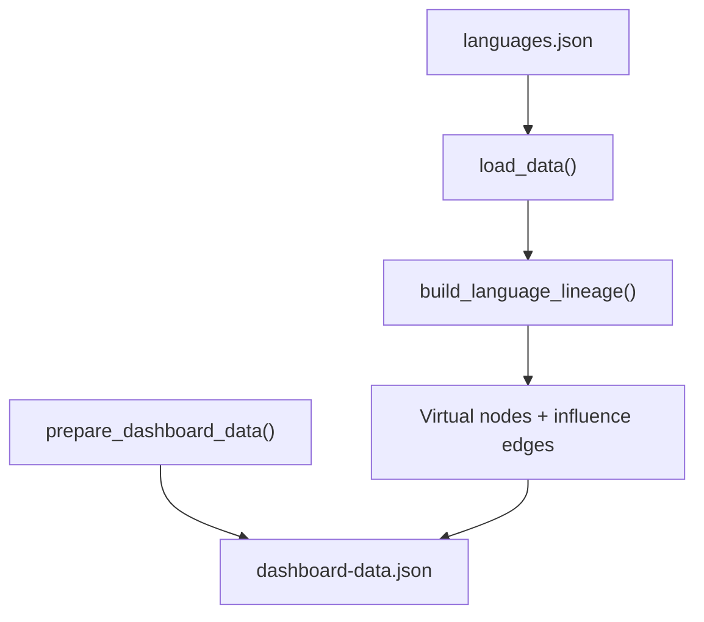

谱系图是一个**有向影响图**，用于追踪编程语言之间的设计思想演进路径。该面板以力导向图的形式可视化语言间的学术继承与工程借鉴关系，帮助开发者理解现代类型系统特性的历史根源。

Sources: [LineageGraphPanel.vue](frontend/src/components/panels/LineageGraphPanel.vue#L1-L129), [dashboard.ts](frontend/src/types/dashboard.ts#L71-L85)

## 核心数据模型

谱系图的数据结构由节点（nodes）和有向边（edges）组成，每个节点代表一门语言，每条边代表一次设计思想的影响传递。



**LineageNode 接口**定义了谱系图节点的完整属性结构：

| 属性 | 类型 | 说明 |
|------|------|------|
| `name` | string | 语言名称 |
| `year` | number | 首次发布年份 |
| `paradigm` | string | 编程范式（Functional/Systems/Multi-paradigm等） |
| `domain` | string | 应用领域 |
| `domain_group` | string | 领域分组（Academic/Systems/Web/General） |
| `complexity` | number | 类型系统复杂度评分（所有特性得分之和） |
| `virtual` | boolean | 是否为虚拟根节点 |

**LineageEdge 接口**定义了影响关系的结构：

| 属性 | 类型 | 说明 |
|------|------|------|
| `source` | string | 源头语言 |
| `target` | string | 目标语言 |
| `reason` | string | 影响的具体特性描述 |

Sources: [dashboard.ts](frontend/src/types/dashboard.ts#L71-L85), [data_processing.py](src/data_processing.py#L257-L346)

## 虚拟根节点机制

谱系图采用**虚拟根节点（Virtual Roots）**作为历史知识根源的锚定标记。这一设计解决了两个核心问题：早期语言（如1958年的Lisp）缺乏现代类型系统评分数据，但它们的设计理念深刻影响了后代语言。



虚拟节点具有以下特征：
- `virtual: true` 标记
- `complexity: 0`（不参与复杂度计算）
- 金色节点样式（`#ffcf7a`）区别于普通节点
- 固定节点大小 `symbolSize: 34`

Sources: [data_processing.py](src/data_processing.py#L259-L297), [LineageGraphPanel.vue](frontend/src/components/panels/LineageGraphPanel.vue#L55-L58)

## 影响链路图谱

系统定义了24条有向影响边，覆盖ML家族、C/C++家族、JVM生态、Web生态等主要语言演进脉络。

### 影响链路分类

| 家族 | 代表链路 | 影响特性 |
|------|----------|----------|
| **ML Family** | ML → Haskell, ML → OCaml | Hindley-Milner类型推断、模式匹配 |
| **FP on JVM** | Haskell → Scala, Java → Kotlin | 泛型、ADTs |
| **Systems Revival** | C → Rust, C++ → Rust | 零成本抽象、安全性 |
| **Web Typing** | JavaScript → TypeScript | 渐进类型、类型推断 |
| **BEAM Ecosystem** | Erlang → Elixir, Ruby → Elixir | 并发模型、开发者体验 |

关键影响链路示例：

```
ML (1973)
  ├── OCaml (1996) ─── Module system, Pattern matching
  │     ├── F# (2007) ── ML family on .NET
  │     └── Rust (2010) ─ Enums and pattern matching ergonomics
  └── Haskell (1990) ── Typed FP lineage, Hindley-Milner
        ├── PureScript (2013) ─ Type classes, HKT for web
        ├── Elm (2012) ─ Typed FP frontend simplification
        ├── Idris (2011) ─ Dependent type research lineage
        └── Rust (2010) ─ Traits, ADTs, expressive type design
```

Sources: [data_processing.py](src/data_processing.py#L299-L323)

## 力导向图可视化配置

谱系图采用 ECharts 的 `force` 力导向布局算法，通过物理模拟计算节点的稳定位置。



**核心可视化参数**：

| 参数 | 值 | 视觉效果 |
|------|-----|----------|
| `layout` | 'force' | 力导向物理模拟布局 |
| `roam` | true | 支持拖拽和缩放 |
| `draggable` | true | 节点可独立拖动 |
| `repulsion` | 220 | 节点间斥力强度 |
| `edgeLength` | 140 | 连线目标长度 |
| `gravity` | 0.08 | 图向中心吸引力 |
| `edgeSymbol` | ['none', 'arrow'] | 仅目标端显示箭头 |
| `curveness` | 0.14 | 边的弯曲程度 |

Sources: [LineageGraphPanel.vue](frontend/src/components/panels/LineageGraphPanel.vue#L39-L47)

## 焦点过滤交互

谱系图提供**语言焦点选择器**，支持聚焦特定语言并高亮其影响关系网络。

### 焦点模式工作原理



**焦点过滤逻辑**：
1. **全图模式**（`focus === '__all__'`）：所有节点和边正常显示，透明度均为 0.92
2. **聚焦模式**：仅显示与目标语言直接相连的节点和边，其他元素透明度降至 0.12-0.18

**焦点面板显示信息**：

| 区块 | 全图模式内容 | 聚焦模式内容 |
|------|--------------|--------------|
| Roots | 4个虚拟根节点数量 | 当前聚焦语言名称 |
| Influenced by | 24条总边数 | 入边源头语言列表 |
| Influenced | 交互提示文字 | 出边目标语言列表 |

Sources: [LineageGraphPanel.vue](frontend/src/components/panels/LineageGraphPanel.vue#L14-L33)

## 节点视觉编码

谱系图使用多维度视觉编码区分节点属性：

### 节点大小编码

```javascript
symbolSize: node.virtual 
    ? 34                                    // 虚拟节点固定大小
    : Math.max(20, Math.min(46, complexity)) // 复杂度映射到[20, 46]
```

### 颜色编码策略

| 属性 | 颜色 | 来源 |
|------|------|------|
| 虚拟根节点 | `#ffcf7a` (金色) | 固定值 |
| Functional | `#6fe0b7` (青绿) | paradigmColors |
| Multi-paradigm | `#7e96ff` (紫蓝) | paradigmColors |
| Systems | `#ffcf7a` (琥珀) | paradigmColors |
| Object-oriented | `#ff8aa1` (粉红) | paradigmColors |

**透明度映射**：
- 高亮节点/边：`opacity: 0.92`
- 非高亮节点/边：`opacity: 0.12 - 0.24`

Sources: [LineageGraphPanel.vue](frontend/src/components/panels/LineageGraphPanel.vue#L51-L63), [constants.ts](frontend/src/constants.ts#L1-L6)

## 数据管道集成

谱系图数据通过 `build_language_lineage()` 函数构建，作为 `prepare_dashboard_data()` 的核心组件之一。



**数据管道关键步骤**：
1. 从 `languages.json` 加载语言基础数据
2. 创建4个虚拟根节点（ML、Lisp、Erlang、JavaScript）
3. 定义24条硬编码影响边
4. 合并实际语言节点与虚拟节点
5. 过滤掉引用不存在语言的边
6. 输出 `lineage: { nodes: [], edges: [] }` 结构

Sources: [data_processing.py](src/data_processing.py#L257-L346), [data_processing.py](src/data_processing.py#L562-L627)

## 工具提示信息

鼠标悬停在节点或边上时显示详细信息：

**节点 Tooltip**：
```
{name}
{paradigm} / {domain}
Year: {year}
```
若为虚拟根节点，第二行显示 `Virtual lineage root`。

**边 Tooltip**：
```
{source} → {target}
{reason}
```
直接展示影响的具体特性和原因描述。

Sources: [LineageGraphPanel.vue](frontend/src/components/panels/LineageGraphPanel.vue#L36-L43)

## 与其他面板的关联

谱系图与其他分析面板形成互补视角：

| 面板 | 分析维度 | 与谱系图的互补关系 |
|------|----------|-------------------|
| [Similarity Network 相似性网络](16-similarity-network-xiang-si-xing-wang-luo) | 基于特征向量的相似度 | 相似性网络是**自动计算**的，谱系图是**人工整理**的 |
| [Feature Diffusion 特性扩散](17-feature-diffusion-te-xing-kuo-san) | 单特性的跨语言传播 | 扩散分析单个特性，谱系图展示**整体影响网络** |
| [Timeline 时间线](14-timeline-shi-jian-xian) | 特性出现的时间顺序 | 时间线是线性视图，谱系图是**网络视图** |
| [Domain Clusters 领域聚类](18-domain-clusters-ling-yu-ju-lei) | 基于PCA的聚类分组 | 聚类基于特征相似度，谱系图基于**设计影响** |