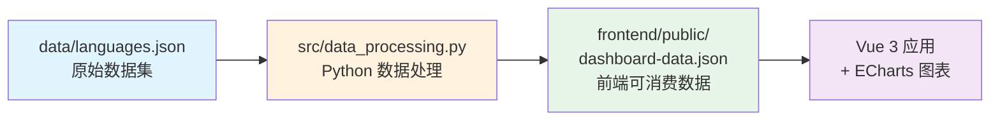

本指南将帮助你在本地环境快速运行编程语言类型系统知识图谱仪表板。只需三个简单步骤，即可启动完整的分析平台。

## 环境准备

在开始之前，请确保你的开发环境满足以下要求。推荐使用 Windows 11 或 macOS/Linux 操作系统。

| 工具 | 版本要求 | 安装说明 |
|------|----------|----------|
| Python | 3.11+ | [Python 官网](https://python.org) 下载安装包 |
| Node.js | 22+ | [Node.js 官网](https://nodejs.org) 下载 LTS 版本 |
| pnpm | 10+ | 运行 `npm install -g pnpm` 全局安装 |

_sources: [README.md](README.md#L44-L49), [pyproject.toml](pyproject.toml#L5-L5), [.python-version](.python-version#L1-L1)_

## 项目架构概览

在深入启动步骤之前，了解项目的整体架构有助于理解数据的流向和组件的协作方式。

### 技术栈组成

本项目采用前后端分离的架构设计：Python 层负责数据的处理和转换，Vue 3 层负责数据的可视化展示。



_sources: [README.md](README.md#L14-L18), [src/data_processing.py](src/data_processing.py#L1-L27)_

### 核心目录结构

```
lang-analysis/
├── main.py                 # 数据生成入口脚本
├── data/
│   └── languages.json      # 编程语言类型系统原始数据
├── src/
│   └── data_processing.py  # Python 数据转换模块
└── frontend/
    ├── public/
    │   └── dashboard-data.json  # 生成的前端数据文件
    ├── src/
    │   ├── App.vue          # Vue 应用主组件
    │   ├── composables/     # Vue 组合式函数
    │   ├── components/      # Vue 组件库
    │   └── types/           # TypeScript 类型定义
    └── package.json         # 前端依赖配置
```

_sources: [README.md](README.md#L88-L103)_

## 快速启动流程

以下三个步骤将带你完成项目的本地部署。每一步都有详细的命令说明和预期输出。

### 第一步：安装前端依赖

进入前端目录并安装项目依赖。pnpm 是本项目指定的包管理器，请确保使用它而非 npm 或 yarn。

```powershell
cd frontend
pnpm install
```

如果在安装过程中看到关于 `esbuild` 构建脚本被忽略的警告，请执行以下命令来解决：

```powershell
pnpm approve-builds
pnpm rebuild esbuild
```

_sources: [README.md](README.md#L52-L59), [frontend/package.json](frontend/package.json#L1-L27)_

### 第二步：生成数据文件

从项目根目录运行 Python 脚本，这会将原始数据转换为前端可用的 JSON 格式。

```powershell
python main.py
```

运行成功后会输出以下信息：

```text
Dashboard JSON generated: frontend\public\dashboard-data.json
Vue frontend data ready at frontend\public\dashboard-data.json.
Run `cd frontend && pnpm dev` for local development.
Run `cd frontend && pnpm build` for a production bundle.
```

_sources: [main.py](main.py#L45-L56)_

### 第三步：启动开发服务器

返回前端目录并启动 Vite 开发服务器：

```powershell
cd frontend
pnpm dev
```

Vite 启动后，默认会在 `http://localhost:5173` 打开浏览器窗口。你应该能看到完整的类型系统知识图谱仪表板。

_sources: [README.md](README.md#L61-L63), [frontend/vite.config.ts](frontend/vite.config.ts#L14-L15)_

## 一键启动命令

如果希望数据同步和开发服务器同时进行，可以使用项目预设的组合命令：

```powershell
cd frontend
pnpm run dev:sync
```

这个命令会先执行 `python ../main.py --json-output public/dashboard-data.json` 生成数据，然后自动启动 Vite 开发服务器。

_sources: [frontend/package.json](frontend/package.json#L8-L9)_

## 常用命令参考

| 命令 | 功能说明 |
|------|----------|
| `python main.py` | 生成标准数据文件 |
| `python main.py --json-output custom/path/dashboard-data.json` | 自定义输出路径 |
| `pnpm run check` | TypeScript 类型检查 |
| `pnpm run build` | 构建生产版本 |
| `pnpm run preview` | 预览生产构建结果 |

_sources: [README.md](README.md#L66-L78)_

## 数据加载流程

当你在浏览器中打开应用时，Vue 组件会通过组合式函数 `useDashboardData` 自动获取数据：

```typescript
// frontend/src/composables/useDashboardData.ts
const baseUrl = import.meta.env.BASE_URL
const dataUrl = `${baseUrl}dashboard-data.json`
const { data } = useFetch(dataUrl).get().json<DashboardData>()
```

数据文件通过 HTTP 请求从 `/dashboard-data.json` 路径加载，加载状态会显示在界面上。

_sources: [frontend/src/composables/useDashboardData.ts](frontend/src/composables/useDashboardData.ts#L1-L21)_

## 启动故障排查

### 常见问题与解决方案

如果遇到 `pnpm run build` 失败并提示 `spawn EPERM` 错误，这通常是 Windows 系统的执行策略问题，而非 Vue 代码错误。可以尝试以管理员身份运行终端或配置合适的执行策略。

_sources: [README.md](README.md#L114-L119)_

### 数据文件缺失

如果页面显示加载失败错误，请确保已运行 `python main.py` 生成数据文件。错误提示会明确告知需要执行的命令。

_sources: [frontend/src/App.vue](frontend/src/App.vue#L107-L109)_

## 下一步学习

完成快速启动后，建议按以下顺序深入学习项目：

| 学习路径 | 页面 | 内容概要 |
|----------|------|----------|
| 架构理解 | [项目概览](1-xiang-mu-gai-lan) | 项目设计理念与整体架构 |
| 数据管道 | [Python 数据处理管道](4-python-shu-ju-chu-li-guan-dao) | 数据转换模块详解 |
| 前端架构 | [Vue 3 前端组件架构](5-vue-3-qian-duan-zu-jian-jia-gou) | Vue 组件设计模式 |
| 类型定义 | [数据结构与类型定义](6-shu-ju-jie-gou-yu-lei-xing-ding-yi) | TypeScript 类型系统 |

如果你已经迫不及待想要体验仪表板功能，可以直接前往 [功能面板导航](10-gong-neng-mian-ban-dao-hang) 查看所有可视化面板的介绍。