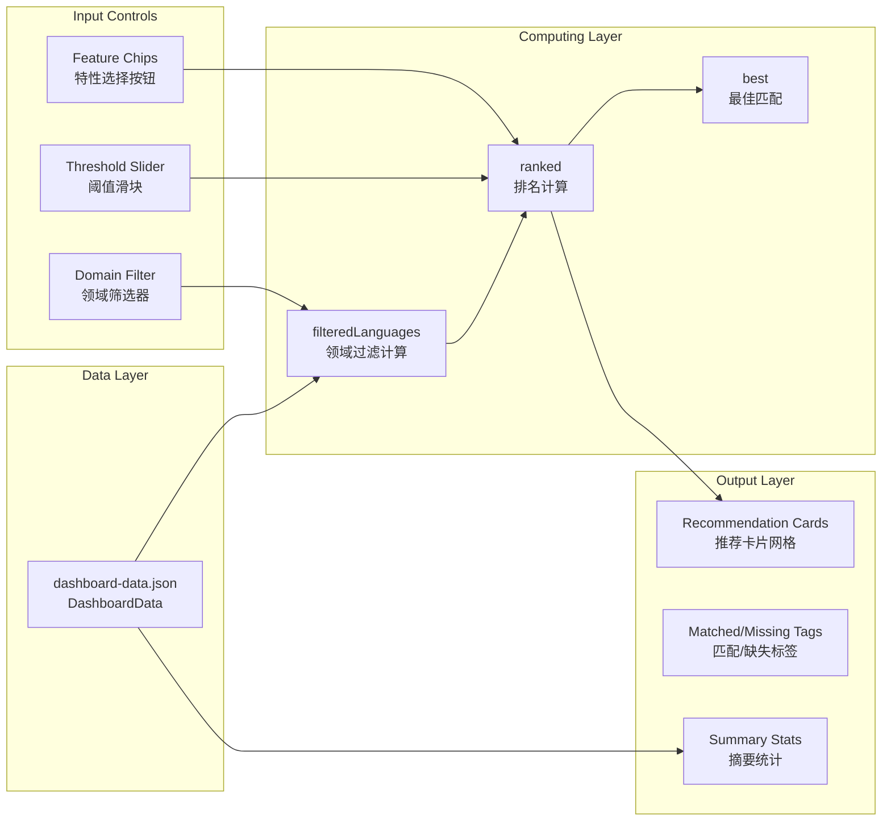
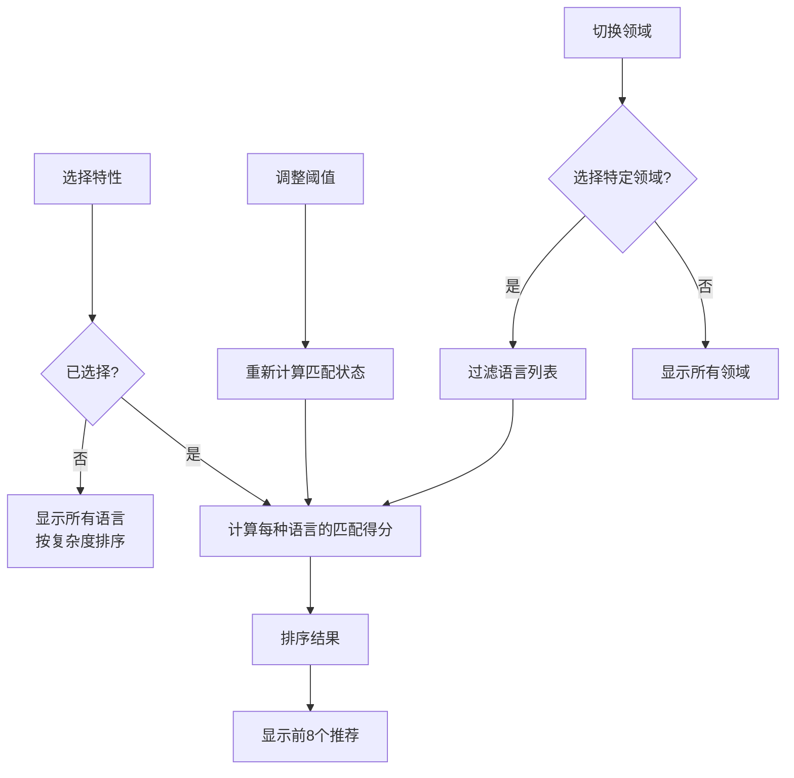

Feature Recommender（语言推荐器）是将类型系统数据集转化为交互式语言配置工具的核心面板。它允许开发者根据所需的类型系统特性反向搜索最匹配的语言，实现从"有哪些语言"到"我需要什么能力"的思维转换。

## 架构概览

该面板采用前端计算架构，所有推荐逻辑在浏览器中实时执行，无需服务器往返。推荐引擎直接消费预处理的 `DashboardData` JSON 数据，利用 Vue 3 的响应式计算属性实现流畅的交互体验。



## 核心数据结构

推荐引擎依赖 `DashboardData` 中的以下字段进行运算：

| 字段 | 类型 | 用途 |
|------|------|------|
| `heatmap` | `HeatmapLanguage[]` | 语言列表及其特性评分、复杂度 |
| `features` | `string[]` | 14个特性维度标识符 |
| `feature_short_labels` | `Record<string, string>` | 特性简称映射 |
| `feature_labels` | `Record<string, string>` | 特性完整名称映射 |

其中 `HeatmapLanguage` 接口定义如下：

```typescript
interface HeatmapLanguage {
  name: string           // 语言名称
  year: number           // 首次发布年份
  paradigm: string       // 编程范式
  domain: string         // 应用领域
  scores: number[]        // 各特性评分数组，与 features 索引对应
  complexity: number      // 类型系统复杂度总分
  rationale: Record<string, string>  // 各特性评分理由
}
```

Sources: [dashboard.ts](frontend/src/types/dashboard.ts#L14-L22)

## 推荐算法详解

### 评分公式

面板采用加权评分机制，综合考虑特性匹配程度与语言整体复杂度：

```typescript
score = matched.length × 12 
      + Σ(missing_features_scores) 
      + language.complexity / 10
```

其中各组成部分的语义为：

| 组成部分 | 计算方式 | 设计意图 |
|----------|----------|----------|
| **硬匹配得分** | `matched.length × 12` | 满足阈值的特性获得固定高分，体现刚性需求 |
| **软匹配得分** | `Σ(missing_scores)` | 未达标特性按实际评分累加，鼓励"接近"的选择 |
| **复杂度奖励** | `complexity / 10` | 轻微倾向于复杂度较高的语言 |

排序规则采用双层优先级：

1. **第一排序键**：`matched.length`（降序）— 优先保证满足最多刚性需求
2. **第二排序键**：`score`（降序）— 在满足需求数量相同时比较总分

Sources: [FeatureRecommenderPanel.vue](frontend/src/components/panels/FeatureRecommenderPanel.vue#L24-L45)

### 阈值机制

`threshold` 参数（默认值为3）定义了"硬匹配"的判断标准：

| 阈值 | 语义 | 适用场景 |
|------|------|----------|
| 1-2 | 宽松匹配 | 探索性探索，允许基本支持 |
| 3 | 中等（默认） | 平衡精确度与覆盖率 |
| 4-5 | 严格匹配 | 关键业务场景，需要成熟实现 |

用户可通过滑块实时调整阈值，界面即时响应推荐结果变化。

### 领域过滤

领域分组基于 `domain` 字段的第一级分类提取：

```typescript
const domainGroups = computed(() =>
  [...new Set(props.data.heatmap.map((language) => 
    language.domain.split(' / ')[0]
  ))].sort(),
)
```

可用的领域分组包括：Systems（系统）、Web（Web开发）、Academic（学术）、General（通用）。

Sources: [FeatureRecommenderPanel.vue](frontend/src/components/panels/FeatureRecommenderPanel.vue#L12-L21)

## 界面组件结构

### 控制区域（Actions Bar）

```
┌─────────────────────────────────────────────────────────────────────┐
│ Configure                    [Domain Filter ▼] [Min score ═══● 3] [Clear] │
└─────────────────────────────────────────────────────────────────────┘
```

控制区域包含三个交互元素：

1. **领域下拉框**：快速切换到特定领域分组，减少候选语言数量
2. **阈值滑块**：调整"达标"特性的最低评分要求
3. **清除按钮**：重置所有选择至初始状态

### 摘要卡片网格（Mini Grid）

```
┌────────────────────┐ ┌────────────────────┐ ┌────────────────────┐
│ Best match: Rust   │ │ Selected features  │ │ Visible slice      │
│ 4 of 4 selected    │ │ Generics, Ownership │ │ All domain groups  │
│ requirements meet  │ │ ADTs, Matching      │ │                    │
└────────────────────┘ └────────────────────┘ └────────────────────┘
```

三个微型卡片实时展示：
- **最佳匹配**：排名第一的语言及其满足率
- **已选特性**：以简称展示的当前选择
- **可见切片**：当前领域过滤状态

### 特性选择芯片（Feature Chips）

```
┌──────────┐ ┌──────────┐ ┌──────────┐ ┌──────────┐ ┌──────────┐
│ Generics │ │  Traits  │ │   ADTs   │ │ Matching │ │ Ownership│
│ Param Poly│ │ Ad-hoc   │ │ Sum+Prod │ │ Exhaust  │ │ Borrow   │
└──────────┘ └──────────┘ └──────────┘ └──────────┘ └──────────┘
```

14个特性按钮以网格布局展示，每个按钮包含：
- **简称**（粗体）：紧凑展示
- **完整名称**（小字）：hover 时可见

激活状态（`.active`）通过高亮背景与边框区分选中状态。

Sources: [style.css](frontend/src/style.css#L426-L445)

### 推荐卡片网格（Recommendation Grid）

```
┌─────────────────────────────────┐ ┌─────────────────────────────────┐
│ Rust                      4/4   │
│ 2010 / Systems / Systems       │
│ Score: 61.2 / Complexity: 28   │
│                                 │
│ ✓ Matches:                      │ ✗ Missing:                      │
│ [Generics] [Traits] [ADTs]     │ All requirements covered         │
│ [Matching] [Ownership]         │                                  │
└─────────────────────────────────┘ └─────────────────────────────────┘
```

每个推荐卡片展示：
- **语言基本信息**：名称、年份、范式、领域
- **满足率**：`matched.length / selectedFeatures.length`
- **推荐得分**与**总复杂度**
- **匹配特性标签**（绿色）：满足阈值的特性
- **缺失特性标签**（黄色）：未达标的特性

Sources: [FeatureRecommenderPanel.vue](frontend/src/components/panels/FeatureRecommenderPanel.vue#L98-L140)

## 交互流程



### 无选择状态

当用户尚未选择任何特性时，面板进入"被动浏览模式"：
- 显示所有语言按复杂度降序排列
- 满足率显示为 `0/1`（避免除零）
- 提示文字引导用户选择特性

Sources: [FeatureRecommenderPanel.vue](frontend/src/components/panels/FeatureRecommenderPanel.vue#L82-L86)

## 样式系统

### 色彩语义

| 语义 | CSS 变量 | 用途 |
|------|----------|------|
| 主色调 | `--accent: #7e96ff` | 强调元素、标签分类 |
| 匹配标签 | `--accent-3: #6fe0b7` | 已达标特性 |
| 缺失标签 | `--warning: #ffcf7a` | 未达标特性 |
| 背景 | `--bg: #0d1017` | 整体深色背景 |

### 推荐卡片样式

```css
.recommendation-card {
  padding: 18px;
  border: 1px solid var(--border);
  border-radius: var(--radius-lg);
  background: 
    linear-gradient(180deg, rgba(126, 150, 255, 0.05), transparent 46%),
    rgba(9, 13, 22, 0.5);
}
```

Sources: [style.css](frontend/src/style.css#L626-L635)

## 与其他面板的关系

| 关联面板 | 关系类型 | 数据共享 |
|----------|----------|----------|
| [Feature Matrix 特性矩阵](11-feature-matrix-te-xing-ju-zhen) | 数据上游 | 共享 `heatmap` 数据源 |
| [Similarity Network 相似性网络](16-similarity-network-xiang-si-xing-wang-luo) | 互补分析 | 推荐后可去网络查看语言邻域 |
| [Feature Co-occurrence 特性共现](13-feature-co-occurrence-te-xing-gong-xian) | 参考信息 | 选择前可查看特性共现规律 |
| [Lineage Graph 谱系图](19-lineage-graph-pu-xi-tu) | 延伸探索 | 确定语言后可追踪其谱系渊源 |

## 使用建议

**场景一：技术选型决策**
> "我需要一门支持泛型、ADTs和所有权的语言，且应用领域是系统编程。"

操作路径：选择 `Generics`、`ADTs`、`Ownership` → 设置领域为 `Systems` → 查看推荐结果

**场景二：渐进式迁移规划**
> "当前使用 Python，希望逐步引入类型系统。"

操作路径：选择 `Gradual typing` → 查看推荐列表 → 对比 `TypeScript` 与 `Pyright`

**场景三：学术研究探索**
> "寻找具有依赖类型且支持 effect system 的语言。"

操作路径：选择 `Dependent types`、`Effect system` → 降低阈值至2 → 查看学术导向语言

## 技术债务与扩展方向

当前实现的局限性：

1. **评分权重固定**：硬编码的 `×12` 乘数无法根据场景调整
2. **缺少权重自定义**：无法为不同特性分配不同重要性
3. **仅支持线性评分**：无法表达"必须具备"与"锦上添花"的层级关系

建议的扩展方向：
- 添加特性权重配置面板
- 支持复合条件（如"至少有X个以下特性"）
- 集成相似度计算，为推荐语言提供相似语言推荐

---

## 下一步

- 深入理解14种类型系统特性： [14个类型系统特性说明](22-14ge-lei-xing-xi-tong-te-xing-shuo-ming)
- 了解推荐背后的评分标准： [评分模型与标准](23-ping-fen-mo-xing-yu-biao-zhun)
- 探索相似语言发现： [Similarity Network 相似性网络](16-similarity-network-xiang-si-xing-wang-luo)