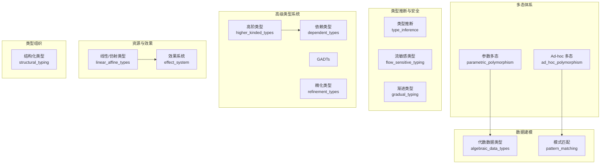
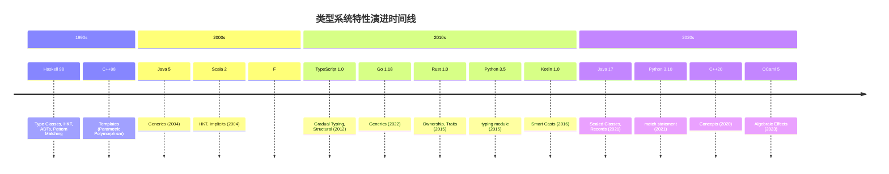

本页面系统性地解释类型系统中 14 个核心特性维度的定义、典型应用场景及代表语言实现。特性评分采用 0-5 分制，其中 0 表示完全不支持，5 表示该语言的最佳实践参考实现。完整评分标准与语言数据请参阅 [评分模型与标准](23-ping-fen-mo-xing-yu-biao-zhun)。

## 评分标准概览

| 分值 | 含义 | 描述 |
|------|------|------|
| **0** | 不支持 | 特性完全缺失，无官方或第三方实现 |
| **1** | 极简 | 非常有限的实现，仅通过非官方/第三方库支持 |
| **2** | 基础 | 特性存在但有明显限制 |
| **3** | 中等 | 可用，覆盖常见场景 |
| **4** | 强 | 良好的集成，有轻微差距 |
| **5** | 完整 | 最佳实践或参考级实现 |

Sources: [data/languages.json](data/languages.json#L5-L11)

## 特性分类体系

类型系统特性按功能划分为六大类别，便于从宏观视角理解各特性之间的关系：



Sources: [collect_type_system_data.py](collect_type_system_data.py#L58-L66)

---

## 一、多态体系

### 1.1 参数多态 (Parametric Polymorphism)

**定义**：允许编写对不同类型操作的通用代码，而无需在运行时进行类型检查。泛型是参数多态最常见的实现形式。

**核心特征**：
- 单态化（Monomorphization）：编译时为每种类型生成专用代码，如 C++、Rust
- 类型擦除（Type Erasure）：运行时泛型信息被擦除，如 Java、Kotlin
- 协变/逆变注解：控制泛型子类型关系

**代表语言评分**：

| 语言 | 评分 | 评分理由 |
|------|------|----------|
| **Idris** | 5 | 依赖类型自然包含参数多态 |
| **Haskell** | 5 | System F 基础上的完整实现 |
| **Rust** | 5 | 完整单态化泛型 + trait bounds + const generics |
| **Scala** | 5 | 完整泛型 + 方差注解 + context bounds |
| **C++** | 4 | Turing 完全的模板系统 |
| **Java** | 3 | 类型擦除限制运行时表现 |
| **Python** | 2 | 仅类型提示，无运行时强制 |

Sources: [data/languages.json](data/languages.json#L36-L38)

```rust
// Rust: 完整参数多态示例
fn largest<T: PartialOrd>(list: &[T]) -> &T {
    let mut largest = &list[0];
    for item in list {
        if item > largest {
            largest = item;
        }
    }
    largest
}
```

### 1.2 Ad-hoc 多态 (Ad-hoc Polymorphism)

**定义**：通过 trait、typeclass 或接口实现不同类型上的同名操作有不同行为。区别于参数多态的"统一处理"，Ad-hoc 多态在编译时确定具体调用哪个实现。

**典型机制**：
- Rust Traits
- Haskell Type Classes
- Java/Kotlin Interfaces
- Scala Implicits/Given

**代表语言评分**：

| 语言 | 评分 | 核心机制 |
|------|------|----------|
| **Haskell** | 5 | Type Classes（原始设计） |
| **Rust** | 5 | Traits + 关联类型 + supertraits |
| **Scala** | 5 | Implicits → Given-Using（Scala 3） |
| **Kotlin** | 3 | 接口 + 默认方法 + 扩展函数 |
| **Go** | 2 | 隐式接口（结构化） |

Sources: [data/languages.json](data/languages.json#L39-L41)

---

## 二、数据建模

### 2.1 代数数据类型 (Algebraic Data Types, ADTs)

**定义**：由**积类型**（Product Types，如结构体、元组）和**和类型**（Sum Types，如枚举变体）组成的复合数据类型。ADTs 是函数式语言的基石。

**设计模式**：
```haskell
-- Haskell: 经典 ADT 示例
data Maybe a = Nothing | Just a  -- 和类型
data Tree a = Leaf a | Node (Tree a) (Tree a)

-- Rust: 对等实现
enum Option<T> { None, Some(T) }
enum Tree<T> { Leaf(T), Node(Box<Tree<T>>, Box<Tree<T>>) }
```

**代表语言评分**：

| 语言 | 评分 | 实现方式 |
|------|------|----------|
| **Haskell** | 5 | 原始设计，canonical 定义 |
| **Rust** | 5 | `enum` 带数据是参考实现 |
| **Scala** | 5 | `sealed trait + case class` / `enum`（Scala 3） |
| **Swift** | 5 | `enum` 带关联值 |
| **Kotlin** | 3 | `sealed classes`，不如 Rust  ergonomic |
| **Java** | 3 | `sealed classes + records`（JDK 17+） |
| **C++** | 2 | `std::variant`，语法繁琐 |

Sources: [data/languages.json](data/languages.json#L42-L44)

### 2.2 模式匹配 (Pattern Matching)

**定义**：基于数据结构形状进行条件分支的机制，通常要求穷尽性检查（Exhaustiveness Checking）。

**核心能力**：
- 穷尽性检查：编译器确保所有情况被处理
- 嵌套模式：解构深层结构
- 守卫表达式（Guards）：添加额外条件
- 提取器（Extractors）：自定义解构逻辑

**代表语言评分**：

| 语言 | 评分 | 特色功能 |
|------|------|----------|
| **Haskell** | 5 | 穷尽、嵌套、as-patterns、view patterns |
| **OCaml** | 5 | 参考实现，or-patterns |
| **Rust** | 5 | 穷尽 + 守卫 + 嵌套 match |
| **Scala** | 5 | 穷尽 match + extractors + 守卫 |
| **Swift** | 5 | exhaustive switch + where clauses |
| **Python** | 2 | 3.10 match，无穷尽性强制 |
| **C++** | 1 | 仅 structured bindings，无 match |

Sources: [data/languages.json](data/languages.json#L45-L47)

---

## 三、类型推断与安全

### 3.1 类型推断 (Type Inference)

**定义**：编译器自动推导变量和表达式的类型，减少显式类型注解。Hindley-Milner 系统是该领域的基础理论。

**推断范围**：
- 局部推断：仅限单行/单表达式
- 全局推断：函数返回类型自动推导
- 双向推断：参数和返回值相互推导

**代表语言评分**：

| 语言 | 评分 | Hindley-Milner | 推断范围 |
|------|------|-----------------|----------|
| **Haskell** | 5 | 完整 DM (Damas-Milner) | 全局 |
| **OCaml** | 5 | 完整 HM | 全局 |
| **Rust** | 4 | 局部（函数签名需注解） | 局部 |
| **Scala** | 4 | 良好局部推断 | 局部 |
| **TypeScript** | 4 | 上下文推断 + 控制流 | 中等 |
| **Java** | 2 | `var` 仅限局部变量 | 局部 |
| **Go** | 2 | `:=` 仅局部 | 局部 |

Sources: [data/languages.json](data/languages.json#L48-L50)

### 3.2 流敏感类型 (Flow-Sensitive Typing)

**定义**：基于控制流分析自动收窄类型范围，也称**类型收窄**（Type Narrowing）或**智能转换**（Smart Casts）。

**常见场景**：
```typescript
// TypeScript: 类型收窄示例
function process(value: string | null) {
    if (value !== null) {
        // TypeScript 自动收窄为 string
        console.log(value.toUpperCase()); // OK
    }
}
```

**代表语言评分**：

| 语言 | 评分 | 实现机制 |
|------|------|----------|
| **TypeScript** | 5 | 最佳实践：typeof/instanceof/断言函数 |
| **Kotlin** | 5 | Smart casts 是最佳实现之一 |
| **Swift** | 3 | `if let`/`guard let` 需显式绑定 |
| **Rust** | 2 | `if-let`/`while-let` 有限收窄 |
| **Java** | 2 | instanceof 模式匹配（Java 16+） |

Sources: [data/languages.json](data/languages.json#L51-L53)

### 3.3 渐进类型 (Gradual Typing)

**定义**：在同一代码库中混合静态类型和动态类型，支持逐步迁移已有项目。

**设计维度**：
- `any`/`Object` 逃逸孔（Escape Hatch）
- 类型标注可选
- 运行时类型检查

**代表语言评分**：

| 语言 | 评分 | 类型系统 |
|------|------|----------|
| **TypeScript** | 5 | 专为渐进迁移设计 |
| **Python** | 4 | PEP 484 + mypy/pyright |
| **Hack** | 4 | PHP 渐进类型化版本 |
| **Dart** | 3 | 强类型但 `dynamic` 存在 |

Sources: [data/languages.json](data/languages.json#L54-L56)

---

## 四、高级类型系统

### 4.1 高阶类型 (Higher-Kinded Types, HKT)

**定义**：类型构造器本身可以作为参数或返回值，即"类型构造函数上的多态"。例如 `Functor f` 中的 `f` 是 HKT。

```haskell
-- Haskell: HKT 允许这样写
class Functor f where
    fmap :: (a -> b) -> f a -> f b
-- f 是类型构造器，不是具体类型

-- TypeScript: 无 HKT，只能这样
interface Functor<F> {
    map: <A, B>(fn: (a: A) => B) => F<B>  // F 被"绑定"，无法抽象
}
```

**代表语言评分**：

| 语言 | 评分 | 说明 |
|------|------|------|
| **Haskell** | 5 | 第一-class HKT，Functor/Monad 依赖此特性 |
| **Scala** | 5 | 第一-class HKT + type lambdas（Scala 3） |
| **OCaml** | 3 | 函子（模块级）提供 HKT |
| **Rust** | 1 | GATs（Generic Associated Types）部分解决 |

Sources: [data/languages.json](data/languages.json#L57-L59)

### 4.2 依赖类型 (Dependent Types)

**定义**：类型可以依赖于值，实现 Compile-Time 计算和更强的类型安全。例如 `Vector<3, Int>` 表示长度为 3 的整数向量。

**能力层级**：
1. 非类型模板参数（C++）
2. 路径依赖类型（Scala）
3. 单一家族类型（Idris/Singletons）
4. 完整 Π/Σ 类型（Idris、Agda）

**代表语言评分**：

| 语言 | 评分 | 能力范围 |
|------|------|----------|
| **Idris** | 5 | 完整依赖类型，定义性语言 |
| **Agda** | 5 | 完整依赖类型，构造主义 |
| **Coq/Lean** | 5 | 证明助手，依赖类型 |
| **Zig** | 3 | `comptime` 提供值依赖类型 |
| **Scala** | 3 | 路径依赖 + match types |

Sources: [data/languages.json](data/languages.json#L60-L62)

### 4.3 广义代数数据类型 (GADTs)

**定义**： GADTs 允许构造器返回不同的类型实例，是 ADTs 的扩展。常用语实现嵌入式 DSLs 和类型安全的 interpreters。

```haskell
-- Haskell: GADT 示例
data Expr a where
    LitInt  :: Int  -> Expr Int
    LitBool :: Bool -> Expr Bool
    If      :: Expr Bool -> Expr a -> Expr a -> Expr a

-- eval 类型安全保证 Int 表达式返回 Int
eval :: Expr a -> a
eval (LitInt n)  = n
eval (LitBool b) = b
eval (If cond thn els) = if eval cond then eval thn else eval els
```

**代表语言评分**：

| 语言 | 评分 | 支持情况 |
|------|------|----------|
| **Haskell** | 5 | GHC 扩展完全支持 |
| **OCaml** | 5 | OCaml 4.00+ 完全支持 |
| **Rust** | 0 | 无原生 GADT（RFC 尚未合并） |
| **Scala** | 3 | 通过 sealed hierarchies 实现 |

Sources: [data/languages.json](data/languages.json#L63-L65)

### 4.4 精化类型 (Refinement Types)

**定义**：通过谓词约束在现有类型上添加额外条件。例如 `{x: Int | x > 0}` 表示正整数。

**实现路径**：
- 内置：LiquidHaskell、F* 
- 库级：Diamond Types（Rust）
- 受限：TypeScript branded types

**代表语言评分**：

| 语言 | 评分 | 实现方式 |
|------|------|----------|
| **Idris** | 5 | 依赖类型完全包含精化类型 |
| **Agda** | 5 | 依赖类型完全包含 |
| **Haskell** | 2 | LiquidHaskell 提供外部工具 |
| **TypeScript** | 1 | 字面量类型 + branded types 受限 |

Sources: [data/languages.json](data/languages.json#L66-L68)

---

## 五、资源与效果

### 5.1 线性/仿射类型 (Linear/Affine Types)

**定义**：资源只能被使用一次（线性）或最多一次（仿射）。Rust 的所有权/借用系统是该特性的最佳实践。

**核心语义**：
- **线性**：值必须被消费或转移
- **仿射**：值最多被使用一次
- **借用**：临时共享访问

```rust
// Rust: 所有权转移
let s1 = String::from("hello");
let s2 = s1;  // s1 被移动，无法再使用
// println!("{}", s1);  // 编译错误

// Rust: 借用
let s1 = String::from("hello");
let len = calculate_length(&s1);  // 只借用，不转移
println!("{} 的长度是 {}", s1, len);  // s1 仍可用
```

**代表语言评分**：

| 语言 | 评分 | 实现机制 |
|------|------|----------|
| **Rust** | 5 | 定义性实现：ownership + borrowing |
| **Swift** | 2 | `~Copyable`、consuming/borrowing（5.9+） |
| **C++** | 2 | RAII + move semantics，无借用检查 |
| **Idris** | 1 | QTT（Quantitative Type Theory） |

Sources: [data/languages.json](data/languages.json#L69-L71)

### 5.2 效果系统 (Effect Systems)

**定义**：在类型层面追踪计算效果（如 IO、异常、状态变更）。可实现无栈（algebraic）效果处理器。

**效果类型化方式**：
- `IO` Monad（Haskell）
- Algebraic Effect Handlers（Idris 2、OCaml 5）
- 检查异常（Java checked exceptions）

**代表语言评分**：

| 语言 | 评分 | 实现方式 |
|------|------|----------|
| **Idris** | 5 | 代数效果处理器内置（Idris 2） |
| **OCaml** | 4 | OCaml 5 multicore algebraic effects |
| **Haskell** | 3 | IO Monad + monadic effects（非原生 handlers） |
| **Rust** | 0 | 无内置 effect system |
| **Java** | 0 | checked exceptions 算部分实现 |

Sources: [data/languages.json](data/languages.json#L72-L74)

---

## 六、类型组织

### 6.1 结构化类型 (Structural Typing)

**定义**：类型兼容性基于结构（字段和方法），而非名称（Nominal typing）。Go 和 TypeScript 是典型代表。

**对比**：

| 类型系统 | 兼容性依据 | 代表语言 |
|----------|------------|----------|
| **结构化** | 字段匹配 | Go、TypeScript、Python |
| **名义** | 显式声明 | Java、C#、Rust |
| **鸭子类型** | 运行时行为 | Python（运行时）、Go（编译时） |

**代表语言评分**：

| 语言 | 评分 | 说明 |
|------|------|------|
| **TypeScript** | 5 | 核心设计原则 |
| **Go** | 5 | 接口隐式实现 |
| **Python** | 3 | Protocol（PEP 544）提供静态结构化类型 |
| **OCaml** | 3 | 多态变体 + 行多态 |

Sources: [data/languages.json](data/languages.json#L75-L77)

---

## 特性综合对比表

下表展示 14 个特性在主要语言中的评分分布（0-5 分）：

| 特性 | Rust | Haskell | TypeScript | Scala | Go | Python | Java | Swift |
|------|------|---------|------------|-------||-----|--------|------|-------|
| 参数多态 | 5 | 5 | 4 | 5 | 3 | 2 | 3 | 4 |
| Ad-hoc 多态 | 5 | 5 | 2 | 5 | 2 | 2 | 2 | 4 |
| 代数数据类型 | 5 | 5 | 3 | 5 | 0 | 2 | 3 | 5 |
| 模式匹配 | 5 | 5 | 2 | 5 | 0 | 2 | 3 | 5 |
| 类型推断 | 4 | 5 | 4 | 4 | 2 | 2 | 2 | 4 |
| 流敏感类型 | 2 | 0 | 5 | 1 | 0 | 2 | 2 | 3 |
| 渐进类型 | 0 | 0 | 5 | 0 | 0 | 4 | 0 | 0 |
| 高阶类型 | 1 | 5 | 1 | 5 | 0 | 0 | 0 | 0 |
| 依赖类型 | 0 | 3 | 0 | 3 | 0 | 0 | 0 | 0 |
| GADTs | 0 | 5 | 0 | 3 | 0 | 0 | 0 | 0 |
| 精化类型 | 0 | 2 | 1 | 2 | 0 | 0 | 0 | 0 |
| 线性/仿射类型 | 5 | 1 | 0 | 0 | 0 | 0 | 0 | 2 |
| 效果系统 | 0 | 3 | 0 | 2 | 0 | 0 | 0 | 0 |
| 结构化类型 | 0 | 0 | 5 | 3 | 5 | 3 | 0 | 0 |

Sources: [data/languages.json](data/languages.json#L30-L600)

---

## 特性引入时间线

了解各语言何时引入关键特性有助于理解类型系统演进脉络：



Sources: [feature_timeline.csv](feature_timeline.csv#L1-L50)

---

## 下一步学习路径

| 兴趣方向 | 推荐页面 |
|----------|----------|
| 深入理解评分方法 | [评分模型与标准](23-ping-fen-mo-xing-yu-biao-zhun) |
| 可视化特性对比 | [Radar 雷达图对比](12-radar-lei-da-tu-dui-bi) |
| 特性共现分析 | [Feature Co-occurrence 特性共现](13-feature-co-occurrence-te-xing-gong-xian) |
| 特性时间演进 | [Timeline 时间线](14-timeline-shi-jian-xian) |