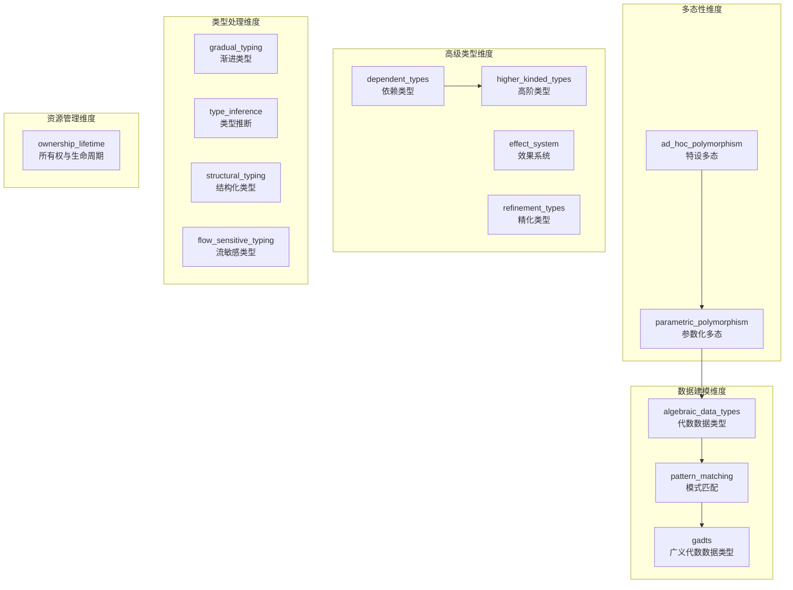

本页面详细阐述类型系统知识图谱项目中用于评估编程语言类型系统特性的评分体系。该模型定义了 14 个核心类型系统维度的量化标准，采用 0-5 分制对每种语言的每个特性进行标准化评分，并基于这些分数计算语言的类型系统复杂度、相似度矩阵及其他分析指标。

## 评分量表定义

评分系统采用 **0-5 的整数评分制**，其中每个分数对应一个明确的能力级别定义。这种离散的评分设计既保证了评估的可操作性，又保留了足够细粒度以区分不同语言在特性实现质量上的差异。

### 评分等级对照表

| 分值 | 等级名称 | 能力描述 | 典型场景 |
|:---:|:---|:---|:---|
| 0 | 不支持 | 特性完全缺失，无官方或第三方实现 | C 语言的泛型支持 |
| 1 | 最小化 | 非常有限的实现，或仅通过非官方/第三方库获得 | Zig 的特性和接口系统 |
| 2 | 基础级 | 特性存在但存在显著限制 | C++17 的 `std::variant` |
| 3 | 中等级 | 覆盖常见用例的可用品质实现 | Kotlin 的密封类与模式匹配 |
| 4 | 强级别 | 特性集成良好，仅有少量缺口 | TypeScript 的参数化多态 |
| 5 | 完整级 | 最佳实践或参考级实现 | Rust 的所有权与生命周期系统 |

该评分量表定义于 `data/languages.json` 的 metadata.scoring 字段中，并通过 `src/data_processing.py` 的 `get_scoring_scale()` 函数提取供前端使用。前端组件 `FeatureMatrixPanel.vue` 将此评分标准展示为工具栏中的 pill 标签，便于用户在查看特性矩阵时随时参照。

Sources: [data/languages.json](data/languages.json#L1-L15)
Sources: [src/data_processing.py](src/data_processing.py#L35-L44)

## 14 个类型系统特性维度

项目定义了 14 个核心类型系统特性作为评估维度，每个维度都经过精心选择以覆盖现代编程语言类型系统的重要方面。

### 特性维度详情



**参数化多态 (parametric_polymorphism)** 衡量语言通过泛型/模板机制实现类型无关代码复用的能力。Rust 的 `monomorphized generics` 和 Haskell 的 System F 都被评为 5 分，而动态类型语言如 Ruby 则为 0 分。

**特设多态 (ad_hoc_polymorphism)** 评估语言支持接口抽象、trait 系统或类型类的能力。Rust trait 系统、Haskell typeclass 被评为参考级实现（5 分），而 Java 的接口机制被评为中等级（2 分）。

**所有权与生命周期 (ownership_lifetime)** 是最具区分度的维度之一，目前仅有 Rust（5 分）、Zig（3 分）和 Nim（2 分）等少数语言具有编译器强制的内存安全机制。

Sources: [data/languages.json](data/languages.json#L14-L27)
Sources: [src/data_processing.py](src/data_processing.py#L17-L33)

## 复杂度评分计算

### 单语言复杂度计算

语言的类型系统复杂度评分是其在 14 个特性维度上得分的总和。这一指标反映了语言的类型系统总体"深度"，但需注意其局限性：未考虑特性间的相互依赖关系和实际使用频率。

```python
def compute_type_complexity_score(lang: dict) -> int:
    """Sum of all feature scores as a rough complexity metric."""
    return sum(lang["features"].values())
```

该函数位于 `src/data_processing.py`，由 `prepare_dashboard_data()` 调用，用于为热力图、网络图和聚类分析提供统一的复杂度数值。在前端 `FeatureMatrixPanel.vue` 中，复杂度分数以 "Total Complexity" 列展示，并附带其占最大可能分数的百分比。

```typescript
// 前端复杂度计算示例
const complexity = language.scores.reduce((sum, s) => sum + s, 0)
const percentage = (complexity / data.max_score).toFixed(2)
```

### 最大可能分数

系统的最大理论分数由特性数量乘以最高单特性得分决定：

```python
def max_possible_score(data: dict) -> int:
    """Maximum possible complexity score (num_features * max_score)."""
    num_features = len(get_feature_names(data))
    max_score = max(int(k) for k in data["metadata"]["scoring"].keys())
    return num_features * max_score  # 14 * 5 = 70
```

由于当前配置 14 个特性 × 最高 5 分，理论最大复杂度为 **70 分**。典型语言的复杂度分布呈现双峰特征：学术语言（Idris、Haskell）和 Rust 等现代系统语言位于高端，而动态语言和经典语言位于低端。

Sources: [src/data_processing.py](src/data_processing.py#L96-L102)
Sources: [frontend/src/components/panels/FeatureMatrixPanel.vue](frontend/src/components/panels/FeatureMatrixPanel.vue#L80-L82)

## 评分理由文档化

每种语言的每个特性评分都附带了详细的评分理由说明，这些理由存储在 `data/languages.json` 的 `scoring_rationale` 字段中。这一设计使得评分过程透明可查，便于社区审查和持续改进。

### 评分理由结构示例

```json
{
  "name": "Rust",
  "features": {
    "parametric_polymorphism": 5,
    "ownership_lifetime": 5,
    "type_inference": 4
  },
  "scoring_rationale": {
    "parametric_polymorphism": "Full monomorphized generics with trait bounds, where clauses, const generics",
    "ownership_lifetime": "Defines the category — borrow checker, lifetimes, move semantics",
    "type_inference": "Strong local inference (Hindley-Milner inspired) but requires annotations on fn signatures"
  }
}
```

前端通过悬停交互展示这些理由：当用户将鼠标悬停在热力图的单元格上时，`FeatureMatrixPanel.vue` 的 `showTooltip()` 函数会读取对应语言和特性的评分理由并显示在浮动卡片中。这种设计将密集的数据表格与详细的评分说明解耦，保持界面的可读性。

Sources: [data/languages.json](data/languages.json#L28-L62)
Sources: [frontend/src/components/panels/FeatureMatrixPanel.vue](frontend/src/components/panels/FeatureMatrixPanel.vue#L38-L48)

## 基于评分的分析指标

### 余弦相似度计算

评分向量被广泛用于计算语言间的相似度关系。系统采用**余弦相似度**作为主要相似度度量，其数学定义为两个评分向量点积除以各自模长的乘积：

```python
def cosine_similarity(a: list[int], b: list[int]) -> float:
    """Compute cosine similarity between two vectors."""
    dot = sum(x * y for x, y in zip(a, b))
    mag_a = math.sqrt(sum(x * x for x in a))
    mag_b = math.sqrt(sum(x * x for x in b))
    if mag_a == 0 or mag_b == 0:
        return 0.0
    return dot / (mag_a * mag_b)
```

该函数用于生成相似性网络图（`compute_similarity_edges()`）和相似度矩阵（`compute_similarity_matrix()`）。默认相似度阈值为 0.65，高于此值的语言对会在网络图中显示连接边。

```python
def compute_similarity_edges(data: dict, threshold: float = 0.6) -> list[dict]:
    """Compute similarity edges for the network graph."""
    # ...
    if sim >= threshold:
        edges.append({
            "source": name_a,
            "target": name_b,
            "similarity": round(sim, 4),
        })
```

Sources: [src/data_processing.py](src/data_processing.py#L57-L68)
Sources: [src/data_processing.py](src/data_processing.py#L75-L91)

### 皮尔逊相关系数

对于特性共现分析，系统使用皮尔逊相关系数衡量两个特性在语言集合中共同出现的趋势：

```python
def pearson_correlation(a: list[float], b: list[float]) -> float:
    """Compute Pearson correlation between two equal-length vectors."""
    # 计算中心化向量和相关系数
```

相关系数接近 1 表示两个特性倾向于同时出现（如 GADTs 和模式匹配），接近 -1 表示互斥，接近 0 表示无明显关联。这一分析通过 `build_feature_cooccurrence()` 函数实现，输出用于 [Feature Co-occurrence 特性共现](13-feature-co-occurrence-te-xing-gong-xian) 面板。

Sources: [src/data_processing.py](src/data_processing.py#L70-L85)
Sources: [src/data_processing.py](src/data_processing.py#L505-L540)

### PCA 降维与聚类

评分向量还被用于 [Domain Clusters 领域聚类](18-domain-clusters-ling-yu-ju-lei) 分析，通过主成分分析（PCA）将 14 维评分空间投影到 2D 平面，再用 K-means 聚类识别语言的分组模式：

```python
def _project_pca_2d(vectors: list[list[float]]) -> tuple[list[tuple[float, float]], list[list[float]]]:
    """Power iteration PCA for 2D projection."""
    # 协方差矩阵计算、特征向量求解、投影
```

这种降维方法的优势在于保留了评分向量中的主要方差方向，使得视觉上相近的语言在类型系统特性上确实具有相似性。

Sources: [src/data_processing.py](src/data_processing.py#L330-L399)

## 前端评分可视化

### 热力图颜色映射

`FeatureMatrixPanel.vue` 使用基于评分强度的 alpha 通道颜色映射方案：

```typescript
function colorFor(score: number, max: number) {
  const alpha = 0.16 + (score / Math.max(max, 1)) * 0.8
  return `rgba(126, 150, 255, ${alpha.toFixed(3)})`
}
```

该函数生成从近乎透明（0 分）到深紫色（5 分）的渐变色，使视觉模式一目了然。相同的颜色机制也应用于其他面板的可视化元素中。

Sources: [frontend/src/components/panels/FeatureMatrixPanel.vue](frontend/src/components/panels/FeatureMatrixPanel.vue#L30-L33)

### 数据接口类型定义

前端通过 TypeScript 接口与后端评分数据交互：

```typescript
export interface HeatmapLanguage {
  name: string
  year: number
  paradigm: string
  domain: string
  scores: number[]           // 14维评分向量
  complexity: number         // 复杂度总分
  rationale: Record<string, string>  // 评分理由映射
}
```

该接口定义于 `frontend/src/types/dashboard.ts`，与后端 `prepare_dashboard_data()` 函数返回的 JSON 结构完全对应，确保类型安全的数据流。

Sources: [frontend/src/types/dashboard.ts](frontend/src/types/dashboard.ts#L13-L20)

## 评分数据更新流程

评分数据通过以下管道从源数据文件流向最终展示：

```
data/languages.json
       ↓
src/data_processing.py (load_data, prepare_dashboard_data)
       ↓
frontend/public/dashboard-data.json
       ↓
main.py --json-output (默认输出路径)
       ↓
frontend/src/components (通过 fetch 加载)
```

运行 `python main.py` 会生成完整的仪表板数据 JSON 文件，包含所有语言的评分向量、复杂度分数和派生分析结果。前端开发服务器通过 Vite 的公共资源机制直接加载此 JSON 文件。

Sources: [main.py](main.py#L1-L67)
Sources: [frontend/src/composables/useDashboardData.ts](frontend/src/composables/useDashboardData.ts#L1-L30)

## 评分的局限性

本评分模型存在以下固有局限：

**等权假设**：所有 14 个特性维度被赋予相同权重，但实际上参数化多态和所有权系统对语言能力的影响可能远大于某些其他特性。

**静态评估**：评分反映的是语言的设计能力，而非实际使用中的表现。例如 C++ 模板是图灵完备的（5 分级），但其错误信息质量和使用体验远不如 Rust 的泛型实现。

**时间因素**：评分未考虑特性在语言历史中的演进阶段。Go 1.18 的泛型与 Rust 2012 年的泛型处于不同成熟度，但可能被赋予相近评分。

**领域偏差**：评分标准倾向于函数式编程传统，对于特定领域语言（如 R、MATLAB）的适用性有限。

---

## 相关页面推荐

- [14个类型系统特性说明](22-14ge-lei-xing-xi-tong-te-xing-shuo-ming) — 深入了解每个评分维度的定义与边界
- [Feature Matrix 特性矩阵](11-feature-matrix-te-xing-ju-zhen) — 查看评分数据在前端的可视化效果
- [Similarity Network 相似性网络](16-similarity-network-xiang-si-xing-wang-luo) — 基于评分相似度的语言关系图
- [Feature Recommender 语言推荐器](21-feature-recommender-yu-yan-tui-jian-qi) — 基于评分特征的语言推荐功能