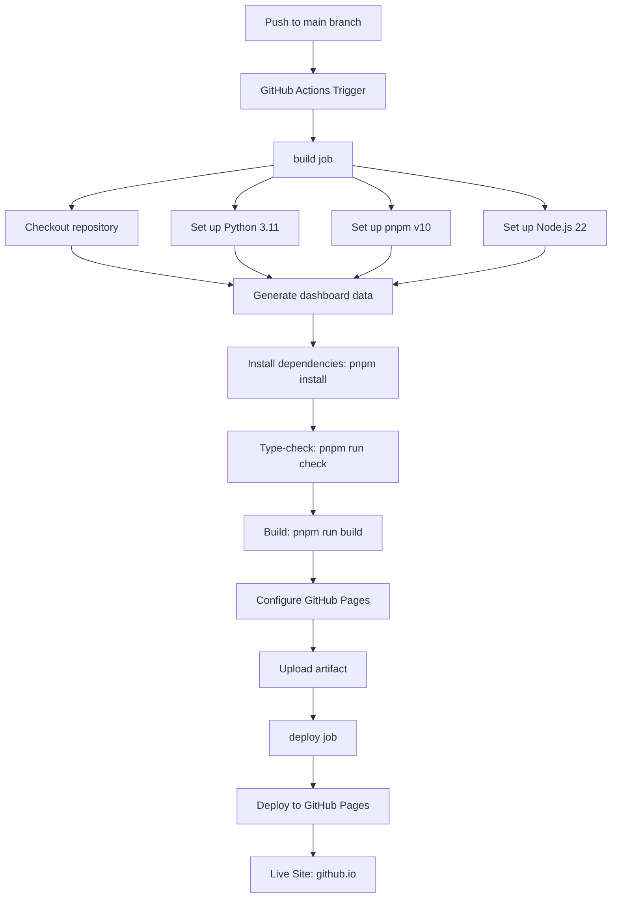

本页面详细说明如何将项目自动部署到 GitHub Pages，包括 CI/CD 工作流配置、仓库设置步骤以及本地构建流程。

## 部署架构概述

项目采用 **GitHub Actions** 驱动的自动化部署方案，通过 `ubuntu-latest` 虚拟机执行完整的构建-部署流程。整个部署管道包含两个核心任务：`build` 负责编译前端应用并准备部署产物，`deploy` 负责将产物推送到 GitHub Pages 环境。



Sources: [deploy-github-pages.yml](.github/workflows/deploy-github-pages.yml#L1-L88)

## 工作流配置详解

### 触发条件

工作流在两种情况下触发：向 `main` 分支推送代码时自动执行，或者通过 GitHub 界面手动触发 `workflow_dispatch` 事件。这种设计允许开发者在推送前验证部署配置，也支持回滚部署。

```yaml
on:
  push:
    branches:
      - main
  workflow_dispatch:
```

Sources: [deploy-github-pages.yml](.github/workflows/deploy-github-pages.yml#L3-L7)

### 权限配置

部署需要向 GitHub Pages API 写入数据，因此配置了三个关键权限：`contents: read` 用于检出代码，`pages: write` 允许操作 Pages 配置，`id-token: write` 用于 OIDC 令牌验证。并发控制设置确保同一时间只有一个部署任务运行，避免部署冲突。

```yaml
permissions:
  contents: read
  pages: write
  id-token: write

concurrency:
  group: github-pages
  cancel-in-progress: true
```

Sources: [deploy-github-pages.yml](.github/workflows/deploy-github-pages.yml#L9-L16)

### 构建步骤序列

| 步骤 | 工具 | 关键配置 | 产物 |
|------|------|----------|------|
| Checkout | actions/checkout@v4 | 默认设置 | 完整代码库 |
| Python | actions/setup-python@v5 | Python 3.11 | Python 环境 |
| pnpm | pnpm/action-setup@v4 | v10 | 包管理器 |
| Node.js | actions/setup-node@v4 | v22, pnpm 缓存 | Node 环境 |
| 数据生成 | python main.py | 输出到 public/ | dashboard-data.json |
| 依赖安装 | pnpm install | frozen-lockfile | node_modules |
| 类型检查 | vue-tsc | --noEmit | 类型验证报告 |
| 前端构建 | vite build | GITHUB_REPOSITORY | dist/ 目录 |

Sources: [deploy-github-pages.yml](.github/workflows/deploy-github-pages.yml#L22-L58)

### 产物验证与复制

构建完成后，工作流执行两项验证操作确保产物完整，然后将数据文件复制到部署目录。这是必要的步骤，因为 Vite 构建产物位于 `frontend/dist`，而动态生成的数据位于 `frontend/public`。

```yaml
- name: Copy generated dashboard data into Pages artifact
  run: cp frontend/public/dashboard-data.json frontend/dist/dashboard-data.json

- name: Verify generated Pages artifact
  run: |
    test -f frontend/public/dashboard-data.json
    test -f frontend/dist/dashboard-data.json
    test -f frontend/dist/index.html
```

Sources: [deploy-github-pages.yml](.github/workflows/deploy-github-pages.yml#L60-L68)

## 前端构建配置

### Vite 基础路径处理

项目支持组织级 GitHub Pages 部署，因此需要正确配置静态资源的基路径。Vite 配置通过环境变量判断当前运行环境：GitHub Actions 环境中使用仓库名作为基础路径，本地开发使用根路径 `/`。

```typescript
const base = runtimeEnv.VITE_BASE_PATH
  ?? (runtimeEnv.GITHUB_ACTIONS === 'true' ? defaultPagesBase : '/')

export default defineConfig({
  base,
  plugins: [vue()],
})
```

Sources: [vite.config.ts](frontend/vite.config.ts#L1-L18)

### 数据生成脚本

Python 数据处理脚本将源代码转换为前端可用的 JSON 数据包。脚本接受 `--json-output` 参数指定输出路径，这在 CI/CD 环境中用于将数据写入到正确的位置。

```python
def generate_dashboard_json(output_path: Path | None = None) -> Path:
    """Generate frontend-consumable dashboard data JSON."""
    data = load_data()
    dashboard_data = prepare_dashboard_data(data)
    output_path.write_text(
        json.dumps(dashboard_data, ensure_ascii=False, indent=2),
        encoding="utf-8",
    )
    return output_path
```

Sources: [main.py](main.py#L20-L33)

## GitHub 仓库设置

### 一次性配置步骤

首次部署前需要在 GitHub 仓库设置中启用 GitHub Pages 并选择 Actions 作为部署源：

1. 打开仓库的 **Settings** 页面
2. 导航至左侧菜单的 **Pages** 选项
3. 在 **Source** 下拉框中选择 **GitHub Actions**
4. 保存设置

配置完成后，每次向 `main` 分支推送代码都会自动触发部署流程，无需手动干预。

Sources: [README.md](README.md#L137-L145)

### 预期部署 URL

部署完成后，站点将托管在以下 URL 结构：

```
https://{username}.github.io/{repository-name}/
```

当前仓库配置的部署地址为：`https://zlatanwic.github.io/lang-analysis/`

Sources: [README.md](README.md#L147-L155)

## 部署流程状态监控

### 状态徽章

README 中嵌入了工作流状态徽章，实时反映最近一次部署的结果：

```markdown
[](https://github.com/Zlatanwic/lang-analysis/actions/workflows/deploy-github-pages.yml)
```

Sources: [README.md](README.md#L3-L4)

### 查看部署日志

通过 GitHub Actions 界面可以查看完整的工作流执行日志，包括每一步的输入输出和环境变量。如果部署失败，日志可以帮助快速定位问题所在。

## 本地构建验证

在推送代码前，建议在本地执行完整的构建流程以确保部署成功：

```powershell
# 生成数据文件
python main.py

# 安装依赖
cd frontend
pnpm install

# 类型检查
pnpm run check

# 构建生产版本
pnpm run build

# 预览构建结果
pnpm run preview
```

Sources: [README.md](README.md#L108-L120)

## 常见部署问题

### 构建产物缺失 dashboard-data.json

如果访问页面时出现数据加载错误，检查 `frontend/dist/` 目录是否包含 `dashboard-data.json` 文件。确保数据生成步骤在构建之前完成，且文件复制步骤正确执行。

### 静态资源 404 错误

资源加载失败通常是因为基础路径配置错误。检查 `vite.config.ts` 中的 `base` 配置是否与仓库名称匹配。对于组织级部署，确认 `GITHUB_REPOSITORY` 环境变量被正确传递。

### TypeScript 类型检查失败

部署工作流包含类型检查步骤，如果存在未修复的类型错误，构建将失败。确保本地运行 `pnpm run check` 通过后再推送代码。

## 下一步

部署完成后，可以深入了解数据的更新与维护流程：

- [数据更新与维护](25-shu-ju-geng-xin-yu-wei-hu) - 学习如何更新语言数据并触发重新部署

如果需要修改数据处理逻辑，建议先了解整体架构设计：

- [项目架构设计](3-xiang-mu-jia-gou-she-ji) - 深入理解前后端数据流
- [Python 数据处理管道](4-python-shu-ju-chu-li-guan-dao) - 数据转换模块详解