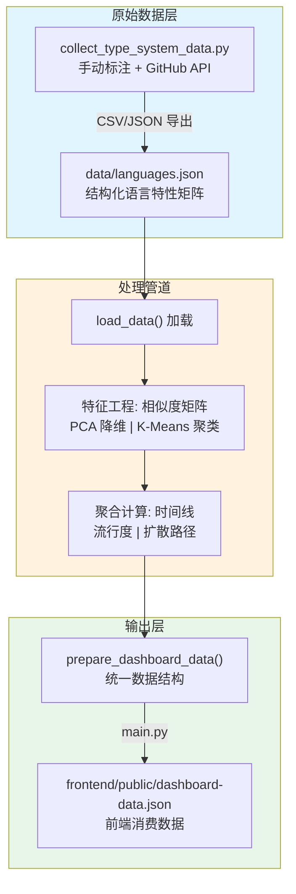
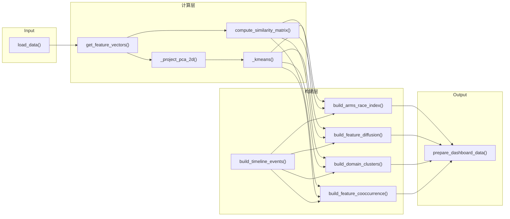
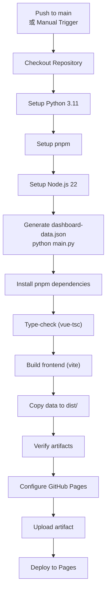

本文档详细说明编程语言类型系统知识图谱项目的数据更新与维护流程，涵盖数据采集管道、处理逻辑、生成工作流以及自动化部署机制。

## 数据架构概览

项目采用三层数据架构：原始数据源 → 处理管道 → 前端可消费数据。数据流向清晰分离，每层职责明确。



Sources: [src/data_processing.py](src/data_processing.py#L1-L30)
Sources: [collect_type_system_data.py](collect_type_system_data.py#L1-L50)

---

## 数据采集管道

### 类型系统特性采集脚本

`collect_type_system_data.py` 是数据采集的核心脚本，负责将手动标注的特性矩阵导出为多种格式。该脚本采用分层架构设计：

**特性评分标准**：采用 0-2 三级评分体系，与 `data/languages.json` 中的 0-5 评分体系不同：

| 分值 | 含义 | 示例场景 |
|------|------|----------|
| 2 | 完整支持 | 语言核心特性，有完善的语法和语义支持 |
| 1 | 部分支持 | 通过扩展/库/有限语法支持，或支持但有明显限制 |
| 0 | 不支持 | 特性完全不存在 |

**特性分类组织**：脚本将 21 种类型系统特性归类为 6 个维度，便于理解语言的设计侧重：

```python
FEATURE_CATEGORIES = {
    "基础多态": ["parametric_polymorphism", "ad_hoc_polymorphism", "subtype_polymorphism"],
    "数据建模": ["algebraic_data_types", "pattern_matching"],
    "类型推断与安全": ["type_inference", "flow_sensitive_typing", "gradual_typing"],
    "高级类型特性": ["higher_kinded_types", "dependent_types", "gadt", 
                       "existential_types", "rank_n_types", "row_polymorphism"],
    "资源与效果": ["linear_affine_types", "effect_system", "refinement_types"],
    "类型组织": ["type_classes", "structural_typing", "macro_metaprogramming"],
}
```

Sources: [collect_type_system_data.py](collect_type_system_data.py#L60-L70)

### 数据导出功能

脚本提供四个核心导出函数，生成不同用途的数据文件：

| 函数 | 输出文件 | 用途 |
|------|----------|------|
| `export_type_features_csv()` | `languages_type_features.csv` | 特性矩阵表格视图 |
| `export_timeline_csv()` | `feature_timeline.csv` | 特性引入时间线 |
| `export_popularity_csv()` | `languages_popularity.csv` | GitHub 流行度快照 |
| `export_combined_json()` | `languages_combined.json` | 完整合并数据集 |

```python
def export_type_features_csv(output_dir):
    """导出类型系统特性矩阵为 CSV"""
    filepath = os.path.join(output_dir, "languages_type_features.csv")
    with open(filepath, "w", newline="", encoding="utf-8") as f:
        writer = csv.writer(f)
        header = ["language", "year", "paradigm", "domain", "typing"] + FEATURES + ["total_score"]
        writer.writerow(header)
```

Sources: [collect_type_system_data.py](collect_type_system_data.py#L330-L345)

---

## 核心数据结构

### languages.json 规范

`data/languages.json` 是项目的主数据源，采用元数据 + 语言数组的双层结构：

```json
{
  "metadata": {
    "version": "2.0",
    "scoring": {
      "0": "Not supported — feature completely absent",
      "1": "Minimal — very limited or unofficial/third-party support only",
      "2": "Basic — feature present but with significant limitations",
      "3": "Moderate — usable implementation covering common cases",
      "4": "Strong — well-integrated feature with minor gaps",
      "5": "Full — best-in-class or reference implementation"
    },
    "features": {
      "parametric_polymorphism": "Generics / parametric polymorphism",
      "ad_hoc_polymorphism": "Trait / typeclass / interface-based polymorphism",
      ...
    }
  },
  "languages": [...]
}
```

Sources: [data/languages.json](data/languages.json#L1-L28)

### 语言条目结构

每种语言条目包含以下关键字段：

| 字段 | 类型 | 说明 |
|------|------|------|
| `name` | string | 语言名称 |
| `year` | number | 首次发布年份 |
| `paradigm` | string | 编程范式分类 |
| `domain` | string | 主要应用领域 |
| `features` | Record<string, number> | 14 个特性的 0-5 评分 |
| `scoring_rationale` | Record<string, string> | 每项评分的依据说明 |
| `feature_timeline` | Record<string, number> | 特性引入年份映射 |
| `popularity` | object | 流行度指标 (TIOBE, GitHub, StackOverflow) |

Sources: [data/languages.json](data/languages.json#L30-L75)

---

## 数据处理管道

### 处理模块架构

`src/data_processing.py` 实现了完整的数据处理管道，所有函数设计为纯函数，便于测试和复用：



Sources: [src/data_processing.py](src/data_processing.py#L1-L100)
Sources: [src/data_processing.py](src/data_processing.py#L520-L627)

### 关键处理函数

**特征向量提取**：将每种语言的特性评分转换为数值向量，用于后续相似度计算：

```python
def get_feature_vectors(data: dict) -> dict[str, list[int]]:
    """Return {language_name: [feature_scores]} dict."""
    features = get_feature_names(data)
    return {
        lang["name"]: [lang["features"].get(f, 0) for f in features]
        for lang in data["languages"]
    }
```

Sources: [src/data_processing.py](src/data_processing.py#L38-L45)

**相似度计算**：使用余弦相似度算法计算语言间的类型系统相似性：

```python
def cosine_similarity(a: list[int], b: list[int]) -> float:
    """Compute cosine similarity between two vectors."""
    dot = sum(x * y for x, y in zip(a, b))
    mag_a = math.sqrt(sum(x * x for x in a))
    mag_b = math.sqrt(sum(x * x for x in b))
    if mag_a == 0 or mag_b == 0:
        return 0.0
    return dot / (mag_a * mag_b)
```

Sources: [src/data_processing.py](src/data_processing.py#L47-L55)

**PCA 降维**：使用幂迭代法实现协方差矩阵的特征值分解，将高维特性空间投影到二维平面用于可视化：

```python
def _project_pca_2d(vectors: list[list[float]]) -> tuple[list[tuple[float, float]], list[list[float]]]:
    # 计算协方差矩阵
    covariance = []
    for row in range(dimension):
        covariance_row = []
        for col in range(dimension):
            covariance_row.append(
                sum(vector[row] * vector[col] for vector in centered) / denom
            )
        covariance.append(covariance_row)
    
    # 幂迭代法提取前两个主成分
    eigenvalue_1, eigenvector_1 = _power_iteration(covariance)
    covariance_2 = _deflate(covariance, eigenvalue_1, eigenvector_1)
    _, eigenvector_2 = _power_iteration(covariance_2)
```

Sources: [src/data_processing.py](src/data_processing.py#L390-L420)

---

## 数据生成工作流

### main.py 入口脚本

`main.py` 是项目的主入口，负责协调整个数据生成流程：

```python
def generate_dashboard_json(output_path: Path | None = None) -> Path:
    """Generate frontend-consumable dashboard data JSON."""
    if output_path is None:
        output_path = DEFAULT_JSON_OUTPUT
    output_path.parent.mkdir(parents=True, exist_ok=True)

    data = load_data()
    dashboard_data = prepare_dashboard_data(data)
    output_path.write_text(
        json.dumps(dashboard_data, ensure_ascii=False, indent=2),
        encoding="utf-8",
    )
    print(f"Dashboard JSON generated: {output_path}")
    return output_path
```

Sources: [main.py](main.py#L15-L30)

**命令行参数**：

| 参数 | 说明 | 默认值 |
|------|------|--------|
| `--output` | 输出文件路径 | `frontend/public/dashboard-data.json` |
| `--json-output` | JSON 输出路径（别名） | 无 |

### 执行命令

```bash
# 生成默认路径
python main.py

# 指定输出路径
python main.py --output custom/path/data.json
python main.py --json-output custom/path/data.json
```

Sources: [main.py](main.py#L32-L67)

---

## 自动化部署管道

### GitHub Actions 工作流

`.github/workflows/deploy-github-pages.yml` 定义了完整的 CI/CD 流程：



Sources: [.github/workflows/deploy-github-pages.yml](.github/workflows/deploy-github-pages.yml#L1-L88)

**关键构建步骤**：

```yaml
- name: Generate dashboard data
  run: python main.py --json-output frontend/public/dashboard-data.json

- name: Copy generated dashboard data into Pages artifact
  run: cp frontend/public/dashboard-data.json frontend/dist/dashboard-data.json
```

Sources: [.github/workflows/deploy-github-pages.yml](.github/workflows/deploy-github-pages.yml#L40-L54)

---

## 前端数据消费

### 数据类型定义

`frontend/src/types/dashboard.ts` 定义了 TypeScript 类型接口，确保前后端数据结构一致：

```typescript
export interface DashboardData {
  features: string[]
  feature_labels: Record<string, string>
  feature_short_labels: Record<string, string>
  scoring: Record<string, string>
  max_score: number
  heatmap: HeatmapLanguage[]
  network: { nodes: NetworkNode[]; edges: NetworkEdge[] }
  timeline: TimelineEvent[]
  arms_race: ArmsRaceSeries
  popularity: PopularityPoint[]
  diffusion: { default_feature: string; features: Record<string, DiffusionFeature> }
  lineage: { nodes: LineageNode[]; edges: LineageEdge[] }
  clusters: { cluster_labels: Record<string, string>; points: ClusterPoint[] }
  cooccurrence: { features: string[]; prevalence: Record<string, number>; cells: CooccurrenceCell[]; top_pairs: CooccurrenceTopPair[] }
}
```

Sources: [frontend/src/types/dashboard.ts](frontend/src/types/dashboard.ts#L100-L148)

### 数据加载 Hook

`frontend/src/composables/useDashboardData.ts` 提供了响应式的数据加载接口：

```typescript
export function useDashboardData() {
  const baseUrl = import.meta.env.BASE_URL.endsWith('/')
    ? import.meta.env.BASE_URL
    : `${import.meta.env.BASE_URL}/`
  const dataUrl = `${baseUrl}dashboard-data.json`
  const { data, error, isFetching, isFinished } = useFetch(dataUrl)
    .get()
    .json<DashboardData>()

  return { data: computed(() => data.value ?? null), error, isFetching, isFinished }
}
```

Sources: [frontend/src/composables/useDashboardData.ts](frontend/src/composables/useDashboardData.ts#L1-L21)

---

## 数据更新操作指南

### 更新语言特性评分

当某语言引入新的类型系统特性或特性实现发生重大变化时，需更新 `data/languages.json`：

1. 定位目标语言的 `features` 对象
2. 更新对应特性的评分 (0-5)
3. 在 `scoring_rationale` 中添加或修改评分依据
4. 若特性有明确的引入版本，在 `feature_timeline` 中添加年份

```json
{
  "name": "Kotlin",
  "features": {
    "pattern_matching": 4,  // 从 2 更新到 4（Kotlin 2.0 新增 when guards）
    ...
  },
  "scoring_rationale": {
    "pattern_matching": "Kotlin 2.0 introduces when guards, enabling more complex pattern conditions",
    ...
  },
  "feature_timeline": {
    "pattern_matching": 2024,
    ...
  }
}
```

Sources: [data/languages.json](data/languages.json#L1-L29)

### 添加新语言

在 `data/languages.json` 的 `languages` 数组中添加新条目：

```json
{
  "name": "新语言名称",
  "year": 2024,
  "paradigm": "Multi-paradigm",
  "domain": "Systems programming",
  "features": {
    "parametric_polymorphism": 4,
    "ad_hoc_polymorphism": 4,
    "algebraic_data_types": 3,
    "pattern_matching": 3,
    "ownership_lifetime": 0,
    "dependent_types": 0,
    "gadts": 0,
    "higher_kinded_types": 0,
    "effect_system": 0,
    "refinement_types": 0,
    "gradual_typing": 0,
    "type_inference": 4,
    "structural_typing": 0,
    "flow_sensitive_typing": 2
  },
  "scoring_rationale": { ... },
  "feature_timeline": { ... },
  "popularity": { ... }
}
```

### 添加新特性

1. 在 `data/languages.json` 的 `metadata.features` 中添加新特性定义
2. 为所有语言添加该特性的评分
3. 运行 `python main.py` 重新生成前端数据

### 本地开发流程

```bash
# 1. 克隆仓库并安装依赖
git clone <repository-url>
cd lang_analysis

# 2. 安装 Python 依赖（项目无外部依赖）
# 或使用 uv
uv sync

# 3. 安装前端依赖
cd frontend
pnpm install

# 4. 生成数据并启动开发服务器
pnpm run dev:sync
```

Sources: [frontend/package.json](frontend/package.json#L8)

---

## 版本控制与数据一致性

### 版本标记

`data/languages.json` 的 `metadata.version` 字段记录数据格式版本，当数据结构发生破坏性变更时递增：

```json
"metadata": {
  "version": "2.0",
  ...
}
```

Sources: [data/languages.json](data/languages.json#L4)

### 评分依据追踪

每项评分必须包含 `scoring_rationale` 说明，确保评分的可审计性和可维护性：

```json
"scoring_rationale": {
  "parametric_polymorphism": "Full monomorphized generics with trait bounds, where clauses, const generics"
}
```

Sources: [data/languages.json](data/languages.json#L52-L60)

---

## 相关文档

- [GitHub Pages 部署流程](24-github-pages-bu-shu-liu-cheng) — 了解自动化部署的完整配置
- [Python 数据处理管道](4-python-shu-ju-chu-li-guan-dao) — 数据处理模块的深度解析
- [数据结构与类型定义](6-shu-ju-jie-gou-yu-lei-xing-ding-yi) — 详细的数据结构规范