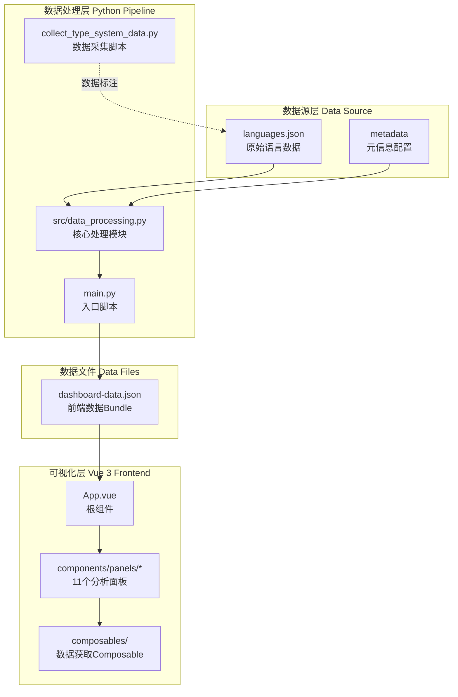
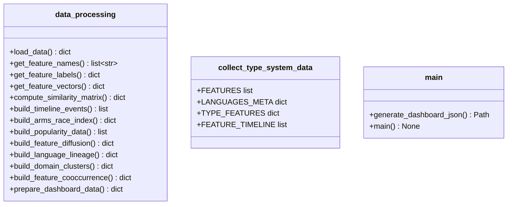
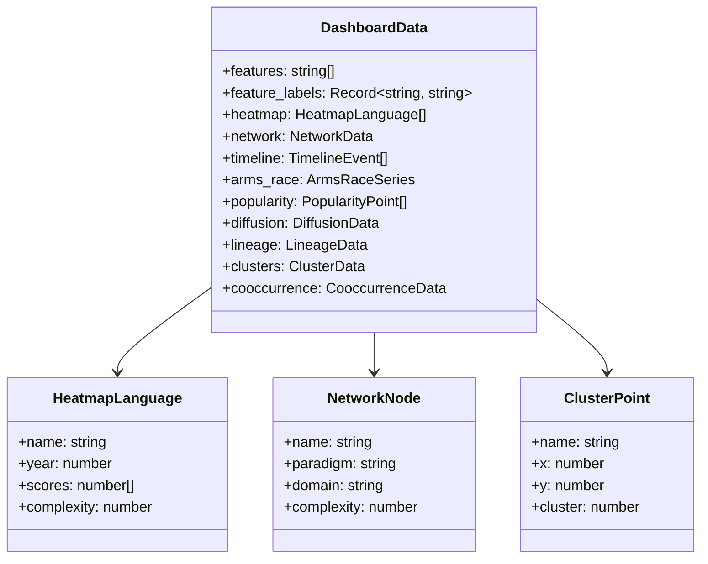

本页面详细介绍 Programming Language Type System Knowledge Graph（编程语言类型系统知识图谱）的整体架构设计，包括数据处理管道、前端组件结构、数据流向以及各核心模块的职责划分。该项目采用经典的**前后端分离架构**，Python 负责数据分析与转换，Vue 3 负责可视化呈现，两者通过 JSON 数据文件解耦。

## 系统架构概览

本项目采用**分层数据流架构**，核心设计原则是**数据与视图分离**、**静态生成与动态交互结合**。整体架构可划分为三个主要层次：数据源层、数据处理层和可视化层。



这种架构的优势在于：**Python 端可以独立进行数据更新和维护**，无需重新构建前端；**Vue 端通过 fetch 加载 JSON**，可以实现缓存和增量更新；两个技术栈各自发挥所长，Python 擅长数据处理，Vue 擅长交互式可视化。

Sources: [main.py](main.py#L1-L67), [src/data_processing.py](src/data_processing.py#L1-L100), [frontend/src/App.vue](frontend/src/App.vue#L1-L50)

## Python 数据处理管道

Python 层是整个系统的数据引擎，负责从原始语言数据中提取、计算、聚合各种分析指标，并将结果转换为前端可用的 JSON 格式。这一层完全独立于前端，可以单独运行和测试。

### 模块职责划分

数据处理层的代码组织遵循**单一职责原则**，每个模块有明确的职责边界：



`main.py` 是整个 Python 程序的入口点，提供命令行接口和文件输出功能。它调用 `data_processing` 模块中的 `load_data()` 和 `prepare_dashboard_data()` 函数，将处理结果写入 `frontend/public/dashboard-data.json` 文件。

`src/data_processing.py` 是核心处理模块，包含约 20 个数据处理函数，涵盖特征向量计算、相似度分析、时间线构建、聚类分析等多个分析维度。该模块完全依赖标准库，无需额外依赖。

`collect_type_system_data.py` 是数据采集和标注脚本，用于生成初始数据文件 `languages_combined.json`。该脚本包含语言元信息、类型系统特性评分矩阵、功能引入时间线等结构化数据。

Sources: [main.py](main.py#L1-L67), [src/data_processing.py](src/data_processing.py#L1-L100), [collect_type_system_data.py](collect_type_system_data.py#L1-L100)

### 核心数据处理函数

`prepare_dashboard_data()` 函数是数据处理层的总调度器，它调用各个子函数收集不同类型的分析数据，最终组装成前端所需的完整数据结构：

```python
def prepare_dashboard_data(data: dict) -> dict:
    """Prepare all data needed by the frontend dashboard."""
    # ... 初始化逻辑
    
    # Heatmap data - 语言特性评分矩阵
    heatmap_languages = []
    for lang in data["languages"]:
        heatmap_languages.append({
            "name": lang["name"],
            "scores": [lang["features"].get(f, 0) for f in features],
            "complexity": compute_type_complexity_score(lang),
        })
    
    # Similarity network - 相似性网络
    edges = compute_similarity_edges(data, threshold=0.65)
    
    # Timeline and Arms Race
    timeline = build_timeline_events(data)
    arms_race = build_arms_race_index(data)
    
    # Advanced analysis
    diffusion = build_feature_diffusion(data)
    lineage = build_language_lineage(data)
    clusters = build_domain_clusters(data)
    cooccurrence = build_feature_cooccurrence(data)
    
    return { /* 完整数据结构 */ }
```

Sources: [src/data_processing.py](src/data_processing.py#L562-L628)

### 算法模块分析

数据处理层包含三个核心算法模块：**相似度计算**、**PCA 降维与聚类**、**统计分析**。

相似度计算模块实现余弦相似度和皮尔逊相关系数两种度量方式，用于衡量语言之间的类型系统相似程度：

```python
def cosine_similarity(a: list[int], b: list[int]) -> float:
    """Compute cosine similarity between two vectors."""
    dot = sum(x * y for x, y in zip(a, b))
    mag_a = math.sqrt(sum(x * x for x in a))
    mag_b = math.sqrt(sum(x * x for x in b))
    if mag_a == 0 or mag_b == 0:
        return 0.0
    return dot / (mag_a * mag_b)

def pearson_correlation(a: list[float], b: list[float]) -> float:
    """Compute Pearson correlation between two equal-length vectors."""
    # 皮尔逊相关系数计算
```

PCA 降维与聚类模块采用**幂迭代法**计算协方差矩阵的特征向量，实现从高维特征空间到二维平面的投影：

```python
def _power_iteration(matrix: list[list[float]], iterations: int = 64) -> tuple[float, list[float]]:
    """Power iteration method for finding the dominant eigenvector."""
    size = len(matrix)
    vector = _normalize([1.0 + (idx * 0.07) for idx in range(size)])
    for _ in range(iterations):
        vector = _normalize(_mat_vec(matrix, vector))
    eigenvalue = _dot(vector, _mat_vec(matrix, vector))
    return eigenvalue, vector
```

K-means 聚类算法使用**欧氏距离**进行样本到中心的距离计算，采用**最大距离原则**选择新的聚类中心：

```python
def _kmeans(points: list[list[float]], k: int = 3, iterations: int = 24) -> tuple[list[int], list[list[float]]]:
    """K-means clustering with fixed iteration limit."""
    k = min(k, len(points))
    centroids = [point[:] for point in points[:k]]
    # ... 迭代优化逻辑
```

Sources: [src/data_processing.py](src/data_processing.py#L60-L67), [src/data_processing.py](src/data_processing.py#L70-L84), [src/data_processing.py](src/data_processing.py#L364-L370), [src/data_processing.py](src/data_processing.py#L420-L458)

## Vue 3 前端组件架构

前端采用 Vue 3 Composition API 构建，整体采用**单页应用（SPA）模式**，通过 Tab 切换展示不同的分析面板。所有面板共享同一个数据源，数据通过 Composable 获取。

### 组件目录结构

```
frontend/src/
├── App.vue                          # 根组件，路由逻辑
├── components/
│   ├── PanelCard.vue                # 面板容器组件
│   ├── EChartPanel.vue               # ECharts 图表封装
│   └── panels/                      # 11个分析面板
│       ├── FeatureMatrixPanel.vue    # 特性矩阵热力图
│       ├── FeatureCooccurrencePanel.vue
│       ├── RadarComparisonPanel.vue
│       ├── FeatureTimelinePanel.vue
│       ├── ArmsRacePanel.vue
│       ├── SimilarityNetworkPanel.vue
│       ├── PopularityAnalysisPanel.vue
│       ├── FeatureDiffusionPanel.vue
│       ├── DomainClustersPanel.vue
│       ├── LineageGraphPanel.vue
│       └── FeatureRecommenderPanel.vue
├── composables/
│   └── useDashboardData.ts          # 数据获取Composable
├── types/
│   └── dashboard.ts                 # TypeScript类型定义
└── constants.ts                     # 颜色主题常量
```

这种目录结构的组织逻辑是：**组件层负责展示**，**Comppables 层负责数据获取**，**Types 层负责类型安全**，**Constants 层负责主题配置**。各层职责清晰，便于维护和扩展。

Sources: [frontend/src/App.vue](frontend/src/App.vue#L1-L45), [frontend/src/types/dashboard.ts](frontend/src/types/dashboard.ts#L1-L148)

### 核心组件设计模式

前端组件架构遵循**高内聚低耦合**的设计原则，主要体现在以下几个方面：

**PanelCard 容器组件**封装了面板的通用布局结构，包括标题、描述、操作按钮插槽和内容插槽，避免重复代码：

```vue
<!-- PanelCard.vue -->
<script setup lang="ts">
defineProps<{
  title: string
  description: string
  eyebrow?: string
}>()
</script>

<template>
  <section class="panel-card">
    <header class="panel-head">
      <div>
        <span v-if="eyebrow" class="panel-eyebrow">{{ eyebrow }}</span>
        <h2>{{ title }}</h2>
        <p>{{ description }}</p>
      </div>
      <div class="panel-actions">
        <slot name="actions" />
      </div>
    </header>
    <div class="panel-body">
      <slot />
    </div>
  </section>
</template>
```

**EChartPanel 封装组件**提供了 ECharts 图表的响应式封装，处理图表初始化、响应式重绘和资源清理：

```typescript
// EChartPanel.vue
function renderChart(option: EChartsOption) {
  if (!chart.value) return
  chart.value.setOption(option, true)
}

watch(
  () => props.option,
  (option) => {
    renderChart(option)
  },
  { deep: true },
)

useResizeObserver(root, () => {
  chart.value?.resize()
})
```

Sources: [frontend/src/components/PanelCard.vue](frontend/src/components/PanelCard.vue#L1-L26), [frontend/src/components/EChartPanel.vue](frontend/src/components/EChartPanel.vue#L1-L47)

### 数据流向与状态管理

前端采用**本地状态管理 + URL 持久化**的策略，使用 `@vueuse/core` 的 `useLocalStorage` 实现 Tab 状态的持久化：

```typescript
// App.vue
const activeTab = useLocalStorage<(typeof tabs)[number]['key']>('dashboard-active-tab', 'matrix')
```

数据通过 `useDashboardData` Composable 获取，该 Composable 封装了 `useFetch` 逻辑，提供响应式的数据访问接口：

```typescript
// useDashboardData.ts
export function useDashboardData() {
  const baseUrl = import.meta.env.BASE_URL.endsWith('/')
    ? import.meta.env.BASE_URL
    : `${import.meta.env.BASE_URL}/`
  const dataUrl = `${baseUrl}dashboard-data.json`
  const { data, error, isFetching, isFinished } = useFetch(dataUrl)
    .get()
    .json<DashboardData>()

  return {
    data: computed(() => data.value ?? null),
    error,
    isFetching,
    isFinished,
  }
}
```

这种设计的优点是：**数据获取逻辑集中管理**，避免在每个面板组件中重复 fetch 代码；**使用 computed 包装响应式数据**，确保数据变化时自动触发视图更新。

Sources: [frontend/src/composables/useDashboardData.ts](frontend/src/composables/useDashboardData.ts#L1-L21), [frontend/src/App.vue](frontend/src/App.vue#L17-L35)

## TypeScript 类型系统

前端使用 TypeScript 提供完整的类型安全保证，类型定义文件 `types/dashboard.ts` 定义了所有数据接口。



所有 TypeScript 类型与 Python 端的数据结构完全对应，确保前后端数据交换的一致性。

Sources: [frontend/src/types/dashboard.ts](frontend/src/types/dashboard.ts#L1-L148)

## 数据文件结构

数据是连接前后端的桥梁，其结构经过精心设计，既能包含足够的分析信息，又保持良好的可读性。

### 原始数据格式（languages.json）

```json
{
  "metadata": {
    "description": "Programming Language Type System Feature Matrix",
    "version": "2.0",
    "scoring": {
      "0": "Not supported",
      "1": "Minimal support",
      "2": "Basic support",
      "3": "Moderate support",
      "4": "Strong support",
      "5": "Full support"
    },
    "features": {
      "parametric_polymorphism": "Generics / parametric polymorphism",
      "ad_hoc_polymorphism": "Trait / typeclass / interface-based polymorphism",
      ...
    }
  },
  "languages": [
    {
      "name": "Rust",
      "year": 2010,
      "paradigm": "Systems",
      "domain": "Systems programming",
      "features": {
        "parametric_polymorphism": 5,
        ...
      },
      "feature_timeline": {
        "parametric_polymorphism": 2012,
        ...
      },
      "popularity": {
        "tiobe_rank": 14,
        "github_stars_rank": 8,
        ...
      }
    }
  ]
}
```

### 前端数据格式（dashboard-data.json）

Python 端处理后生成的数据包含预处理好的分析结果，包括相似度计算、聚类分组、统计指标等，避免在前端进行复杂计算。

Sources: [data/languages.json](data/languages.json#L1-L100)

## 主题与可视化配置

前端使用常量文件管理颜色主题和可视化配置，支持功能-paradigm-域多维度的颜色映射：

```typescript
// constants.ts
export const paradigmColors: Record<string, string> = {
  Functional: '#6fe0b7',
  'Multi-paradigm': '#7e96ff',
  Systems: '#ffcf7a',
  ObjectOriented: '#ff8aa1',
  'Object-oriented': '#ff8aa1',
  Procedural: '#9bd6ff',
}

export const clusterPalette = ['#7e96ff', '#ff8aa1', '#6fe0b7']

export const domainGroupColors: Record<string, string> = {
  Systems: '#ffcf7a',
  Web: '#7e96ff',
  Academic: '#6fe0b7',
  General: '#ff8aa1',
}

export const domainGroupSymbols: Record<string, string> = {
  Systems: 'diamond',
  Web: 'circle',
  Academic: 'triangle',
  General: 'rect',
}
```

这种配置化管理方式使得主题调整只需修改常量文件，无需触及组件代码。

Sources: [frontend/src/constants.ts](frontend/src/constants.ts#L1-L42)

## 构建与部署配置

前端使用 Vite 作为构建工具，通过环境变量支持 GitHub Pages 部署：

```typescript
// vite.config.ts
const defaultPagesBase = repositoryName ? `/${repositoryName}/` : '/'
const base = runtimeEnv.VITE_BASE_PATH
  ?? (runtimeEnv.GITHUB_ACTIONS === 'true' ? defaultPagesBase : '/')

export default defineConfig({
  base,
  plugins: [vue()],
  server: {
    port: 5173,
  },
})
```

package.json 中定义了数据同步脚本，实现 Python 数据生成和前端启动的一体化流程：

```json
{
  "scripts": {
    "sync:data": "python ../main.py --json-output public/dashboard-data.json",
    "dev:sync": "pnpm run sync:data && pnpm dev"
  }
}
```

Sources: [frontend/vite.config.ts](frontend/vite.config.ts#L1-L19), [frontend/package.json](frontend/package.json#L1-L27)

## 架构设计总结

本项目采用前后端分离架构，通过以下设计决策实现高质量的系统设计：

| 设计维度 | 实现方案 | 设计优势 |
|---------|---------|---------|
| 数据管理 | Python 静态生成 + JSON 传输 | 前端无需复杂数据处理，支持 CDN 缓存 |
| 组件复用 | PanelCard + EChartPanel 封装 | 减少重复代码，统一交互行为 |
| 类型安全 | TypeScript 完整类型定义 | 编译期错误检测，IDE 智能提示 |
| 状态持久化 | useLocalStorage 存储 Tab 状态 | 用户体验一致，刷新不丢失 |
| 主题管理 | 常量文件集中配置 | 快速换肤，代码结构清晰 |
| 构建配置 | Vite + 环境变量适配 | 单一代码库支持多部署环境 |

这种架构特别适合**数据分析类可视化项目**：数据更新频率相对较低，无需实时后端服务；前端交互复杂，需要丰富的组件库支持；部署目标是静态托管环境（GitHub Pages）。

## 下一步阅读建议

了解完整体架构后，建议按以下路径深入：

- 如果你关注数据处理的技术细节，请阅读 [Python 数据处理管道](4-python-shu-ju-chu-li-guan-dao) 获取完整的算法实现分析
- 如果你关注前端组件的实现模式，请阅读 [Vue 3 前端组件架构](5-vue-3-qian-duan-zu-jian-jia-gou) 获取组件设计模式详解
- 如果你关注数据类型定义，请阅读 [数据结构与类型定义](6-shu-ju-jie-gou-yu-lei-xing-ding-yi) 获取完整的数据结构文档