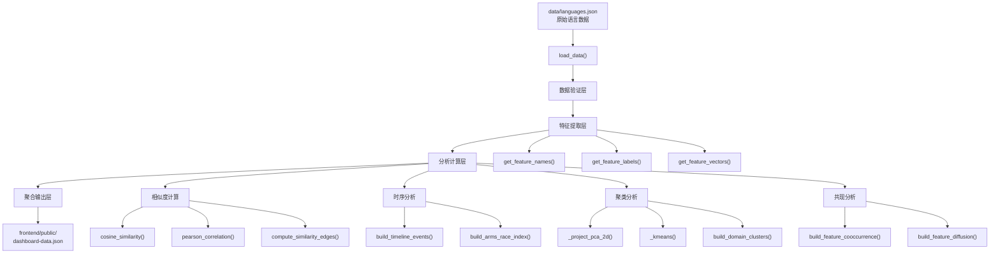
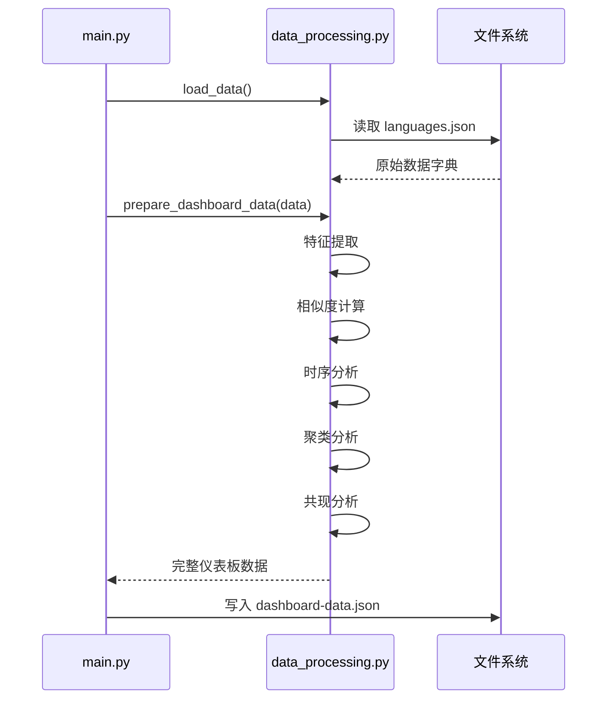

本页面详细解析项目中 Python 数据处理管道的设计架构与核心实现。该管道负责从原始语言类型系统数据中提取、转换和聚合信息，最终生成前端仪表板所需的完整数据结构。

## 管道架构概览

数据处理管道采用分层架构设计，从数据源到前端输出形成清晰的数据流。



## 入口点与编排逻辑

`main.py` 作为管道的入口脚本，负责命令行参数解析和输出文件管理。该脚本不包含复杂业务逻辑，仅承担协调职责，将数据加载与处理委托给核心模块。

```python
def generate_dashboard_json(output_path: Path | None = None) -> Path:
    """Generate frontend-consumable dashboard data JSON."""
    if output_path is None:
        output_path = DEFAULT_JSON_OUTPUT
    output_path.parent.mkdir(parents=True, exist_ok=True)

    data = load_data()
    dashboard_data = prepare_dashboard_data(data)
    output_path.write_text(
        json.dumps(dashboard_data, ensure_ascii=False, indent=2),
        encoding="utf-8",
    )
```

核心编排函数 `prepare_dashboard_data()` 位于 `src/data_processing.py`，负责调用所有分析模块并汇总结果。该函数接收原始数据字典，返回包含所有仪表板视图数据的完整结构。

Sources: [main.py](main.py#L20-L33)
Sources: [src/data_processing.py](src/data_processing.py#L562-L627)

## 数据加载层

数据加载层仅包含一个函数 `load_data()`，负责从 JSON 文件读取语言类型系统原始数据。默认路径为项目根目录下的 `data/languages.json`。

```python
def load_data(path: str | None = None) -> dict:
    """Load the language type system dataset."""
    if path is None:
        path = str(Path(__file__).parent.parent / "data" / "languages.json")
    with open(path, encoding="utf-8") as f:
        return json.load(f)
```

该函数采用延迟加载模式，仅在需要时才读取文件系统。文件路径计算使用 `Path` 对象的相对定位，确保无论脚本从何处执行都能正确定位数据文件。

数据文件结构包含两个顶层键：`metadata` 存储特性定义和评分标准，`languages` 存储各语言的类型系统特性评分。加载后的数据在后续处理中作为只读输入传递。

Sources: [src/data_processing.py](src/data_processing.py#L8-L13)

## 特征提取层

特征提取层提供元数据访问接口，将原始数据中的特性名称、标签和评分标准转换为便于处理的数据结构。

### 特性名称与标签映射

`get_feature_names()` 返回特性键的有序列表，该列表决定后续所有向量计算中特性的排列顺序。`get_feature_labels()` 返回特性键到人类可读标签的映射字典，用于前端显示。

```python
def get_feature_names(data: dict) -> list[str]:
    """Return ordered list of feature keys."""
    return list(data["metadata"]["features"].keys())

def get_feature_labels(data: dict) -> dict[str, str]:
    """Return feature key -> human-readable label mapping."""
    return data["metadata"]["features"]
```

`get_feature_short_labels()` 提供紧凑型标签映射，专为仪表板表格头部等空间有限的场景设计。例如 "parametric_polymorphism" 映射为 "Generics"，"algebraic_data_types" 映射为 "ADTs"。

Sources: [src/data_processing.py](src/data_processing.py#L16-L43)

### 特性向量构建

`get_feature_vectors()` 将每种语言的特性评分转换为数值向量，形成后续相似度计算的基础数据结构。

```python
def get_feature_vectors(data: dict) -> dict[str, list[int]]:
    """Return {language_name: [feature_scores]} dict."""
    features = get_feature_names(data)
    return {
        lang["name"]: [lang["features"].get(f, 0) for f in features]
        for lang in data["languages"]
    }
```

该函数对每种语言构建一个整数向量，向量长度等于特性总数，默认缺失特性填充为 0。这种设计确保所有语言向量具有相同维度，便于向量运算。

Sources: [src/data_processing.py](src/data_processing.py#L51-L57)

## 相似度计算模块

相似度计算是管道核心分析功能之一，用于衡量语言间类型系统设计的相似程度。

### 余弦相似度

`cosine_similarity()` 计算两个特性向量间的余弦相似度，输出值范围为 [-1, 1]，其中 1 表示完全相似。

```python
def cosine_similarity(a: list[int], b: list[int]) -> float:
    """Compute cosine similarity between two vectors."""
    dot = sum(x * y for x, y in zip(a, b))
    mag_a = math.sqrt(sum(x * x for x in a))
    mag_b = math.sqrt(sum(x * x for x in b))
    if mag_a == 0 or mag_b == 0:
        return 0.0
    return dot / (mag_a * mag_b)
```

算法核心计算向量点积除以向量模的乘积。当任一向量为零向量时返回 0，避免除零错误。该度量对向量长度不敏感，专注于方向一致性。

### 皮尔逊相关系数

`pearson_correlation()` 计算特性评分的线性相关性，能够捕捉 languages 在特性支持程度上的整体趋势关联。

```python
def pearson_correlation(a: list[float], b: list[float]) -> float:
    """Compute Pearson correlation between two equal-length vectors."""
    if not a or not b or len(a) != len(b):
        return 0.0

    mean_a = sum(a) / len(a)
    mean_b = sum(b) / len(b)
    centered_a = [value - mean_a for value in a]
    centered_b = [value - mean_b for value in b]
    numerator = sum(x * y for x, y in zip(centered_a, centered_b))
    denom_a = math.sqrt(sum(value * value for value in centered_a))
    denom_b = math.sqrt(sum(value * value for value in centered_b))
    if denom_a == 0 or denom_b == 0:
        return 0.0
    return numerator / (denom_a * denom_b)
```

皮尔逊相关系数通过中心化处理消除量纲差异，衡量两个变量间的线性关系强度。

Sources: [src/data_processing.py](src/data_processing.py#L60-L84)

### 相似度边计算

`compute_similarity_edges()` 根据相似度阈值筛选语言对，生成可视化网络图所需的边数据。

```python
def compute_similarity_edges(data: dict, threshold: float = 0.6) -> list[dict]:
    """Compute similarity edges for the network graph."""
    vectors = get_feature_vectors(data)
    names = list(vectors.keys())
    edges = []
    for i, name_a in enumerate(names):
        for j, name_b in enumerate(names):
            if i < j:
                sim = cosine_similarity(vectors[name_a], vectors[name_b])
                if sim >= threshold:
                    edges.append({
                        "source": name_a,
                        "target": name_b,
                        "similarity": round(sim, 4),
                    })
    return edges
```

默认阈值为 0.65，仅保留高于此值的语言对作为相似性网络中的有效连接。

Sources: [src/data_processing.py](src/data_processing.py#L100-L115)

## 时序分析模块

### 时间线事件构建

`build_timeline_events()` 从语言数据中提取特性引入时间信息，构建可用于 Timeline 可视化面板的扁平事件列表。

```python
def build_timeline_events(data: dict) -> list[dict]:
    """Build a flat list of (year, language, feature) events for the timeline."""
    labels = get_feature_labels(data)
    events = []
    for lang in data["languages"]:
        for feat, year in lang.get("feature_timeline", {}).items():
            events.append({
                "year": year,
                "language": lang["name"],
                "feature": feat,
                "feature_label": labels.get(feat, feat),
            })
    events.sort(key=lambda e: e["year"])
    return events
```

每条事件记录包含年份、语言名称、特性标识符和可读标签，按时间顺序排序输出。

Sources: [src/data_processing.py](src/data_processing.py#L130-L143)

### 军备竞赛指数

`build_arms_race_index()` 分析类型系统特性引入的年度趋势，计算加速度等指标以衡量语言类型系统进化速度。

```python
def build_arms_race_index(data: dict) -> dict:
    """Aggregate yearly feature arrivals into an acceleration-focused trend series."""
    events = build_timeline_events(data)
    if not events:
        return {...}

    years = list(range(events[0]["year"], events[-1]["year"] + 1))
    yearly_totals = {year: 0 for year in years}
    for event in events:
        yearly_totals[event["year"]] += 1

    yearly_counts = [yearly_totals[year] for year in years]
    cumulative_counts = []
    running_total = 0
    for count in yearly_counts:
        running_total += count
        cumulative_counts.append(running_total)

    moving_average = []
    for idx in range(len(yearly_counts)):
        start_idx = max(0, idx - 4)
        window = yearly_counts[start_idx : idx + 1]
        moving_average.append(round(sum(window) / len(window), 2))

    acceleration = []
    previous = 0
    for count in yearly_counts:
        acceleration.append(count - previous)
        previous = count
```

该函数返回多年期统计数据，包括年度计数、累计计数、5 年移动平均和年度加速度。峰值年份和峰值计数用于识别类型系统快速演进的关键时期。

Sources: [src/data_processing.py](src/data_processing.py#L146-L197)

## 聚类分析模块

### PCA 降维实现

`_project_pca_2d()` 使用幂迭代法实现主成分分析，将高维特性向量投影到二维平面以支持散点图可视化。

```python
def _power_iteration(matrix: list[list[float]], iterations: int = 64) -> tuple[float, list[float]]:
    size = len(matrix)
    vector = _normalize([1.0 + (idx * 0.07) for idx in range(size)])
    for _ in range(iterations):
        vector = _normalize(_mat_vec(matrix, vector))
    eigenvalue = _dot(vector, _mat_vec(matrix, vector))
    return eigenvalue, vector
```

幂迭代法通过反复矩阵-向量乘法收敛到主特征向量。每次迭代后对向量进行归一化，确保数值稳定性。

```python
def _deflate(matrix: list[list[float]], eigenvalue: float, eigenvector: list[float]) -> list[list[float]]:
    size = len(matrix)
    return [
        [
            matrix[row][col] - eigenvalue * eigenvector[row] * eigenvector[col]
            for col in range(size)
        ]
        for row in range(size)
    ]
```

Deflation 操作移除已提取主成分的贡献，使后续迭代能收敛到次要特征向量。

Sources: [src/data_processing.py](src/data_processing.py#L349-L382)

### K-means 聚类

`_kmeans()` 实现标准 K-means 聚类算法，将投影后的语言分组到预定义的聚类中。

```python
def _kmeans(points: list[list[float]], k: int = 3, iterations: int = 24) -> tuple[list[int], list[list[float]]]:
    if not points:
        return [], []

    k = min(k, len(points))
    centroids = [point[:] for point in points[:k]]
    assignments = [0] * len(points)

    for _ in range(iterations):
        updated = False
        for idx, point in enumerate(points):
            distances = [
                sum((value - centroid[dim]) ** 2 for dim, value in enumerate(point))
                for centroid in centroids
            ]
            cluster = min(range(k), key=lambda cluster_idx: distances[cluster_idx])
            if assignments[idx] != cluster:
                assignments[idx] = cluster
                updated = True
```

算法采用平方欧氏距离作为相似度度量，通过迭代优化聚类分配直至收敛或达到最大迭代次数。

Sources: [src/data_processing.py](src/data_processing.py#L420-L458)

### 领域聚类聚合

`build_domain_clusters()` 整合 PCA 投影和 K-means 聚类结果，添加聚类标签和领域归属信息。

```python
def build_domain_clusters(data: dict) -> dict:
    """Project languages into 2D and cluster them by type-feature profile."""
    languages = data["languages"]
    features = get_feature_names(data)
    raw_vectors = [
        [lang["features"].get(feature, 0) for feature in features]
        for lang in languages
    ]
    projections, centered_vectors = _project_pca_2d(raw_vectors)
    assignments, _ = _kmeans(centered_vectors, k=3)
```

聚类标签根据各聚类中语言的领域分布投票确定，选择得票最高的领域作为聚类名称后缀。

Sources: [src/data_processing.py](src/data_processing.py#L461-L502)

## 特性共现分析

`build_feature_cooccurrence()` 分析类型系统特性在语言间的共现模式，识别经常同时出现的特性组合。

```python
def build_feature_cooccurrence(data: dict) -> dict:
    """Measure how strongly features travel together across the language set."""
    features = get_feature_names(data)
    labels = get_feature_labels(data)
    feature_scores = {
        feature: [lang["features"].get(feature, 0) for lang in data["languages"]]
        for feature in features
    }
    prevalence = {
        feature: sum(1 for score in scores if score > 0)
        for feature, scores in feature_scores.items()
    }

    cells = []
    top_pairs = []
    for y_index, feature_y in enumerate(features):
        scores_y = feature_scores[feature_y]
        for x_index, feature_x in enumerate(features):
            scores_x = feature_scores[feature_x]
            correlation = 1.0 if feature_x == feature_y else pearson_correlation(scores_x, scores_y)
            cooccurrence = sum(
                1 for score_x, score_y in zip(scores_x, scores_y)
                if score_x > 0 and score_y > 0
            )
```

输出包含完整的相关性矩阵单元、特性流行度统计，以及按相关性和共现次数排序的特性对列表。

Sources: [src/data_processing.py](src/data_processing.py#L505-L559)

## 谱系与扩散分析

### 语言谱系图

`build_language_lineage()` 构建语言影响关系的有向图，包含虚拟根节点表示语言家族祖先。

```python
def build_language_lineage(data: dict) -> dict:
    """Build a directed language influence graph with a few virtual roots."""
    languages = {lang["name"]: lang for lang in data["languages"]}
    virtual_nodes = {
        "ML": {"name": "ML", "year": 1973, ...},
        "Lisp": {"name": "Lisp", "year": 1958, ...},
        "Erlang": {"name": "Erlang", "year": 1986, ...},
        "JavaScript": {"name": "JavaScript", "year": 1995, ...},
    }

    influence_edges = [
        ("ML", "OCaml", "Module system and pattern matching"),
        ("ML", "Haskell", "Typed FP lineage and Hindley-Milner"),
        ...
    ]
```

虚拟节点（ML、Lisp、Erlang、JavaScript）作为语言家族的抽象祖先，用于表示历史上对类型系统设计产生重要影响但未直接纳入分析的语言。

Sources: [src/data_processing.py](src/data_processing.py#L257-L346)

### 特性扩散追踪

`build_feature_diffusion()` 追踪各类型系统特性在语言间的采用路径，展示特性的跨语言传播历史。

```python
def build_feature_diffusion(data: dict) -> dict:
    """Build chronological adoption paths for each feature."""
    labels = get_feature_labels(data)
    features = get_feature_names(data)
    diffusion = {}
    for feature in features:
        events = []
        for lang in data["languages"]:
            year = lang.get("feature_timeline", {}).get(feature)
            score = lang["features"].get(feature, 0)
            if year is None and score <= 0:
                continue
            events.append({
                "language": lang["name"],
                "year": year or lang["year"],
                "score": score,
                ...
            })
        events.sort(key=lambda item: (item["year"], item["language"]))
        diffusion[feature] = {"label": labels.get(feature, feature), "events": events}
```

每种特性的扩散事件按年份和语言名称排序，形成该特性在语言生态系统中的演进时间线。

Sources: [src/data_processing.py](src/data_processing.py#L226-L254)

## 输出数据结构

`prepare_dashboard_data()` 作为管道编排函数，汇总所有分析模块的输出，生成前端可直接消费的统一数据结构。

```python
return {
    "features": features,
    "feature_labels": labels,
    "feature_short_labels": {...},
    "scoring": scoring,
    "max_score": max_score,
    "heatmap": heatmap_languages,
    "network": {"nodes": nodes, "edges": edges},
    "timeline": timeline,
    "arms_race": arms_race,
    "popularity": popularity,
    "diffusion": diffusion,
    "lineage": lineage,
    "clusters": clusters,
    "cooccurrence": cooccurrence,
}
```

输出 JSON 文件保存至 `frontend/public/dashboard-data.json`，前端应用通过 HTTP 请求加载该文件初始化仪表板状态。

Sources: [src/data_processing.py](src/data_processing.py#L609-L627)

## 核心处理流程总结



整个数据处理管道无外部依赖，仅使用 Python 标准库实现（`json`、`math`、`pathlib`）。这种设计确保管道在最小化环境中可运行，同时保持代码可维护性。

## 后续阅读

- 若需了解前端如何消费此数据结构，请参阅 [Vue 3 前端组件架构](5-vue-3-qian-duan-zu-jian-jia-gou)
- 若需深入理解相似度计算算法原理，请参阅 [相似度计算算法](8-xiang-si-du-ji-suan-suan-fa)
- 若需查看 14 个类型系统特性的详细定义，请参阅 [14个类型系统特性说明](22-14ge-lei-xing-xi-tong-te-xing-shuo-ming)