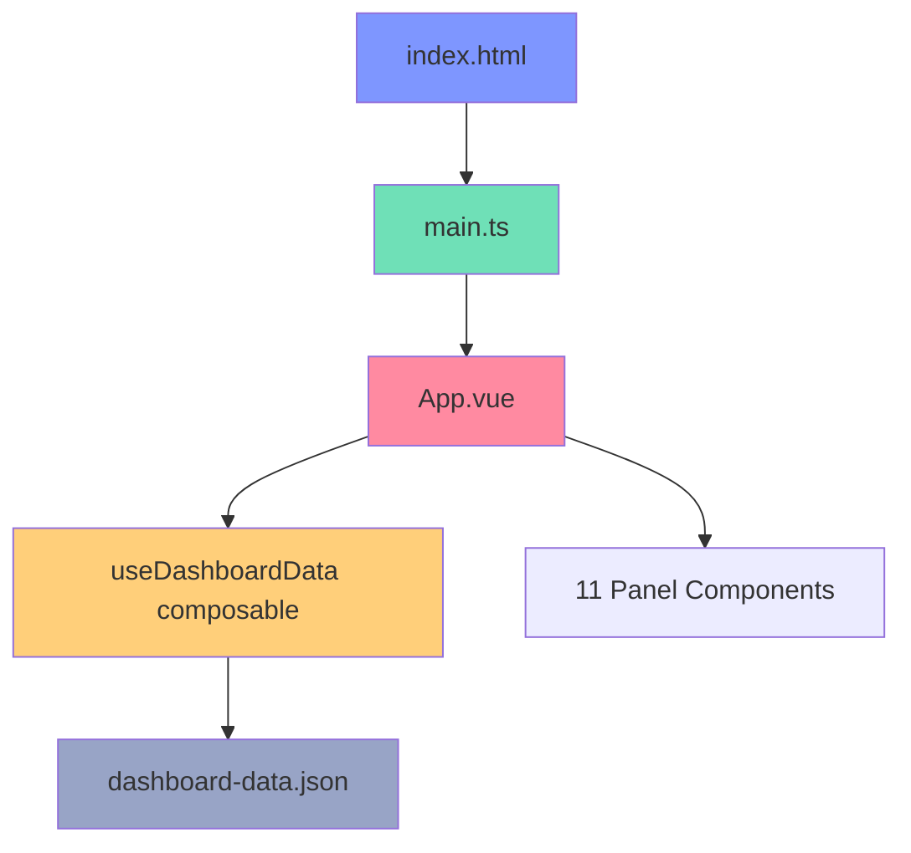
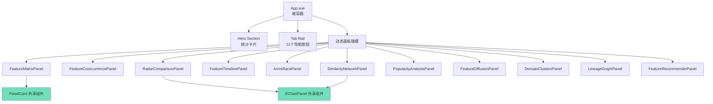

本文档详细解析编程语言类型系统知识图谱仪表板的 Vue 3 前端架构设计。该仪表板采用现代 Vue 3 Composition API 构建，集成了 ECharts 5 可视化引擎和 VueUse 工具库，通过清晰的组件层次结构实现了 11 个独立分析面板的切换与管理。

## 架构总览

### 技术栈全景

该前端项目采用以下核心技术构建，构成了一个现代化的 Vue 3 单页应用：

| 层级 | 技术选型 | 用途说明 |
|------|----------|----------|
| 框架核心 | Vue 3.5.13 | 响应式 UI 框架，基于 Composition API |
| 构建工具 | Vite 6.2 | 快速开发服务器与生产构建 |
| 可视化 | ECharts 5.6 | 图表渲染引擎 |
| 工具库 | @vueuse/core | 响应式工具函数（useFetch, useLocalStorage 等） |
| 类型系统 | TypeScript 5.8 | 静态类型检查与接口定义 |
| 样式 | 原生 CSS | CSS 变量驱动的设计系统 |

Sources: [package.json](frontend/package.json#L1-L26)

### 项目入口流程

应用的初始化流程简洁高效，从 HTML 入口到 Vue 实例挂载仅涉及三个核心文件：



应用入口定义在 `index.html` 中，Vue 实例通过 `main.ts` 的 `createApp` 函数创建并挂载到 `#app` 元素。整个应用采用 Composition API 风格编写，所有逻辑都在 `<script setup>` 块中组织。

Sources: [index.html](frontend/index.html#L1-L13), [main.ts](frontend/src/main.ts#L1-L6)

## 核心模块设计

### 数据获取层：useDashboardData Composable

数据获取采用 VueUse 的 `useFetch` 封装为可复用的组合式函数，实现了响应式的数据加载机制：

```typescript
// 关键实现逻辑
const baseUrl = import.meta.env.BASE_URL.endsWith('/')
  ? import.meta.env.BASE_URL
  : `${import.meta.env.BASE_URL}/`
const dataUrl = `${baseUrl}dashboard-data.json`
const { data, error, isFetching, isFinished } = useFetch(dataUrl)
  .get()
  .json<DashboardData>()

return {
  data: computed(() => data.value ?? null),
  error,
  isFetching,
  isFinished,
}
```

该设计确保了三个核心能力：自动根据 Vite 的 base 配置生成正确的数据 URL、返回 TypeScript 强类型的 DashboardData、以及通过 computed 包装保证响应式更新。

Sources: [useDashboardData.ts](frontend/src/composables/useDashboardData.ts#L1-L21)

### 状态管理层：App.vue 根组件

App.vue 作为应用根组件，承担了面板切换逻辑和全局状态管理的职责。其核心职责包括：

**Tab 导航系统**：使用 VueUse 的 `useLocalStorage` 实现 tab 状态的持久化存储，确保页面刷新后仍保持用户选择的分析面板：

```typescript
const tabs = [
  { key: 'matrix', label: 'Feature Matrix', kicker: 'Compare', summary: 'Dense scorecard...' },
  { key: 'cooccurrence', label: 'Feature Co-occurrence', kicker: 'Correlate', summary: '...' },
  // ... 11 个面板配置
] as const

const activeTab = useLocalStorage<(typeof tabs)[number]['key']>('dashboard-active-tab', 'matrix')
```

**条件渲染面板**：使用 `v-if/v-else-if` 链根据 activeTab 值动态渲染对应的面板组件：

```vue
<template v-if="data">
  <FeatureMatrixPanel v-if="activeTab === 'matrix'" :data="data" />
  <FeatureCooccurrencePanel v-else-if="activeTab === 'cooccurrence'" :data="data" />
  <!-- 其他 9 个面板组件 -->
</template>
```

Sources: [App.vue](frontend/src/App.vue#L1-L133)

## 组件层次结构

### 组件树图

组件架构采用树形结构组织，从根组件到叶子面板形成清晰的父子关系：



### 共享组件设计

项目定义了两个关键的共享组件用于减少代码重复：

**PanelCard.vue** — 统一的面板容器组件，提供标准化的面板头部、描述、操作按钮插槽和内容区域：

```vue
<script setup lang="ts">
defineProps<{
  title: string
  description: string
  eyebrow?: string
}>()
</script>

<template>
  <section class="panel-card">
    <header class="panel-head">
      <div>
        <span v-if="eyebrow" class="panel-eyebrow">{{ eyebrow }}</span>
        <h2>{{ title }}</h2>
        <p>{{ description }}</p>
      </div>
      <div class="panel-actions">
        <slot name="actions" />
      </div>
    </header>
    <div class="panel-body">
      <slot />
    </div>
  </section>
</template>
```

该组件使用 Vue 3 的具名插槽机制，允许多个面板自定义操作按钮区域而保持一致的视觉风格。

Sources: [PanelCard.vue](frontend/src/components/PanelCard.vue#L1-L26)

**EChartPanel.vue** — ECharts 图表封装组件，处理图表的初始化、更新响应式配置和容器尺寸变化：

```typescript
const chart = shallowRef<EChartsType | null>(null)

onMounted(() => {
  if (!root.value) return
  chart.value = echarts.init(root.value)
  renderChart(props.option)
})

watch(
  () => props.option,
  (option) => {
    renderChart(option)
  },
  { deep: true },
)

useResizeObserver(root, () => {
  chart.value?.resize()
})
```

该组件使用 `shallowRef` 存储 ECharts 实例以避免深度响应式开销，使用 VueUse 的 `useResizeObserver` 监听容器尺寸变化并自动触发图表重绘。

Sources: [EChartPanel.vue](frontend/src/components/EChartPanel.vue#L1-L47)

## 类型系统架构

### DashboardData 接口设计

类型定义集中在 `types/dashboard.ts` 中，定义了从 Python 后端获取的完整数据结构：

```typescript
export interface DashboardData {
  features: string[]
  feature_labels: Record<string, string>
  feature_short_labels: Record<string, string>
  scoring: Record<string, string>
  max_score: number
  heatmap: HeatmapLanguage[]
  network: { nodes: NetworkNode[]; edges: NetworkEdge[] }
  timeline: TimelineEvent[]
  arms_race: ArmsRaceSeries
  popularity: PopularityPoint[]
  diffusion: { default_feature: string; features: Record<string, DiffusionFeature> }
  lineage: { nodes: LineageNode[]; edges: LineageEdge[] }
  clusters: { cluster_labels: Record<string, string>; points: ClusterPoint[] }
  cooccurrence: {
    features: string[]
    prevalence: Record<string, number>
    cells: CooccurrenceCell[]
    top_pairs: CooccurrenceTopPair[]
  }
}
```

这种设计将 11 个面板对应的数据结构统一到一个接口中，通过 `useDashboardData` 一次性加载后传递给各面板组件，实现了数据获取与消费的关注点分离。

Sources: [dashboard.ts](frontend/src/types/dashboard.ts#L115-L148)

### 核心数据结构对照表

| 数据字段 | 对应面板 | 主要用途 |
|----------|----------|----------|
| `heatmap` | FeatureMatrix | 语言与特性的二维评分矩阵 |
| `cooccurrence` | Feature Co-occurrence | 特性间的相关性热力图 |
| `timeline` | Feature Timeline | 特性出现的时间序列 |
| `arms_race` | Arms Race Index | 年度特性引入统计 |
| `network` | Similarity Network | 语言相似性图 |
| `clusters` | Domain Clusters | PCA 降维后的语言聚类散点图 |
| `lineage` | Lineage Graph | 语言演化影响关系图 |
| `diffusion` | Feature Diffusion | 单特性的扩散路径动画 |
| `popularity` | Popularity Analysis | 流行度与复杂度关系分析 |

Sources: [App.vue](frontend/src/App.vue#L36-L44)

## 面板组件分类

### 表格型面板：FeatureMatrixPanel

FeatureMatrixPanel 是唯一不使用 ECharts 的面板，采用原生 HTML table 实现密集的数据展示：

```typescript
// 单元格颜色映射逻辑
function colorFor(score: number, max: number) {
  const alpha = 0.16 + (score / Math.max(max, 1)) * 0.8
  return `rgba(126, 150, 255, ${alpha.toFixed(3)})`
}
```

该面板实现了表头和首列的 sticky 定位以支持滚动时保持参考线，并使用 Teleport 将悬停提示卡渲染到 body 层级避免溢出问题。

Sources: [FeatureMatrixPanel.vue](frontend/src/components/panels/FeatureMatrixPanel.vue#L1-L159)

### 雷达图面板：RadarComparisonPanel

雷达图面板展示了最多 4 种语言的类型系统轮廓对比：

```typescript
const selected = ref<string[]>(['Rust', 'Haskell', 'Go'])

function toggleLanguage(name: string) {
  if (selected.value.includes(name)) {
    selected.value = selected.value.filter((item) => item !== name)
    return
  }
  if (selected.value.length >= 4) return
  selected.value = [...selected.value, name]
}
```

通过 paradigmColors 常量映射编程范式到对应颜色，使雷达图在视觉上清晰区分不同范式的语言特征轮廓。

Sources: [RadarComparisonPanel.vue](frontend/src/components/panels/RadarComparisonPanel.vue#L1-L81)

### 力导向图面板：SimilarityNetworkPanel 与 LineageGraphPanel

两个面板共享 graph + force 布局模式，但存在关键设计差异：

| 特性 | SimilarityNetworkPanel | LineageGraphPanel |
|------|------------------------|-------------------|
| 边类型 | 无向相似度边 | 带箭头的影响方向边 |
| 交互模式 | 纯探索式 | 支持聚焦特定语言 |
| 节点高亮 | 固定颜色 | 可切换领域着色 |
| 聚类依据 | paradigm 范式 | domain_group 领域分组 |

LineageGraphPanel 实现了更复杂的聚焦逻辑，通过 `highlighted` computed 属性动态计算需要高亮的节点集：

```typescript
const highlighted = computed(() => {
  if (focus.value === '__all__') {
    return new Set(props.data.lineage.nodes.map((node) => node.name))
  }
  const active = new Set([focus.value])
  props.data.lineage.edges.forEach((edge) => {
    if (edge.source === focus.value || edge.target === focus.value) {
      active.add(edge.source)
      active.add(edge.target)
    }
  })
  return active
})
```

Sources: [SimilarityNetworkPanel.vue](frontend/src/components/panels/SimilarityNetworkPanel.vue#L1-L81), [LineageGraphPanel.vue](frontend/src/components/panels/LineageGraphPanel.vue#L1-L129)

### 动态可视化面板：FeatureDiffusionPanel

该面板引入了动画控制逻辑，使用 VueUse 的 `useIntervalFn` 实现特性扩散的自动播放：

```typescript
const { pause, resume, isActive } = useIntervalFn(() => {
  progress.value += 1
  if (progress.value >= featureData.value.events.length) {
    pause()
  }
}, 850, { immediate: false })
```

用户可通过播放/暂停按钮和进度滑块两种方式控制动画，结合 ECharts 的 effectScatter 实现涟漪动画效果。

Sources: [FeatureDiffusionPanel.vue](frontend/src/components/panels/FeatureDiffusionPanel.vue#L1-L156)

### 交互推荐面板：FeatureRecommenderPanel

该面板展示了前端状态管理的复杂性，包含三个独立的响应式状态：

```typescript
const selectedFeatures = ref<string[]>([])
const threshold = ref(3)
const domainFilter = ref('__all__')
```

推荐算法基于加权评分机制：完全匹配的特性得 12 分，部分得分累加，再加上语言复杂度作为辅助排序依据：

```typescript
const score =
  matched.length * 12 +
  missing.reduce((acc, feature) => {
    const index = props.data.features.indexOf(feature)
    return acc + language.scores[index]
  }, 0) +
  language.complexity / 10
```

Sources: [FeatureRecommenderPanel.vue](frontend/src/components/panels/FeatureRecommenderPanel.vue#L1-L203)

## 样式系统设计

### CSS 变量体系

样式系统采用 CSS 自定义属性定义的设计令牌，确保视觉一致性和主题切换能力：

```css
:root {
  --bg: #0d1017;
  --bg-elevated: #131826;
  --panel: rgba(19, 24, 38, 0.86);
  --border: rgba(143, 162, 204, 0.18);
  --text: #edf2ff;
  --text-dim: #98a4c6;
  --accent: #7e96ff;
  --accent-2: #ff8aa1;
  --accent-3: #6fe0b7;
  --warning: #ffcf7a;
  color-scheme: dark;
  font-family: "Manrope", "Segoe UI", sans-serif;
}
```

这些变量驱动了从背景渐变、面板毛玻璃效果到按钮交互状态的全部样式。

Sources: [style.css](frontend/src/style.css#L1-L24)

### 常量定义：paradigmColors 与 featurePalette

`constants.ts` 导出了视觉映射常量，供各面板组件共享使用：

```typescript
export const paradigmColors: Record<string, string> = {
  Functional: '#6fe0b7',
  'Multi-paradigm': '#7e96ff',
  Systems: '#ffcf7a',
  ObjectOriented: '#ff8aa1',
  'Object-oriented': '#ff8aa1',
  Procedural: '#9bd6ff',
}

export const domainGroupColors: Record<string, string> = {
  Systems: '#ffcf7a',
  Web: '#7e96ff',
  Academic: '#6fe0b7',
  General: '#ff8aa1',
}

export const clusterPalette = ['#7e96ff', '#ff8aa1', '#6fe0b7']
```

这种集中定义方式确保了跨面板的视觉一致性，任何颜色调整只需修改常量文件即可全局生效。

Sources: [constants.ts](frontend/src/constants.ts#L1-L42)

## 构建与部署配置

### Vite 配置

Vite 配置根据 GitHub Actions 环境变量自动适配 GitHub Pages 的部署路径：

```typescript
const repository = runtimeEnv.GITHUB_REPOSITORY ?? ''
const repositoryName = repository.split('/')[1] ?? ''
const defaultPagesBase = repositoryName ? `/${repositoryName}/` : '/'
const base = runtimeEnv.VITE_BASE_PATH
  ?? (runtimeEnv.GITHUB_ACTIONS === 'true' ? defaultPagesBase : '/')
```

本地开发使用根路径 `/`，CI 环境自动使用仓库名作为 base 路径。

Sources: [vite.config.ts](frontend/vite.config.ts#L1-L19)

### 脚本命令

package.json 定义了完整的开发工作流命令：

| 命令 | 功能 |
|------|------|
| `pnpm dev` | 启动本地开发服务器 (端口 5173) |
| `pnpm build` | 生产环境构建 |
| `pnpm sync:data` | 运行 Python 脚本生成 dashboard-data.json |
| `pnpm dev:sync` | 先同步数据再启动开发服务器 |

Sources: [package.json](frontend/package.json#L1-L27)

## 架构设计模式总结

该前端项目展现了若干值得借鉴的架构设计模式：

**Composable-first 架构**：数据获取逻辑封装为 `useDashboardData`，面板特定逻辑分散在各组件内部而非集中于全局状态管理器，实现了关注点分离。

**统一面板模式**：所有 11 个分析面板都遵循 PanelCard + EChartPanel 的组合模式，降低了认知负担并简化了维护。

**响应式配置驱动**：ECharts 的图表配置通过 computed 属性从 props 和本地状态计算得到，确保了 UI 状态与图表渲染的实时同步。

**类型驱动的开发**：完整的 TypeScript 接口定义在类型检查阶段即可捕获数据不匹配问题，提升了开发效率和代码可靠性。