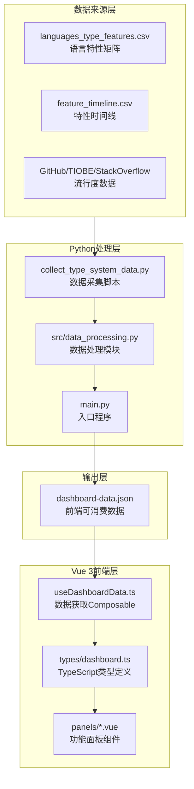

本页面阐述编程语言类型系统知识图谱项目的数据架构与类型系统。文档涵盖从数据采集、Python处理管道到Vue 3前端类型定义的完整数据流，并详解各核心接口的设计意图与使用场景。

## 数据流架构总览

该项目采用**批处理数据管道**架构：Python后端定期生成预计算数据JSON，前端通过Vue 3 Composition API异步加载并消费。以下架构图展示了数据在各层之间的流转路径：



Python后端通过 `main.py` 的 `prepare_dashboard_data()` 函数聚合所有处理结果，生成单一 `dashboard-data.json` 文件供前端异步加载。这种设计将计算密集型分析（相似度计算、PCA降维、K-Means聚类）集中于构建时完成，前端仅需处理纯展示逻辑。

Sources: [main.py](main.py#L20-L33), [src/data_processing.py](src/data_processing.py#L562-L627)

## TypeScript 类型体系

前端类型定义集中于 `types/dashboard.ts` 文件，采用接口（interface）而非类型别名（type alias），以获得更好的可扩展性和声明合并能力。

### 核心数据接口

**DashboardData** 是整个前端应用的根接口，定义了仪表板所需的所有数据结构：

```typescript
export interface DashboardData {
  features: string[]                                    // 14个特性键名数组
  feature_labels: Record<string, string>                 // 特性键名→可读标签映射
  feature_short_labels: Record<string, string>           // 特性键名→紧凑标签映射
  scoring: Record<string, string>                        // 评分标准描述
  max_score: number                                      // 最大评分（5分制）
  heatmap: HeatmapLanguage[]                              // 语言特性矩阵数据
  network: { nodes: NetworkNode[]; edges: NetworkEdge[] }// 相似性网络图
  timeline: TimelineEvent[]                              // 时间线事件列表
  arms_race: ArmsRaceSeries                              // 军备竞赛指数序列
  popularity: PopularityPoint[]                         // 流行度分析数据
  diffusion: { default_feature: string; features: Record<string, DiffusionFeature> }
  lineage: { nodes: LineageNode[]; edges: LineageEdge[] }
  clusters: { cluster_labels: Record<string, string>; points: ClusterPoint[] }
  cooccurrence: { features: string[]; prevalence: Record<string, number>; cells: CooccurrenceCell[]; top_pairs: CooccurrenceTopPair[] }
}
```

Sources: [frontend/src/types/dashboard.ts](frontend/src/types/dashboard.ts#L115-L147)

### 时间线与序列接口

**TimelineEvent** 用于描述编程语言引入特定类型系统特性的历史事件，其结构设计如下：

```typescript
export interface TimelineEvent {
  year: number           // 特性引入年份
  language: string       // 语言名称
  feature: string        // 特性键名
  feature_label: string  // 特性可读标签
}
```

**ArmsRaceSeries** 封装了军备竞赛指数的时间序列分析结果，包含年度计数、累积计数、移动平均和加速度等派生指标：

```typescript
export interface ArmsRaceSeries {
  years: number[]             // 年份序列
  yearly_counts: number[]     // 每年新增特性数
  cumulative_counts: number[] // 累积特性数
  moving_average: number[]   // 5年移动平均
  acceleration: number[]      // 年际加速度
  total_events: number        // 事件总数
  peak_year: number | null    // 峰值年份
  peak_count: number          // 峰值计数
}
```

Sources: [frontend/src/types/dashboard.ts](frontend/src/types/dashboard.ts#L1-L17)

### 网络图接口

相似性网络与谱系图采用图论标准结构：**NetworkNode** 存储节点元数据，**NetworkEdge** 存储边的连接关系和权重：

```typescript
export interface NetworkNode {
  name: string        // 语言名称
  paradigm: string    // 编程范式
  domain: string      // 应用领域
  complexity: number  // 类型复杂度总分
}

export interface NetworkEdge {
  source: string      // 源语言
  target: string      // 目标语言
  similarity: number  // 余弦相似度（0-1）
}
```

**LineageNode** 和 **LineageEdge** 扩展了基础图接口，增加了虚拟节点标记（用于ML、Lisp等追溯性根节点）：

```typescript
export interface LineageNode {
  name: string
  year: number
  paradigm: string
  domain: string
  domain_group: string   // 领域分组（Systems/Web/Academic/General）
  complexity: number
  virtual?: boolean      // 虚拟节点标记
}

export interface LineageEdge {
  source: string
  target: string
  reason: string         // 影响关系说明
}
```

Sources: [frontend/src/types/dashboard.ts](frontend/src/types/dashboard.ts#L29-L93)

### 聚类与共现接口

**ClusterPoint** 封装了PCA降维与K-Means聚类的结果，每个点包含二维投影坐标和聚类归属：

```typescript
export interface ClusterPoint {
  name: string
  x: number             // PCA第一主成分
  y: number             // PCA第二主成分
  cluster: number       // 聚类编号（0-based）
  cluster_label: string // 聚类标签（如 "Cluster 1 / Academic-leaning"）
  domain: string
  domain_group: string
  paradigm: string
  complexity: number
}
```

**CooccurrenceCell** 和 **CooccurrenceTopPair** 用于特性共现分析，每个单元格存储皮尔逊相关系数和共现支持度：

```typescript
export interface CooccurrenceCell {
  x: string             // X轴特性
  y: string             // Y轴特性
  x_index: number
  y_index: number
  correlation: number    // 皮尔逊相关系数
  cooccurrence: number  // 共现语言数
  support_x: number      // X特性流行度
  support_y: number      // Y特性流行度
}
```

Sources: [frontend/src/types/dashboard.ts](frontend/src/types/dashboard.ts#L67-L146)

## Python 数据处理结构

Python层处理的核心数据结构以字典（dict）和列表（list）为主，经JSON序列化后传递给前端。

### 源数据结构

原始数据存储于 `data/languages.json`，其顶层结构包含元数据（metadata）和语言数组（languages）两大部分：

```json
{
  "metadata": {
    "description": "Programming Language Type System Feature Matrix",
    "version": "2.0",
    "scoring": {
      "0": "Not supported — feature completely absent",
      "1": "Minimal — very limited...",
      ...
    },
    "features": {
      "parametric_polymorphism": "Generics / parametric polymorphism",
      ...
    }
  },
  "languages": [
    {
      "name": "Rust",
      "year": 2010,
      "paradigm": "Systems",
      "domain": "Systems programming",
      "features": { "parametric_polymorphism": 5, ... },
      "scoring_rationale": { ... },
      "feature_timeline": { ... },
      "popularity": { ... }
    }
  ]
}
```

Sources: [data/languages.json](data/languages.json#L1-L29)

### 处理函数映射

`data_processing.py` 模块提供了从原始数据到各可视化模块的转换函数：

| 函数名 | 返回类型 | 用途 |
|--------|----------|------|
| `get_feature_names()` | `list[str]` | 提取特性键名列表 |
| `get_feature_labels()` | `dict[str, str]` | 特性键名→可读标签 |
| `get_feature_short_labels()` | `dict[str, str]` | 紧凑标签映射 |
| `get_feature_vectors()` | `dict[str, list[int]]` | 语言→特性向量 |
| `compute_similarity_matrix()` | `dict` | 余弦相似度矩阵 |
| `build_timeline_events()` | `list[dict]` | 时间线事件列表 |
| `build_arms_race_index()` | `dict` | 军备竞赛指数序列 |
| `build_popularity_data()` | `list[dict]` | 流行度数据 |
| `build_feature_diffusion()` | `dict` | 特性扩散路径 |
| `build_language_lineage()` | `dict` | 谱系图数据 |
| `build_domain_clusters()` | `dict` | 聚类分析结果 |
| `build_feature_cooccurrence()` | `dict` | 特性共现矩阵 |

Sources: [src/data_processing.py](src/data_processing.py#L16-L559)

### 相似度计算

项目使用**余弦相似度**衡量编程语言类型系统之间的相似程度：

```python
def cosine_similarity(a: list[int], b: list[int]) -> float:
    """Compute cosine similarity between two vectors."""
    dot = sum(x * y for x, y in zip(a, b))
    mag_a = math.sqrt(sum(x * x for x in a))
    mag_b = math.sqrt(sum(x * x for x in b))
    if mag_a == 0 or mag_b == 0:
        return 0.0
    return dot / (mag_a * mag_b)
```

对于特性共现分析，则采用**皮尔逊相关系数**衡量两个特性评分序列的线性相关性：

```python
def pearson_correlation(a: list[float], b: list[float]) -> float:
    """Compute Pearson correlation between two equal-length vectors."""
    if not a or not b or len(a) != len(b):
        return 0.0
    mean_a = sum(a) / len(a)
    mean_b = sum(b) / len(b)
    centered_a = [value - mean_a for value in a]
    centered_b = [value - mean_b for value in b]
    numerator = sum(x * y for x, y in zip(centered_a, centered_b))
    denom_a = math.sqrt(sum(value * value for value in centered_a))
    denom_b = math.sqrt(sum(value * value for value in centered_b))
    if denom_a == 0 or denom_b == 0:
        return 0.0
    return numerator / (denom_a * denom_b)
```

Sources: [src/data_processing.py](src/data_processing.py#L60-L84)

### PCA降维与K-Means聚类

项目自行实现PCA（主成分分析）和K-Means聚类算法，不依赖外部机器学习库：

**PCA实现**采用幂迭代法（Power Iteration）计算协方差矩阵的特征向量：

```python
def _project_pca_2d(vectors: list[list[float]]) -> tuple[list[tuple[float, float]], list[list[float]]]:
    # 计算均值并中心化
    means = [sum(vector[idx] for vector in vectors) / count for idx in range(dimension)]
    centered = [[vector[idx] - means[idx] for idx in range(dimension)] for vector in vectors]
    
    # 计算协方差矩阵
    covariance = [...]
    
    # 幂迭代法提取第一、第二主成分
    eigenvalue_1, eigenvector_1 = _power_iteration(covariance)
    covariance_2 = _deflate(covariance, eigenvalue_1, eigenvector_1)
    _, eigenvector_2 = _power_iteration(covariance_2)
    
    # 投影到二维空间
    projections = [(_dot(vector, eigenvector_1), _dot(vector, eigenvector_2)) for vector in centered]
    return projections, centered
```

**K-Means实现**采用标准迭代重分配策略，设置24轮最大迭代次数：

```python
def _kmeans(points: list[list[float]], k: int = 3, iterations: int = 24) -> tuple[list[int], list[list[float]]]:
    k = min(k, len(points))
    centroids = [point[:] for point in points[:k]]  # 随机初始化质心
    assignments = [0] * len(points)
    
    for _ in range(iterations):
        # E步：分配每个点到最近的质心
        for idx, point in enumerate(points):
            distances = [sum((value - centroid[dim]) ** 2 for dim, value in enumerate(point)) for centroid in centroids]
            cluster = min(range(k), key=lambda cluster_idx: distances[cluster_idx])
            if assignments[idx] != cluster:
                assignments[idx] = cluster
                updated = True
        
        # M步：更新质心位置
        grouped: list[list[list[float]]] = [[] for _ in range(k)]
        for assignment, point in zip(assignments, points):
            grouped[assignment].append(point)
        
        new_centroids = [sum(point[dim] for point in group) / len(group) if group else centroids[i] for i, group in enumerate(grouped)]
        centroids = new_centroids
```

聚类标签采用领域投票机制：统计每个聚类中各领域分组（Systems/Web/Academic/General）的语言数量，将票数最多的领域作为聚类标签后缀。

Sources: [src/data_processing.py](src/data_processing.py#L384-L458)

## 前端数据获取模式

前端采用Vue 3 Composition API封装数据获取逻辑，提供响应式的数据访问接口。

### useDashboardData Composable

`useDashboardData` 是全局数据获取的单一入口：

```typescript
import { computed } from 'vue'
import { useFetch } from '@vueuse/core'
import type { DashboardData } from '../types/dashboard'

export function useDashboardData() {
  const baseUrl = import.meta.env.BASE_URL.endsWith('/')
    ? import.meta.env.BASE_URL
    : `${import.meta.env.BASE_URL}/`
  const dataUrl = `${baseUrl}dashboard-data.json`
  const { data, error, isFetching, isFinished } = useFetch(dataUrl)
    .get()
    .json<DashboardData>()

  return {
    data: computed(() => data.value ?? null),
    error,
    isFetching,
    isFinished,
  }
}
```

该Composable的核心设计：使用 `@vueuse/core` 的 `useFetch` 处理HTTP请求，通过 `computed` 包装确保响应式访问，自动推断JSON响应类型为 `DashboardData`。

Sources: [frontend/src/composables/useDashboardData.ts](frontend/src/composables/useDashboardData.ts#L1-L21)

### 组件中的类型使用

各功能面板组件通过 `defineProps<{ data: DashboardData }>()` 获取类型安全的数据访问：

```typescript
// RadarComparisonPanel.vue
import type { DashboardData } from '../../types/dashboard'

const props = defineProps<{
  data: DashboardData
}>()

// 类型安全的属性访问
const language = props.data.heatmap.find((lang) => lang.name === name)
const radarIndicator = props.data.features.map((feature) => ({
  name: props.data.feature_short_labels[feature],
  max: props.data.max_score,
}))
```

```typescript
// FeatureMatrixPanel.vue
// heatmap数据用于渲染语言特性矩阵表格
const topLanguage = props.data.heatmap[0]  // complexity最高的语言
```

Sources: [frontend/src/components/panels/RadarComparisonPanel.vue](frontend/src/components/panels/RadarComparisonPanel.vue#L1-L81), [frontend/src/components/panels/FeatureMatrixPanel.vue](frontend/src/components/panels/FeatureMatrixPanel.vue#L1-L100)

## 常量定义体系

`constants.ts` 集中管理可视化配色方案和符号映射，确保全局视觉一致性：

```typescript
// 编程范式→颜色映射
export const paradigmColors: Record<string, string> = {
  Functional: '#6fe0b7',
  'Multi-paradigm': '#7e96ff',
  Systems: '#ffcf7a',
  ObjectOriented: '#ff8aa1',
  'Object-oriented': '#ff8aa1',
  Procedural: '#9bd6ff',
}

// 领域分组→颜色映射
export const domainGroupColors: Record<string, string> = {
  Systems: '#ffcf7a',
  Web: '#7e96ff',
  Academic: '#6fe0b7',
  General: '#ff8aa1',
}

// 领域分组→符号映射（用于散点图）
export const domainGroupSymbols: Record<string, string> = {
  Systems: 'diamond',
  Web: 'circle',
  Academic: 'triangle',
  General: 'rect',
}

// 14色特性调色板（用于雷达图等）
export const featurePalette = [
  '#7e96ff', '#ff8aa1', '#6fe0b7', '#ffcf7a',
  '#8b7cff', '#ffab5b', '#55d6ff', '#ffa9e0',
  '#8bffa8', '#b38cff', '#ffd36f', '#ff7f7f',
  '#71f0ff', '#b3ff7a',
]
```

Sources: [frontend/src/constants.ts](frontend/src/constants.ts#L1-L42)

## 类型系统特性数据

项目追踪14种类型系统特性，涵盖从基础多态到高级类型系统的完整维度：

| 特性键名 | 可读标签 | 说明 |
|----------|----------|------|
| `parametric_polymorphism` | Generics | 参数化多态/泛型 |
| `ad_hoc_polymorphism` | Traits | Trait/Typeclass/Interface多态 |
| `algebraic_data_types` | ADTs | 代数数据类型（和类型+积类型） |
| `pattern_matching` | Matching |穷举式模式匹配 |
| `ownership_lifetime` | Ownership | 所有权/生命周期/借用检查 |
| `dependent_types` | Dep Types | 依赖类型（类型依赖值） |
| `gadts` | GADTs | 广义代数数据类型 |
| `higher_kinded_types` | HKT | 高阶类型构造器 |
| `effect_system` | Effects | 效果系统 |
| `refinement_types` | Refinement | 谓词精化类型 |
| `gradual_typing` | Gradual | 渐进类型（静动混合） |
| `type_inference` | Inference | 自动类型推断 |
| `structural_typing` | Structural | 结构化类型（vs 名义类型） |
| `flow_sensitive_typing` | Flow | 流敏感类型（类型收窄） |

评分采用0-5六档标准：0表示完全不支持，5表示参考级实现。

Sources: [data/languages.json](data/languages.json#L13-L28)

## 类型复杂度计算

类型复杂度评分定义为语言所有特性分数的累加和：

```python
def compute_type_complexity_score(lang: dict) -> int:
    """Sum of all feature scores as a rough complexity metric."""
    return sum(lang["features"].values())
```

该指标用于多场景排序：热力图语言排序、雷达图默认语言选择、网络图节点大小映射等。最大可能分数为 `14 features × 5 = 70` 分。

Sources: [src/data_processing.py](src/data_processing.py#L118-L120)

## 下一步阅读

- 深入了解DashboardData各子接口的详细设计：[DashboardData 接口详解](7-dashboarddata-jie-kou-xiang-jie)
- 掌握数据处理管道的构建流程：[Python 数据处理管道](4-python-shu-ju-chu-li-guan-dao)
- 学习各功能面板如何消费这些类型：[功能面板导航](10-gong-neng-mian-ban-dao-hang)