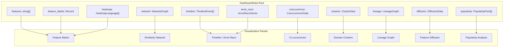
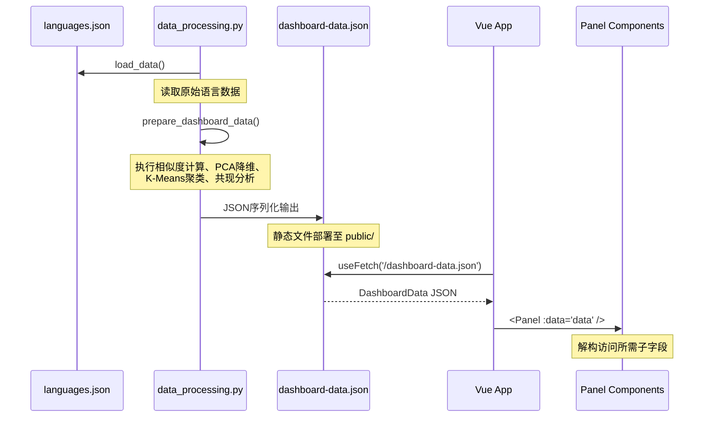

DashboardData 是整个前端仪表板的**单一数据源聚合接口**，它将 Python 后端预处理的所有分析结果封装为 TypeScript 类型，为 11 个可视化面板提供统一的数据访问契约。该接口位于类型定义层级的前端核心位置，是连接 [Python 数据处理管道](4-python-shu-ju-chu-li-guan-dao) 与 [Vue 3 前端组件架构](5-vue-3-qian-duan-zu-jian-jia-gou) 的关键桥梁。

## 接口全景结构



如上图所示，DashboardData 的顶层字段按功能可分为四大类别：**元数据字段**（features、feature_labels、scoring）供所有面板使用，以及 **六个独立分析模块**，每个模块自包含其渲染所需的完整数据结构。

Sources: [dashboard.ts](frontend/src/types/dashboard.ts#L115-L147)

## 核心元数据字段

### 特性标识系统

`features` 数组定义了评分体系中的 14 个类型系统维度键名列表，其顺序决定了 Feature Matrix 表格列的显示顺序。`feature_labels` 和 `feature_short_labels` 分别提供人类可读的完整名称和紧凑缩写版本，后者用于表头空间受限的场景。`scoring` 字段描述评分量表（如 0-4 的含义），`max_score` 则标识理论最高分值。

```typescript
features: string[]                    // ["parametric_polymorphism", "ad_hoc_polymorphism", ...]
feature_labels: Record<string, string>  // { parametric_polymorphism: "Parametric Polymorphism" }
feature_short_labels: Record<string, string> // { parametric_polymorphism: "Generics" }
scoring: Record<string, string>        // { "0": "Not supported", "4": "First-class support" }
max_score: number                       // 4
```

Sources: [dashboard.ts](frontend/src/types/dashboard.ts#L116-L120), [data_processing.py](src/data_processing.py#L16-L48)

## 热力图与相似性网络模块

### HeatmapLanguage 类型

`heatmap` 数组承载 Feature Matrix 面板的核心数据，按类型复杂度降序排列。每个条目包含语言的年份-paradigm-domain 元组、14 维评分向量、以及每项得分的评分理由说明，这些理由数据来自 `scoring_rationale` 字段，在悬停时展示为详细说明。

Sources: [dashboard.ts](frontend/src/types/dashboard.ts#L19-L27), [data_processing.py](src/data_processing.py#L570-L582)

### NetworkGraph 类型

`network` 对象封装相似性网络的节点-边结构。`nodes` 数组仅包含语言名称和分类信息，`edges` 数组则存储余弦相似度 ≥ 0.65 的语言对。相似度计算在 Python 后端完成，前端网络面板直接渲染预计算的边列表，无需实时计算。

Sources: [dashboard.ts](frontend/src/types/dashboard.ts#L29-L40), [data_processing.py](src/data_processing.py#L100-L115)

## 时间序列分析模块

### TimelineEvent 类型

`timeline` 数组将所有语言的特性引入事件扁平化为年份序列。每个事件记录该特性在特定语言的引入年份，供 Timeline 面板渲染时间线视图。

Sources: [dashboard.ts](frontend/src/types/dashboard.ts#L1-L6), [data_processing.py](src/data_processing.py#L130-L143)

### ArmsRaceSeries 类型

`arms_race` 对象是预处理的时间序列聚合，包含：原始年度计数、累积计数、5 年滑动平均、以及年度加速度（相邻年增量）。`peak_year` 和 `peak_count` 标识特性引入最密集的年份，`total_events` 记录事件总数。

Sources: [dashboard.ts](frontend/src/types/dashboard.ts#L8-L17), [data_processing.py](src/data_processing.py#L146-L197)

## 特性共现分析模块

`cooccurrence` 对象包含特性共现热力图的完整数据矩阵。`features` 数组定义矩阵轴，`prevalence` 记录每个特性在多少语言中被支持（非零评分），`cells` 数组以扁平化形式存储所有特性对的相关系数和共现计数，`top_pairs` 筛选相关性最高的前 6 对用于快速洞察展示。

Sources: [dashboard.ts](frontend/src/types/dashboard.ts#L95-L113), [data_processing.py](src/data_processing.py#L505-L559)

## 领域聚类模块

`clusters` 对象封装 PCA 降维与 K-Means 聚类的结果。`points` 数组每个条目包含降维后的二维坐标 (x, y)、聚类分配编号及标签、`domain_group` 和 `paradigm` 分类信息。聚类标签通过投票机制生成：统计每个聚类中各领域归属语言的频次，将得票最高的领域作为聚类标签。

Sources: [dashboard.ts](frontend/src/types/dashboard.ts#L67-L77), [data_processing.py](src/data_processing.py#L461-L502)

## 谱系图与特性扩散模块

### LineageGraph 类型

`lineage` 对象描述语言间的影晌关系。`nodes` 数组包含真实语言节点以及四个**虚拟根节点**（ML、Lisp、Erlang、JavaScript），这些虚拟节点用于表示学术起源和语言家族起点，标记为 `virtual: true`。`edges` 数组存储源-目标语言对及影晌原因说明。

Sources: [dashboard.ts](frontend/src/types/dashboard.ts#L79-L93), [data_processing.py](src/data_processing.py#L257-L346)

### DiffusionFeature 类型

`diffusion` 对象的 `default_feature` 标识默认展示的特性，`features` 字典以特性键名为主索引，每个条目包含 `label` 和按年份排序的 `events` 数组。事件数据包含语言名称、年份、评分、Paradigm/Domain 分类及领域分组。

Sources: [dashboard.ts](frontend/src/types/dashboard.ts#L53-L65), [data_processing.py](src/data_processing.py#L226-L254)

## 流行度分析模块

`popularity` 数组聚合多个流行度指标数据源（TIOBE 排名、GitHub Stars 排名、Stack Overflow 喜爱度百分比），每条记录关联语言的类型复杂度得分和领域分类，用于展示复杂度-流行度的相关性分析。

Sources: [dashboard.ts](frontend/src/types/dashboard.ts#L42-L51), [data_processing.py](src/data_processing.py#L200-L218)

## 数据获取与状态管理

### useDashboardData Composable

前端通过 Vue 3 Composition API 的 `useDashboardData()` composable 获取 DashboardData。该函数使用 `@vueuse/core` 的 `useFetch` 发起 GET 请求，从部署路径 `/dashboard-data.json` 获取 JSON 数据，返回响应式的数据引用、加载状态和错误状态。

Sources: [useDashboardData.ts](frontend/src/composables/useDashboardData.ts#L1-L20)

### 面板组件的数据消费模式

各面板组件通过 Props 接收完整的 `DashboardData` 对象，按需访问其子字段。例如 `FeatureMatrixPanel` 消费 `heatmap`、`features`、`feature_labels`、`feature_short_labels` 和 `scoring`，而 `ArmsRacePanel` 仅依赖 `arms_race` 字段。这种设计使得面板组件保持独立，不直接参与数据获取逻辑。

Sources: [FeatureMatrixPanel.vue](frontend/src/components/panels/FeatureMatrixPanel.vue#L1-L158), [App.vue](frontend/src/App.vue#L119-L129)

## 完整数据流架构



整个系统在构建时一次性生成 `dashboard-data.json`，部署后作为静态资源被前端加载。这种 **离线计算+在线消费** 的架构将计算密集的相似度矩阵和 PCA 降维从运行时转移到构建阶段，确保面板切换时无延迟渲染。

## 后续学习路径

- 深入 [Python 数据处理管道](4-python-shu-ju-chu-li-guan-dao) 了解 `prepare_dashboard_data()` 的完整生成逻辑
- 探索 [Vue 3 前端组件架构](5-vue-3-qian-duan-zu-jian-jia-gou) 掌握面板组件的设计模式
- 查看 [Feature Matrix 特性矩阵](11-feature-matrix-te-xing-ju-zhen) 了解热力图数据的渲染实现