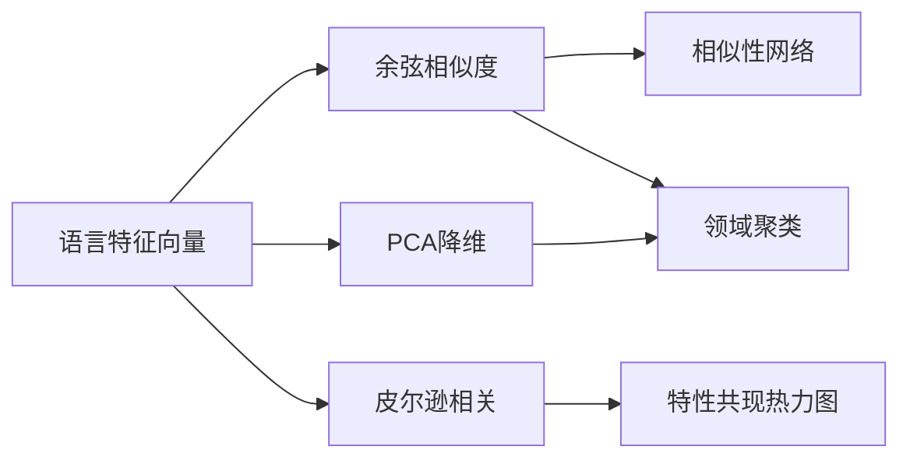

本页面深入解析项目中用于衡量编程语言类型系统相似性的核心算法实现。这些算法支撑着 [Similarity Network 相似性网络](16-similarity-network-xiang-si-xing-wang-luo)、[Domain Clusters 领域聚类](18-domain-clusters-ling-yu-ju-lei) 以及 [Feature Co-occurrence 特性共现](13-feature-co-occurrence-te-xing-gong-xian) 等可视化面板。

## 核心设计理念

项目的相似度计算基于一个关键假设：**编程语言的类型系统可以通过 14 维特征向量进行数值化表示**。每种语言对应一个长度为 14 的整数数组，数组元素取值为 0-5（表示特性支持的完整程度）。通过计算向量间的相似度，可以量化语言间的"类型系统距离"。

Sources: [src/data_processing.py](src/data_processing.py#L51-L67)

## 特征向量提取

在计算相似度之前，系统首先将语言数据转换为统一格式的特征向量。这一过程位于 `get_feature_vectors` 函数中：

```python
def get_feature_vectors(data: dict) -> dict[str, list[int]]:
    """Return {language_name: [feature_scores]} dict."""
    features = get_feature_names(data)
    return {
        lang["name"]: [lang["features"].get(f, 0) for f in features]
        for lang in data["languages"]
    }
```

该函数返回的结构为 `{语言名称: [14维特征分数列表]}`，其中特征顺序与 `data["metadata"]["features"]` 中定义的顺序保持一致，确保所有语言在向量空间中具有可比性。默认分数为 0 表示该语言不支持该特性。

Sources: [src/data_processing.py](src/data_processing.py#L51-L57)

## 余弦相似度（Cosine Similarity）

**余弦相似度**是语言间相似性的核心度量算法。它衡量两个特征向量在多维空间中的方向一致性，而非绝对距离：

```python
def cosine_similarity(a: list[int], b: list[int]) -> float:
    """Compute cosine similarity between two vectors."""
    dot = sum(x * y for x, y in zip(a, b))
    mag_a = math.sqrt(sum(x * x for x in a))
    mag_b = math.sqrt(sum(x * x for x in b))
    if mag_a == 0 or mag_b == 0:
        return 0.0
    return dot / (mag_a * mag_b)
```

**数学原理**：对于两个 n 维向量 A 和 B，余弦相似度定义为：

$$\text{cosine\_similarity}(A, B) = \frac{A \cdot B}{\|A\| \|B\|}$$

**算法特性**：
- 取值范围为 [-1, 1]，在本项目中由于分数非负，实际范围为 [0, 1]
- 值为 1 表示完全相似的特征分布
- 值为 0 表示无相似性（正交向量）
- 对向量 magnitude 不敏感，只关注方向一致性

例如，Rust 和 Haskell 在 ADTs、Pattern Matching、Polymorphism 等特性上都有高分，因此余弦相似度接近 1.0；而 Rust 和纯动态语言（如 JavaScript）的相似度则较低。

Sources: [src/data_processing.py](src/data_processing.py#L60-L67)

## 皮尔逊相关系数（Pearson Correlation）

皮尔逊相关系数用于衡量**特性之间的共现关系**，而非语言间的相似性。这一指标帮助识别哪些类型系统特性倾向于同时出现在编程语言中：

```python
def pearson_correlation(a: list[float], b: list[float]) -> float:
    """Compute Pearson correlation between two equal-length vectors."""
    if not a or not b or len(a) != len(b):
        return 0.0

    mean_a = sum(a) / len(a)
    mean_b = sum(b) / len(b)
    centered_a = [value - mean_a for value in a]
    centered_b = [value - mean_b for value in b]
    numerator = sum(x * y for x, y in zip(centered_a, centered_b))
    denom_a = math.sqrt(sum(value * value for value in centered_a))
    denom_b = math.sqrt(sum(value * value for value in centered_b))
    if denom_a == 0 or denom_b == 0:
        return 0.0
    return numerator / (denom_a * denom_b)
```

**与余弦相似度的区别**：皮尔逊相关系数首先对向量进行中心化（减去均值），因此它测量的是**线性相关性**而非原始向量方向的相似性。这使得它对不同"基线"的语言具有更好的可比性——例如，一种语言可能所有分数都较高，另一种语言分数都较低，但它们仍然具有很高的线性相关性。

Sources: [src/data_processing.py](src/data_processing.py#L70-L84)

## 相似度矩阵构建

### 全量矩阵计算

`compute_similarity_matrix` 函数生成所有语言对的余弦相似度：

```python
def compute_similarity_matrix(data: dict) -> dict:
    """Compute pairwise cosine similarity between all languages."""
    vectors = get_feature_vectors(data)
    names = list(vectors.keys())
    matrix = {}
    for i, name_a in enumerate(names):
        for j, name_b in enumerate(names):
            if i < j:
                sim = cosine_similarity(vectors[name_a], vectors[name_b])
                matrix[f"{name_a}|{name_b}"] = round(sim, 4)
    return {"names": names, "similarities": matrix}
```

该函数仅计算上三角部分（i < j），因为相似度矩阵是对称的，最终输出结构包含语言名称列表和键值对形式的相似度数据（键格式为 `"语言A|语言B"`）。

Sources: [src/data_processing.py](src/data_processing.py#L87-L97)

### 阈值过滤边计算

`compute_similarity_edges` 函数专为 [Similarity Network 相似性网络](16-similarity-network-xiang-si-xing-wang-luo) 可视化设计：

```python
def compute_similarity_edges(data: dict, threshold: float = 0.6) -> list[dict]:
    """Compute similarity edges for the network graph."""
    vectors = get_feature_vectors(data)
    names = list(vectors.keys())
    edges = []
    for i, name_a in enumerate(names):
        for j, name_b in enumerate(names):
            if i < j:
                sim = cosine_similarity(vectors[name_a], vectors[name_b])
                if sim >= threshold:
                    edges.append({
                        "source": name_a,
                        "target": name_b,
                        "similarity": round(sim, 4),
                    })
    return edges
```

**默认阈值 0.65** 的含义：当两种语言的余弦相似度 ≥ 0.65 时，它们在网络图中会有一条边相连。这个阈值在 `prepare_dashboard_data` 中硬编码，确保网络图不会过于稠密（n种语言最多可能有 n(n-1)/2 条边）。

Sources: [src/data_processing.py](src/data_processing.py#L100-L115)
Sources: [src/data_processing.py](src/data_processing.py#L585)

## 前端数据流

后端计算完成后，前端通过 TypeScript 类型定义消费这些数据：

```typescript
export interface NetworkEdge {
  source: string
  target: string
  similarity: number
}
```

在 [SimilarityNetworkPanel.vue](frontend/src/components/panels/SimilarityNetworkPanel.vue#L1-L81) 中，这些边数据被转换为力导向图配置：

```typescript
links: props.data.network.edges.map((edge) => ({
  ...edge,
  value: edge.similarity.toFixed(2),
  lineStyle: {
    width: Math.max(1.4, edge.similarity * 3),
    color: '#4f608d',
    opacity: 0.55,
  },
})),
```

边的宽度与相似度成正比（`edge.similarity * 3`），确保视觉权重反映数学权重。

Sources: [frontend/src/types/dashboard.ts](frontend/src/types/dashboard.ts#L36-L40)
Sources: [frontend/src/components/panels/SimilarityNetworkPanel.vue](frontend/src/components/panels/SimilarityNetworkPanel.vue#L58-L66)

## 算法复杂度分析

| 操作 | 时间复杂度 | 空间复杂度 |
|------|-----------|-----------|
| 特征向量提取 | O(N × F) | O(N × F) |
| 相似度矩阵 | O(N² × F) | O(N²) |
| 皮尔逊相关 | O(F) per pair | O(F) |

其中 N 为语言数量（约 30+），F 为特征数量（固定为 14）。

**实际性能**：由于特征数量固定为 14，核心计算的性能瓶颈主要取决于语言数量。对于 50 种语言，相似度矩阵计算需要进行 1,225 次向量比较，每次比较涉及 14 次乘法和 14 次加法，总操作数约 34,300 次——在现代硬件上可忽略不计。

## 应用场景与阈值选择

相似度阈值的选择直接影响可视化效果和信息密度：

| 阈值 | 网络密度 | 适用场景 |
|------|---------|---------|
| 0.5 | 高 | 宽松关联、发现弱关系 |
| 0.65 | 中（默认） | 平衡视图、多数强关联 |
| 0.8 | 低 | 精确匹配、核心社区识别 |

在 [Feature Co-occurrence 特性共现](13-feature-co-occurrence-te-xing-gong-xian) 面板中，皮尔逊相关系数用于热力图展示特性间的关联强度。高相关值（如 ADTs 与 Pattern Matching 接近 1.0）表明这些特性在语言设计中有强烈的共生关系。

## 下游算法依赖

相似度计算结果是多个高级分析功能的基础输入：



在 [Domain Clusters 领域聚类](18-domain-clusters-ling-yu-ju-lei) 中，PCA 将高维特征空间压缩到 2D 平面，K-means 算法进一步将语言分组为语义相关的簇。

Sources: [src/data_processing.py](src/data_processing.py#L420-L458)
Sources: [src/data_processing.py](src/data_processing.py#L384-L417)

## 继续阅读

本页面讲解了相似度计算的基础算法。如需了解这些算法如何驱动具体可视化，请参阅：

- [PCA 降维与聚类算法](9-pca-jiang-wei-yu-ju-lei-suan-fa) — 深入了解主成分分析原理
- [Similarity Network 相似性网络](16-similarity-network-xiang-si-xing-wang-luo) — 力导向图可视化实现
- [Feature Co-occurrence 特性共现](13-feature-co-occurrence-te-xing-gong-xian) — 特性间相关性热力图