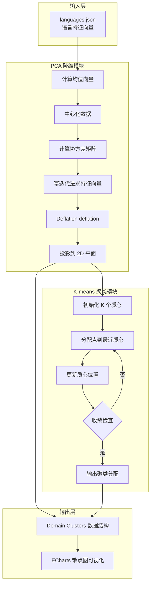
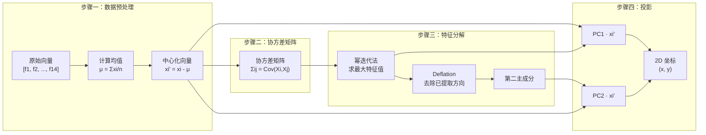
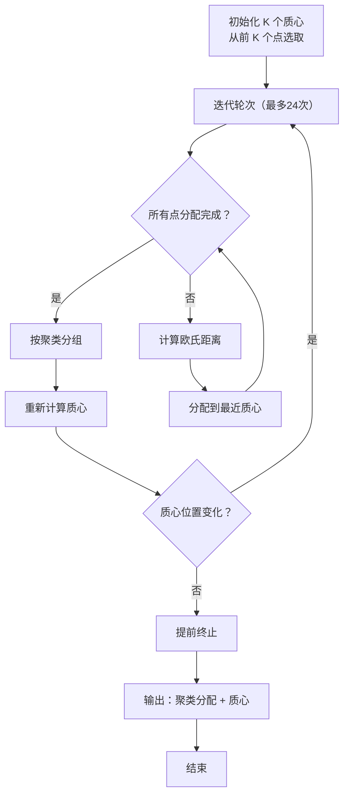
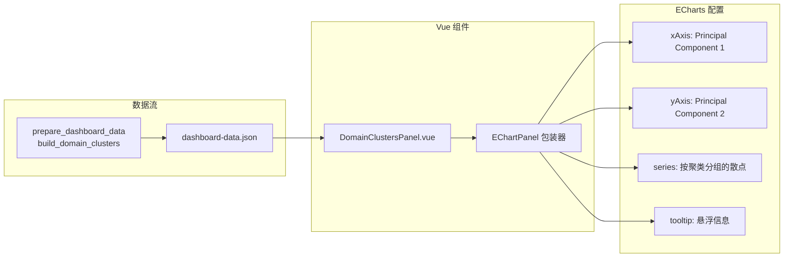

本页面深入解析类型系统知识图谱中实现的 **PCA（主成分分析）降维算法** 与 **K-means 聚类算法**。这两个算法共同构成了「领域聚类（Domain Clusters）」功能的核心——将高维语言特征向量投影至二维平面，并以聚类形式呈现语言间的类型系统相似性。

## 算法架构概览



## PCA 降维算法详解

### 数学原理

PCA（Principal Component Analysis）的核心目标是在保留最大方差的前提下，将高维数据投影到低维空间。对于本项目的 14 维语言特征向量，PCA 提取两个主成分形成二维可视化坐标。



### 核心实现分析

#### 幂迭代法（Power Iteration）

幂迭代法是求解矩阵主特征值的高效算法，其核心思想是通过重复迭代使向量收敛到最大特征值对应的特征向量方向。

```python
def _power_iteration(matrix: list[list[float]], iterations: int = 64) -> tuple[float, list[float]]:
    size = len(matrix)
    vector = _normalize([1.0 + (idx * 0.07) for idx in range(size)])
    for _ in range(iterations):
        vector = _normalize(_mat_vec(matrix, vector))
    eigenvalue = _dot(vector, _mat_vec(matrix, vector))
    return eigenvalue, vector
```
Sources: [src/data_processing.py](src/data_processing.py#L330-L337)

**算法特点**：
- **初始化策略**：使用非均匀初始向量 `[1.0, 1.07, 1.14, ...]`，避免从零向量开始导致的收敛问题
- **收敛判断**：固定 64 次迭代，平衡精度与性能
- **特征值计算**：通过 Rayleigh 商 `λ = (v^T · A · v) / (v^T · v)` 精化特征值估计

#### Deflation 降维技术

提取第一个主成分后，需要从协方差矩阵中移除其贡献，以便提取第二个主成分：

```python
def _deflate(matrix: list[list[float]], eigenvalue: float, eigenvector: list[float]) -> list[list[float]]:
    size = len(matrix)
    return [
        [
            matrix[row][col] - eigenvalue * eigenvector[row] * eigenvector[col]
            for col in range(size)
        ]
        for row in range(size)
    ]
```
Sources: [src/data_processing.py](src/data_processing.py#L339-L347)

**数学原理**：基于特征向量的正交性，deflation 操作将矩阵 `A` 变换为 `A' = A - λvv^T`，使得新矩阵的最大特征值不再是原次大值。

#### 完整投影流程

```python
def _project_pca_2d(vectors: list[list[float]]) -> tuple[list[tuple[float, float]], list[list[float]]]:
    if not vectors:
        return [], []

    dimension = len(vectors[0])
    count = len(vectors)
    # 计算均值向量
    means = [
        sum(vector[idx] for vector in vectors) / count
        for idx in range(dimension)
    ]
    # 中心化数据
    centered = [
        [vector[idx] - means[idx] for idx in range(dimension)]
        for vector in vectors
    ]

    # 计算协方差矩阵
    covariance = []
    denom = max(count - 1, 1)
    for row in range(dimension):
        covariance_row = []
        for col in range(dimension):
            covariance_row.append(
                sum(vector[row] * vector[col] for vector in centered) / denom
            )
        covariance.append(covariance_row)

    # 提取两个主成分
    eigenvalue_1, eigenvector_1 = _power_iteration(covariance)
    covariance_2 = _deflate(covariance, eigenvalue_1, eigenvector_1)
    _, eigenvector_2 = _power_iteration(covariance_2)

    # 执行投影
    projections = [
        (_dot(vector, eigenvector_1), _dot(vector, eigenvector_2))
        for vector in centered
    ]
    return projections, centered
```
Sources: [src/data_processing.py](src/data_processing.py#L349-L391)

**关键参数说明**：

| 参数 | 值 | 说明 |
|------|-----|------|
| `denom` | `max(count - 1, 1)` | 样本协方差（使用 n-1）或总体协方差（n=1） |
| `iterations` | 64 | 幂迭代法收敛迭代次数 |
| 输出 `centered` | `list[list[float]]` | 返回中心化向量供 K-means 使用 |

## K-means 聚类算法详解

### 算法流程



### 实现细节

```python
def _kmeans(points: list[list[float]], k: int = 3, iterations: int = 24) -> tuple[list[int], list[list[float]]]:
    if not points:
        return [], []

    k = min(k, len(points))
    # 初始化：使用前 K 个点作为初始质心
    centroids = [point[:] for point in points[:k]]
    assignments = [0] * len(points)

    for _ in range(iterations):
        updated = False
        # E 步：分配点到最近质心
        for idx, point in enumerate(points):
            distances = [
                sum((value - centroid[dim]) ** 2 for dim, value in enumerate(point))
                for centroid in centroids
            ]
            cluster = min(range(k), key=lambda cluster_idx: distances[cluster_idx])
            if assignments[idx] != cluster:
                assignments[idx] = cluster
                updated = True

        # M 步：重新计算质心
        grouped: list[list[list[float]]] = [[] for _ in range(k)]
        for assignment, point in zip(assignments, points):
            grouped[assignment].append(point)

        new_centroids = []
        for cluster_idx, group in enumerate(grouped):
            if not group:
                new_centroids.append(centroids[cluster_idx])
                continue
            new_centroids.append([
                sum(point[dim] for point in group) / len(group)
                for dim in range(len(group[0]))
            ])
        centroids = new_centroids

        # 提前终止：如果没有点的分配发生变化
        if not updated:
            break

    return assignments, centroids
```
Sources: [src/data_processing.py](src/data_processing.py#L393-L435)

**设计决策分析**：

| 设计点 | 选择 | 权衡考量 |
|--------|------|----------|
| 初始化方法 | 前 K 个点 | 确定性输出，避免随机性 |
| 距离度量 | 欧氏距离平方 | 避免开方计算，提高效率 |
| 空聚类处理 | 保持原质心 | 防止质心丢失导致维度错误 |
| 收敛条件 | 分配不变 或 达到迭代上限 | 平衡精度与性能 |

## 领域聚类构建器

`build_domain_clusters` 函数整合 PCA 与 K-means，形成完整的聚类数据结构：

```python
def build_domain_clusters(data: dict) -> dict:
    """Project languages into 2D and cluster them by type-feature profile."""
    languages = data["languages"]
    features = get_feature_names(data)
    # 构建原始特征向量
    raw_vectors = [
        [lang["features"].get(feature, 0) for feature in features]
        for lang in languages
    ]
    # PCA 降维 + K-means 聚类
    projections, centered_vectors = _project_pca_2d(raw_vectors)
    assignments, _ = _kmeans(centered_vectors, k=3)

    # 基于领域投票生成聚类标签
    cluster_domain_votes: dict[int, dict[str, int]] = {}
    for assignment, lang in zip(assignments, languages):
        cluster_domain_votes.setdefault(assignment, {})
        group = get_domain_group(lang["domain"])
        cluster_domain_votes[assignment][group] = cluster_domain_votes[assignment].get(group, 0) + 1

    cluster_labels = {}
    for assignment, votes in cluster_domain_votes.items():
        dominant_group = max(votes.items(), key=lambda item: item[1])[0]
        cluster_labels[assignment] = f"Cluster {assignment + 1} / {dominant_group}-leaning"

    # 构建点数据集
    points = []
    for idx, lang in enumerate(languages):
        x, y = projections[idx]
        cluster = assignments[idx]
        points.append({
            "name": lang["name"],
            "x": round(x, 3),
            "y": round(y, 3),
            "cluster": cluster,
            "cluster_label": cluster_labels[cluster],
            "domain": lang["domain"],
            "domain_group": get_domain_group(lang["domain"]),
            "paradigm": lang["paradigm"],
            "complexity": compute_type_complexity_score(lang),
        })

    return {
        "cluster_labels": cluster_labels,
        "points": points,
    }
```
Sources: [src/data_processing.py](src/data_processing.py#L437-L475)

**智能标签生成机制**：
- 统计每个聚类中各领域（Domain Group）的语言数量
- 选择票数最高的领域作为聚类标签后缀
- 例如：`"Cluster 1 / Systems-leaning"` 表示该聚类中 Systems 领域语言占多数

## 数据结构与接口

### TypeScript 类型定义

```typescript
export interface ClusterPoint {
  name: string           // 语言名称
  x: number              // PCA 第一主成分坐标
  y: number              // PCA 第二主成分坐标
  cluster: number        // 聚类编号 (0, 1, 2)
  cluster_label: string   // 可读聚类标签
  domain: string         // 详细领域描述
  domain_group: string   // 顶层领域分类
  paradigm: string       // 编程范式
  complexity: number     // 类型复杂度评分
}
```
Sources: [frontend/src/types/dashboard.ts](frontend/src/types/dashboard.ts#L55-L65)

### DashboardData 中的数据结构

```typescript
clusters: {
  cluster_labels: Record<string, string>  // 聚类编号 -> 标签映射
  points: ClusterPoint[]                   // 所有语言的数据点
}
```
Sources: [frontend/src/types/dashboard.ts](frontend/src/types/dashboard.ts#L130-L134)

## 前端可视化集成

Domain Clusters 面板使用 ECharts 散点图展示聚类结果：



### 可视化配置关键点

| 配置项 | 来源 | 作用 |
|--------|------|------|
| `symbol` | `domainGroupSymbols` | 领域组对应不同形状（三角形、菱形等） |
| `symbolSize` | `complexity / 2` | 类型复杂度决定点的大小 |
| `itemStyle.color` | `clusterPalette` | 聚类颜色区分（蓝、粉、绿） |
| `cluster_labels` | 算法自动生成 | 图例显示领域倾向 |

Sources: [frontend/src/components/panels/DomainClustersPanel.vue](frontend/src/components/panels/DomainClustersPanel.vue#L1-L111)

### 颜色与形状映射

```typescript
// 聚类调色板
export const clusterPalette = ['#7e96ff', '#ff8aa1', '#6fe0b7']

// 领域组颜色
export const domainGroupColors: Record<string, string> = {
  Systems: '#ffcf7a',
  Web: '#7e96ff',
  Academic: '#6fe0b7',
  General: '#ff8aa1',
}

// 领域组形状
export const domainGroupSymbols: Record<string, string> = {
  Systems: 'diamond',
  Web: 'circle',
  Academic: 'triangle',
  General: 'rect',
}
```
Sources: [frontend/src/constants.ts](frontend/src/constants.ts#L1-L42)

## 算法性能分析

### 时间复杂度

| 阶段 | 复杂度 | 说明 |
|------|--------|------|
| PCA 中心化 | O(n × d) | n: 语言数量, d: 特征维度(14) |
| 协方差矩阵 | O(n × d²) | 构建 d×d 协方差矩阵 |
| 幂迭代法 | O(d² × iter) | iter=64, d=14 |
| K-means | O(k × n × d × iter) | k=3, iter=24 |

**实际性能表现**：
- 协方差矩阵计算：14 × 14 × n（通常 n ≈ 30-50 种语言）≈ 6,000-10,000 次操作
- K-means：3 × n × 14 × 24 ≈ 3,000-5,000 次操作
- **总体**：在毫秒级完成，适合实时数据更新场景

### 空间复杂度

- 协方差矩阵：O(d²) = O(196) — 固定开销
- 中心化向量：O(n × d) — 线性增长
- 聚类结果：O(n) — 每个点一个标签

## 总结与延伸

本模块通过 **PCA + K-means** 的组合策略，将语言类型系统的高维特征空间映射为可理解的二维聚类视图：

**核心设计亮点**：
- **纯 Python 实现**：不依赖 scikit-learn 等外部库，降低部署复杂度
- **幂迭代法**：适合小规模特征分解，效率优于完整特征分解
- **自动标签生成**：基于领域投票的语义化聚类命名
- **前端解耦**：算法在 Python 后端执行，可视化在 Vue 前端渲染

**推荐阅读顺序**：
- 了解相似度计算基础：[相似度计算算法](8-xiang-si-du-ji-suan-suan-fa)
- 查看聚类可视化面板：[Domain Clusters 领域聚类](18-domain-clusters-ling-yu-ju-lei)
- 探索特性共现分析：[Feature Co-occurrence 特性共现](13-feature-co-occurrence-te-xing-gong-xian)